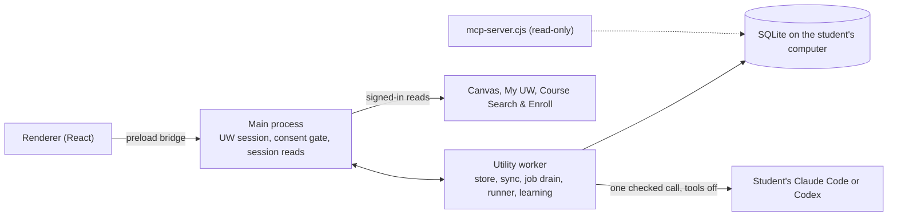

# My Magic UW

**The future of learning, tailored to you.** Stop managing school. Start learning.

My Magic UW is a desktop AI workspace that already knows a UW–Madison student's classes: what matters now, which materials they need, and how to practise for each professor's expectations. After one UW sign-in it reads the student's current courses, keeps everything in one database on their computer, and builds study material with the AI plan the student already has. Built for UW–Madison's Badger BuildFest 2026 by a team of four, entering **Applied AI & Automation**, **Badgers Building for Badgers (DoIT)** and **The Art of the Break**. Open source under the [MIT licence](LICENSE).

*My Magic UW is an independent student project. It is not affiliated with, sponsored by or endorsed by the University of Wisconsin–Madison.*

## What it does

Status per feature, with its evidence, is in [implementation status](docs/implementation-status.md).

- **Connects on its own.** One consent checkbox and the student's own UW sign-in (NetID and Duo by the student); enrollment decides which Canvas courses are this term's, and only those are read. My UW enrollment, saved DARS audits and course search stay on the computer.
- **Maps each course by code.** Materials are split into passages with exact offsets; code sorts material roles, dates, terms and what each assignment references (96.4% of 673 materials on six live courses, with no model calls).
- **Studies with the student's own AI.** Quizzes, flashcards and study guides come from one checked call on the student's Claude Code or Codex (tools off); code checks every quote, date and ID. Every exam, quiz, problem set, essay or lab gets its own study space, gathered in Study & Learn, with maths rendered by KaTeX (generating from a study space is held for now while account and course-policy scoping is connected). Studying itself (FSRS cards, Learn rounds, sectioned quizzes, topic mastery, per-course analytics) costs 0 tokens.
- **Plans the day.** Home, the Today rail, the Calendar with the enrolled class schedule, and notifications from what changed.
- **Open to other tools.** A read-only MCP course bank and a versioned agent API let a student's own AI client or a developer's tool read their courses, with a receipt for every read.
- **Private by design.** Nothing leaves the computer without consent; identities are replaced before any hosted payload; the app has no submit, enroll or post capability.

## How it fits together



**AI writes, code decides:** code does everything with one right answer; Jev makes small typed judgments; the student's AI is called once, where language must be read or written. The full picture is in [the architecture](docs/architecture.md).

## Run it

Node 24 and pnpm 10.29.2:

```sh
pnpm install
pnpm dev      # build and start the desktop app
pnpm test     # the test suite
pnpm check    # TypeScript
```

The app starts empty with hosted AI sharing off. Load the labelled synthetic sample course (it carries a full synthetic term), or sign in to UW in the app's own window. See [development](docs/development.md) for the rest, including the Jev gateway.

## Documentation

| Read | For |
|---|---|
| [Architecture](docs/architecture.md) | processes, packages, sync, the AI boundary, retrieval, study, privacy, the agent layer |
| [Implementation status](docs/implementation-status.md) | every feature's status, location and evidence |
| [Benchmarks](docs/benchmarks.md) | performance and quality measurements, methods, and the rows we lose |
| [Academic data platform](docs/academic-data-platform.md) | the database for developers: agent API, MCP course bank, quickstart, business model |
| [Status, September 27](docs/status-2026-09-27.md) | the backend lane's morning report: measurements and what was broken then |
| [Break card (PDF)](docs/break-card.pdf) | our one-page Art of the Break entry: checked quotes, unchecked sentences ([full write-up](docs/break-card.md)) |
| [Documentation index](docs/README.md) | every document, grouped |

Private course data, credentials, sessions and unredacted captures never belong in this repository; examples are synthetic.
