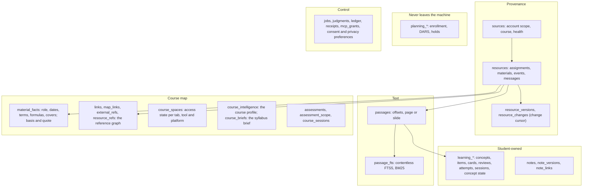

# My Magic UW: the open academic data platform

**Status:** written against `origin/main` at `699e386` (2026-09-27) and updated where the architecture changed since; current status per feature is in [implementation status](implementation-status.md), which defines the labels used here: *researched, proposed, built, tested in isolation, integrated, demonstrated*.
**Canonical homes:** the architecture is [architecture](architecture.md), with backend detail in [the backend reference](course-backend-architecture.md); benchmarks in [benchmarks](benchmarks.md); the full business model in [business model](notes/business-model.md); product surfaces in [the product direction](magic-canvas-direction.md). This document links to them rather than repeating them.

## 1. What it is

**A local-first, agent-first academic database that assembles a student's whole course world automatically, and an open platform other developers can build on.**

The student signs in to UW once. Code inventories every place each course keeps content, reads what the student's own sign-in can already read, and stores it in one SQLite file on the student's computer: materials split into passages with exact offsets, assessments, dates, a reference graph between them, and the access state of every course space. Code checks every quote, ID and date. The student's own AI client is called only where language has to be read or written, one checked call at a time, and studying runs on code at zero model tokens.

It serves two audiences:
- **Students, through the My Magic UW desktop app.** Every feature reads from this database.
- **Developers, through an MIT codebase.** The same store is readable through a versioned, grant-scoped agent API and a read-only MCP course bank, and every package can be used in-process.

## 2. Why build on it

| What a developer gets | Why it matters | Status |
|---|---|---|
| A student's whole course, already connected and current | no LTI install, no admin setup, no scraping of your own; freshness is handled by the app | demonstrated (the operator's account, 6 live courses) |
| Passages with offsets and a BM25 index | quotable, checkable context in milliseconds (search p95 4.8 ms at 5,000 resources, synthetic) | integrated |
| A course graph built by code | material roles, dates, terms, formulas, assessments covered, and what each assignment references, each with its quote | demonstrated (#13) |
| A versioned, read-only, grant-scoped API | the student decides which courses and data categories your tool sees, and every read leaves a receipt | tested in isolation |
| A read-only MCP course bank | the student's own AI client can read their courses outside the app | integrated |
| Prompt packs, a checked one-call runner, learning engines | build generation and study features without an agent loop, and study at 0 tokens | integrated in the app; in-process for developers |

## 3. The agent-first academic database

One SQLite file (`workspace.sqlite`), one writer (the app's worker), schema v14 on `main`. "Agent-first" means the data is shaped for a model's context window: small, cited, bounded units (passages with offsets, facts with quotes, graph edges with reasons) rather than whole documents, and every read has a token budget. The table-level layout per schema version is [architecture §5](course-backend-architecture.md#5-storage).



| Group | What it holds | Tables | Status |
|---|---|---|---|
| **Courses and modules** | a course is `(accountScope, courseId)` on its sources; module items are resources carrying their module and position; each tab, external tool and linked platform is a course space with an access state (readable, needs UW sign-in, own login, link-only, blocked) | `sources`, `course_spaces`, `course_sessions`, `learning_courses` | integrated |
| **Resources with versions** | every assignment, page, file, announcement, event and message, with every version kept and a sequenced change log | `resources`, `resource_versions`, `resource_changes`, `field_seen`, `completions` | integrated |
| **Passages with offsets and FTS** | materials split into passages with character offsets (and page, slide or time where known); a contentless FTS5 index so the text is stored once | `passages`, `passage_fts`, `passage_vocab` | integrated |
| **Material facts** | what code found in each material: its role, module or session, dates, terms, definitions, formulas and the assessments it covers, each with a basis and a quote | `material_facts`, `compile_runs` | demonstrated (#13) |
| **The reference graph** | exact links with reasons; judged and course-pass links with their rung (code, Jev, pass, student); external links stored once per course and fetched only on demand | `links`, `map_links`, `external_refs`, `resource_refs` | integrated |
| **Course profile and syllabus brief** | the course-intelligence profile (cited AI policy, grading, topics, expectations) today; the checked syllabus brief once the course pass writes it (open H6) | `course_intelligence`; `course_briefs` | profile integrated; brief storage tested in isolation, its writer proposed |
| **Assessments and scope** | each assessment's stated scope with the instructor's quote, validated against the exact resource version | `assessments`, `assessment_scope` | tested in isolation (the mapping pass is proposed) |
| **Learning state** | concepts, generated items with their source quotes and checks, flashcards with FSRS reviews, attempts, sessions, topic states, coverage per assessment | `learning_*` (v7, v8) | integrated |
| **Notes** | a notes page per lecture, discussion and lab; versions; links to materials; template choices; remote copies in Word or Google Docs. Notes become passages, so search and ask use them | `notes`, `note_*` (v11) | integrated |
| **Mail and calendar** | Outlook mail as metadata, a ≤255-character preview, a category with its reason and a link, never the body; calendar events with join links. "Sealed" (encrypted at rest) in v14 | resources under the Outlook sources; `life_items` | integrated; sealing built (#25) |
| **Planning** | My UW enrollment, DARS audits, holds, course search. Local only: never sent to AI, Jev, MCP or the platform | `planning_*` | integrated |
| **Control and audit** | the job queue, cached judgments, a ledger row per model call, a receipt per send or read, per-client grants, consent records | `jobs`, `judgments`, `ledger`, `receipts`, `mcp_grants`, `preferences` | integrated |

## 4. Access for tools and agents

Two read surfaces exist on `main`, and both share one grant session (`packages/agent-api/src/session.ts`): each call rechecks the grant, applies the sharing gate (`maySend`), scrubs known identities from what it returns, trims to a token budget instead of refusing, and records one receipt.

### 4.1 Agent API v1 (`@magic/agent-api`)

Contract `magic.agent-api` **1.0.0**, exported as the `v1` namespace. Within a major version a result never changes shape; new fields arrive in a minor version, and a new major version ships beside the old one (`SUPPORTED_VERSIONS`). **Status: tested in isolation** (`tests/fix-platform-agent-api.test.ts`); developers use it in-process.

| Verb | Input | Returns | Budget (tokens) |
|---|---|---|---|
| `courses()` | none | granted courses: name, resource count, open assignments, next due date, source coverage | 4,000 |
| `courseGraph({ courseId })` | a course | counts by kind, accepted links by type, assignments without a due date, coverage | 4,000 |
| `resources({ courseId?, kinds?, cursor?, limit? })` | a page of ≤100 | list rows without bodies, `total`, `nextCursor` | 8,000 |
| `resource({ id })` | one id | the scrubbed item: an excerpt window, deadline, citation, freshness | 12,000 |
| `searchPassages({ query, courseId?, limit? })` | ≤20 hits | passage search on the FTS index (BM25, OR), each hit an excerpt around the match with its citation | 8,000 |
| `assignments({ courseId?, days? })` | a window in days | assignments with resolved due and planning dates, conflicts and completion, soonest first | 6,000 |
| `agenda({ days? })` | | `status: "not_built"`: the core agenda merges planning class meetings, which never leave through the platform | 6,000 |

### 4.2 The read-only MCP course bank

Six stdio tools for the student's own AI client: `search`, `due_soon`, `recent_changes`, `course_overview`, `get_item` and `answer_course_question` (extractive: exact quotes with citations, no model call). The student creates a grant per client in Settings → Data & AI and exports a connection; the app writes a token file readable only by the current user and returns an `mcpServers` entry that launches `mcp-server.cjs --connection <file>`. The reader opens the database read-only and appends receipts to a side log the app imports. **Status: integrated** (`apps/desktop/src/mcp-server.ts`, `packages/core/src/mcp.ts`).

### 4.3 What the platform will add (D42, proposed)

- **A versioned SQL read contract:** named views `v<major>_<name>`, a typed `@magic/sdk`, and a handshake `{contract} → {supported, user_version}` so a separate process can read without importing the app's packages.
- **Scoped, revocable, per-tool tokens** that reuse the grants; localhost is not authorization.
- **A narrow, atomic write path for student-owned artifacts only:** `deck.create`, `card.add`, `card.edit`, `note.save`, `review.record`, each checked by code, reversible, with a before-image. Coursework and evidence are never writable, and planning is never exposed.

The evidence behind each choice (Zotero's version requests, AnkiConnect's "localhost alone is not authentication", Obsidian's atomic `process()`, Logseq's schema handshake) is in [plan D42](plans/2026-09-26-course-backend/plan.md).

## 5. Developer quickstart

Node 24 and pnpm 10.29.2.

```sh
git clone https://github.com/benverhaalen/magic-uw.git
cd magic-uw
pnpm install
pnpm test        # the whole suite: 1,101/1,101 at 699e386
pnpm check       # TypeScript across apps, packages and evals
```

**Where things live:** `packages/contracts` (types and schemas) → `domain` → `core` (queries, the job drain, the intent router, MCP, egress) → `storage` (the store) → `retrieval`, `connectors`, `ai`, `runner`, `packs/*`, `learning`, `notes`, `agent-api`. The desktop app is `apps/desktop` (main process, utility worker, renderer); the Jev gateway is `apps/gateway`. Aliases such as `@magic/storage` are in `tsconfig.json` `paths`; a new package needs its alias there, or `pnpm check` fails with TS2307.

**Build a study tool on the agent API.** Save this as `.data/quickstart.ts` (git ignores `.data/`) and run `pnpm exec tsx .data/quickstart.ts` from the repository root. It plays both sides on the synthetic sample course: the app (the writer, with the student's consent and a grant) and your tool (a read-only reader). It ran and type-checked at `699e386`.

```ts
import { createHash, randomBytes } from "node:crypto";
import { mkdtempSync, readFileSync } from "node:fs";
import { tmpdir } from "node:os";
import { join } from "node:path";
import { createStore } from "@magic/storage";
import { createReadApi } from "@magic/agent-api";
import { defaultPrivacy } from "@magic/contracts";
import { CONSENT_DISCLOSURE_VERSION } from "@magic/domain";

// 1. The app's writer: one SQLite file; migrations run on open. Load the synthetic sample course.
const file = join(mkdtempSync(join(tmpdir(), "magic-quickstart-")), "workspace.sqlite");
const writer = createStore(file);
writer.ingest(JSON.parse(readFileSync("fixtures/course.json", "utf8")));

// 2. The student's side: consent to a recipient, share course text, and grant one tool one course.
const now = new Date().toISOString();
writer.setConsent!({ action: "grant", recipient: "claude", disclosureVersion: CONSENT_DISCLOSURE_VERSION }, now);
writer.setPrivacy({ ...defaultPrivacy, mode: "selective_cloud", hostedProvider: "claude", shareCourseText: true });
const token = randomBytes(32).toString("hex");
writer.setMcpGrant({
  id: "my-study-tool",
  label: "My study tool",
  recipient: "claude",
  enabled: true,
  courses: [{ accountScope: "synthetic", courseId: "sample-101" }],
  categories: ["course_text"],
  tokenHash: createHash("sha256").update(token).digest("hex"),
});
writer.close();

// 3. Your tool: a read-only reader and the agent API v1, scoped by the grant, one receipt per call.
const reader = createStore(file, { readOnly: true });
const api = createReadApi(reader, { clientId: "my-study-tool", token }, { recordReceipt: (r) => console.log("receipt:", r.purpose) });
console.log(api.contract, api.version);
for (const c of api.courses().courses) console.log(c.course, c.resources, "resources,", c.openAssignments, "open");
const { hits, trimmed } = api.searchPassages({ query: "essay thesis", limit: 3 });
for (const h of hits) console.log("hit:", h.title);
console.log("trimmed:", trimmed);
console.log("due in 30 days:", api.assignments({ days: 30 }).items.length);
reader.close();
```

Its output at `699e386`: `magic.agent-api 1.0.0`, one receipt per call, the course `Writing 101 · Sample` with 10 resources and 4 open, two passage hits, and the assignments due in the next 30 days. Revoke the grant or turn sharing off in the writer and the next call throws.

**Go further, in-process.**
- **Register a background job:** add a `JobHandler` to the registry passed to `createCore({ jobs })`; the one drain runs it when the student is idle and never during a sync ([architecture §8](course-backend-architecture.md#8-one-job-drain)).
- **Add a prompt pack:** `definePack` from `packages/packs/core` (a strict schema, code checks such as `quotesGrounded`, a cache key, data categories). `tests/packs.test.ts` runs one end to end against a fake CLI; `packages/packs/items` and `packages/packs/cards` are complete examples.
- **Connect your own AI client** to the MCP course bank from Settings → Data & AI in the running app.

## 6. Building on it

| A tool a Badger developer could build | What it reads | Works today | Needs |
|---|---|---|---|
| A lab-report checker | the lab's assignment text and rubric passages; a pack whose checks quote the rubric | in-process: `searchPassages`, `resource`, a prompt pack | D42 to run as its own process |
| A group-project planner | assignments with dates, course sessions | `assignments({ days })`, `courseGraph` | a planning-free `agenda` in v1 |
| A flashcard exporter to Anki | the student's cards and reviews | in-process through the learning store | D42's read contract and the `card.*` write verbs |
| A course-schedule bot | due dates and changes | `assignments`, `resources` with the change cursor through `core.query` | D42's scoped tokens to run separately |

**Rules every tool must keep** (from [AGENTS.md](../AGENTS.md)):
- **No school actions.** Nothing submits, enrolls, posts or marks anything complete.
- **Planning data is never exposed** to AI, Jev, MCP or the platform.
- **Never automate Duo or bypass expiry;** use the app's own sessions, never a personal browser profile.
- **Private coursework, credentials, sessions and unredacted captures stay out of Git and logs.** Test with synthetic fixtures.
- **Page content is untrusted** and can't authorize an action; a model's output is never an authorization.
- **Exact facts stay in code:** dates, IDs, permissions and budgets.

## 7. Business model

**In one line:** the code is open source and free with the student's own AI; the paid part is an optional hosted service; revenue never depends on student data. The full model, payment research and distribution plan are in [business model](notes/business-model.md); the team's recorded resolution is in [decisions](decisions.md#pricing-and-ai-access-resolution--september-26).

| Layer | What it is | Status |
|---|---|---|
| **Open source, free with your own AI** | MIT code; model calls run on the student's own Claude Code or Codex (the student's plan) or their own API key; a local-model adapter exists for fully local use | code integrated; the Claude Code and Codex routes integrated through instant mode and app-owned profiles (#29); Gemini by the student's API key only |
| **The hosted Jev service** | a gateway holding the team's Jev key server-side, so a student never needs a Jev account; OpenRouter users pay Jev through their own key | gateway tested in isolation, not deployed ([gateway README](../apps/gateway/README.md)); the OpenRouter route proposed |
| **The price** | **$5 a month** (September 27, [decision](decisions.md#2026-09-27--price-5-a-month)); earlier, open decision H1 ([plan §9](plans/2026-09-26-course-backend/plan.md#9-open-human-calls)): the operator's "free with your own keys; $5 lifetime for our hosted Jev service", against the team's recorded "$5 one-time app license" covering the service and company-funded Jev. Neither includes model usage. The payment provider is not chosen | proposed |
| **A UW licence, after launch only** | a sanctioned connection (a university-issued Canvas developer key and approved Microsoft 365 access) and a campus review, at $1–2 per student. **No partnership exists; don't present one as existing** | proposed |

**Why the student's own subscription means no extra usage credits.** The app buys no model usage and resells none. It runs the student's already signed-in Claude Code or Codex on the student's computer, so generation is paid by the plan the student already has, with no second meter. The design keeps that use small: study runs at 0 tokens, a repeat hits the content-hash cache at 0 tokens, the byte-stable course prefix lets the provider's cache hit, instant mode cut fixed input by 57–70% (#29), and code answers most decisions before any model is asked.

**The honest caveat.** Those calls still **count toward the student's plan limits**. Anthropic states that "Advertised usage limits for Pro and Max plans assume ordinary, individual usage of Claude Code and the Agent SDK" (sourced: [Claude Code legal and compliance](https://code.claude.com/docs/en/legal-and-compliance), read 2026-09-27). The app's daily background budget and its pause after a usage limit exist to protect those limits, and client health shows the reset time when a limit is hit.

**The open terms question (H5).** The same page states: "Anthropic does not permit third-party developers to offer Claude.ai login or to route requests through Free, Pro, or Max plan credentials on behalf of their users" (sourced, read 2026-09-27). The app never offers a login and never handles a credential: the student signs in to their own client through the provider's own flow, and the client runs on the student's machine. Whether that satisfies the provider's terms is **not settled** and is open decision H5; accepting Anthropic's Commercial Terms is a prerequisite before release. The sentence earlier documents quoted from that page ("Each end user must authenticate with their own Anthropic API key, Claude subscription plan credentials, or 3P inference provider credential") was **not found** on it on 2026-09-27. For Codex, no documented arrangement was found ([openai/codex#36886](https://github.com/openai/codex/issues/36886), sourced 2026-09-26, not re-checked); Gemini CLI's terms forbid third-party use of its sign-in ([tos-privacy.md](https://github.com/google-gemini/gemini-cli/blob/main/docs/resources/tos-privacy.md), sourced 2026-09-26, not re-checked), which is why Gemini is API-key only.

## 8. Scorecard

**How to read it.** Competitor cells come from each vendor's own pages, checked 2026-09-26; the reference numbers point to the sources below. "Not stated" means we found no statement; it doesn't mean "no". Our cells carry their build status.

**Where we lead on evidence today:**
- **Canvas connects automatically for a student alone,** with no admin setup. Every other tool we checked that connects to Canvas needs an institution to enable it, or doesn't document Canvas at all.
- **Local-first and open source, with Canvas.** Open Notebook and Anki are open and local, but have no LMS connection.
- **No study-time token cost and no daily artifact quotas.** Studying runs on code; generated results are cached.
- **Code-verified quotes.** Others cite sources; none states that the quote is checked against the source text.

**Where quality is not yet measured.** We make no claim that our answers or questions are better than anyone's. The blind quality run (spec B6, [benchmarking](notes/benchmarking.md)) has its protocol fixed; results go to [benchmarks](benchmarks.md). We found no published accuracy figures from any of the ten vendors below.

### My Magic UW

| Criterion | My Magic UW | Status |
|---|---|---|
| Price for a student | code MIT and free; generation on the student's own AI plan or key; the product price is open decision H1 (§7) | proposed |
| Automatic Canvas connection for a student alone | yes: the student's own UW sign-in; no school deployment | demonstrated (the operator's account) |
| Quoted, code-verified citations | every quote checked by code against the exact source version | integrated (generation packs, guides); tested in isolation (grounded ask) |
| Exam-scope grounding | each assessment's scope stored with the instructor's quote; material facts record which assessments a material covers | material facts demonstrated (#13); scope mapping proposed |
| Spaced repetition | FSRS (`ts-fsrs`), with reviews placed before real exam dates | integrated |
| Per-topic progress analytics | evidence-defined topic states (no percentages), recomputable from raw answers | integrated |
| Local or offline | one SQLite file on the student's computer; study works offline; generation needs the student's AI or a local model | integrated |
| Open source | MIT ([LICENSE](../LICENSE)) | integrated |
| Usage quotas | none set by the app; the student's provider limits apply; a daily background budget protects them | integrated |
| Cost during study | 0 model tokens | integrated |
| Published benchmarks | backend performance before and after, with the misses ([benchmarks](benchmarks.md)); quality: protocol fixed, run pending | measured (performance); pending (quality) |

### AI assistants and notebooks

| Criterion | NotebookLM (Gemini Notebook) | ChatGPT Study Mode | Claude learning mode | Gemini study notebooks |
|---|---|---|---|---|
| Price for a student | free tier; higher limits on paid Google AI plans [1] | free and paid plans [8] | free; Pro $20/mo ($17 billed annually) [9] | Google AI Pro for Education, $20–24 per user [10] |
| Canvas for a student alone | no: Gemini LTI imports Canvas files only after the institution's admin sets it up [5] | not found [8] | only through an institution's admin [9] | Gemini LTI needs Canvas and Google admins [5], [10] |
| Quoted citations | "uses direct quotes… from your sources as citations"; checking not stated [3] | not stated [8] | "proper citations" (literature reviews) [9] | not specified [10] |
| Exam-scope grounding | not stated | not stated | not stated | not stated |
| Spaced repetition | not stated | not stated [8] | not stated [9] | not stated [10] |
| Per-topic progress analytics | progress tracking on flashcards and quizzes; per topic not stated [4] | not stated [8] | not stated [9] | "track your proficiency" [10] |
| Local or offline | no: a hosted service [1] | no [8] | not stated [9] | no [10] |
| Open source | no | no [8] | no [9] | no [10] |
| Usage quotas | compute-based limits from 2026-09-02, refreshing every 5 hours up to a weekly limit [2]; 50 sources per notebook on Free [6] | "does not add extra messages, bypass rate limits" [8] | plan limits [9] | up to 600 sources, by plan [10] |
| Cost during study | chats, quizzes and flashcards count against the limits [1], [2] | messages count against plan limits [8] | plan limits [9] | not stated |
| Published benchmarks | none from Google found; one third-party clinical study [7] | none found | none found | none found |

### Study apps and open tools

| Criterion | Quizlet | StudyFetch | Knowt | RemNote | Anki | Open Notebook |
|---|---|---|---|---|---|---|
| Price for a student | Plus $35.99/yr; Plus Unlimited $44.99/yr [11] | free start; paid "as low as" $8/mo [15] | free; Ultra $199.99/yr [16] | free; Pro $8/mo; Pro+AI $18/mo [18] | free desktop version [19] | free, self-hosted [22] |
| Canvas for a student alone | no: a Google Classroom add-on, no direct Canvas integration documented [14] | not stated [15] | "LMS Integration (Canvas, Google Classroom, etc.)" on the plan for schools [17] | not stated [18] | not stated | none [22] |
| Quoted citations | not stated | "citations back to your original materials" [15] | not stated | not stated | n/a (no generation) | "Basic references (will improve)" [22] |
| Exam-scope grounding | not stated | not stated | not stated | not stated | not stated | not stated |
| Spaced repetition | adaptive Learn [12] | yes (Again/Hard/Good/Easy) [15] | yes [16] | yes [18] | FSRS, 90% default desired retention [20] | not stated [22] |
| Per-topic progress analytics | Progress, Plus only [13] | covered topics [15] | a teacher-side hub (mastery per card and per file) [16] | not stated [18] | reviews, forecast, true retention, FSRS stability and retrievability [21] | not stated [22] |
| Local or offline | not stated | not stated | not stated | "work fully offline" [18] | a desktop app; sync optional [19] | "100% local" [22] |
| Open source | no | no | no | no | AGPL-3.0 or later [23] | MIT [22] |
| Usage quotas | Plus: 3 practice tests and 20 Learn rounds per month [11] | not stated | "unlimited rounds of our free learn mode" [16] | Pro+AI: 50 AI runs per month [18] | not stated | depends on the model provider [22] |
| Cost during study | Learn rounds and tests capped on Plus [11] | not stated | not stated | AI runs capped [18] | not stated | each model call is paid to the student's provider [22] |
| Published benchmarks | none found | none found | none found | none found | not checked (Anki doesn't generate answers) | none found |

### Sources (all checked 2026-09-26)

1. NotebookLM plans, limits and data use: https://support.google.com/notebooklm/answer/16213268
2. Gemini Notebook compute-based usage limits: https://support.google.com/gemininotebook/answer/17670842
3. NotebookLM chat citations: https://support.google.com/notebooklm/answer/14276569
4. NotebookLM flashcards and quizzes: https://support.google.com/notebooklm/answer/16958963
5. Gemini LTI for Canvas (institution setup): https://support.google.com/edu/assignments/answer/15672329
6. NotebookLM sources: https://support.google.com/notebooklm/answer/16215270
7. Third-party grounding study (86% vs 39% on lung-cancer staging): https://pubmed.ncbi.nlm.nih.gov/39585559/
8. ChatGPT Study Mode: https://help.openai.com/en/articles/11780217
9. Claude for Education: https://www.anthropic.com/news/introducing-claude-for-education
10. Gemini study notebooks: https://support.google.com/gemini/answer/16972047
11. Quizlet plans: https://quizlet.com/upgrade
12. Quizlet Learn and Test: https://help.quizlet.com/hc/en-us/articles/360030841732
13. Quizlet Progress: https://help.quizlet.com/hc/en-us/articles/360048803491
14. Quizlet and LMSs: https://help.quizlet.com/hc/en-us/articles/45955621176589
15. StudyFetch flashcards: https://www.studyfetch.com/use-case/flashcard
16. Knowt: https://knowt.com, https://knowt.com/plans, and its help centre, https://help.knowt.com (teacher progress hub, article 10721997)
17. Knowt for teachers: https://knowt.com/teachers
18. RemNote offline mode and plans: https://www.remnote.com/feature/offline-mode
19. Anki downloads: https://apps.ankiweb.net/ and sync: https://docs.ankiweb.net/syncing.html
20. Anki deck options (FSRS): https://docs.ankiweb.net/deck-options.html
21. Anki statistics: https://docs.ankiweb.net/stats.html
22. Open Notebook (v1.14.0, MIT): https://github.com/lfnovo/open-notebook
23. Anki licence: https://github.com/ankitects/anki/blob/main/LICENSE

The earlier two-product comparison, with its honest reading of where each competitor is ahead, is in [competitive comparison](notes/competitive-comparison.md).

## 9. Licensing and governance

**Licence: MIT** ([LICENSE](../LICENSE), copyright 2026 Ben Verhaalen). Anyone may use, modify and redistribute the code, including commercially, with the notice kept. The paid part of the business is the hosted service, never the code.

| Practice | Today | Status |
|---|---|---|
| Contribution flow | fork or branch as `feat/<name>`, keep `pnpm check` and `pnpm test` passing, add tests beside the existing ones in `tests/`, open a pull request to `main` | integrated (the team works this way) |
| Continuous integration | `.github/workflows/verify.yml` runs `pnpm test` and `pnpm build` on Ubuntu for every push and pull request | integrated |
| Shared interfaces | contracts, storage and core changes are reviewed as a team; a schema change goes through `packages/storage` only, as a new version with purge coverage | integrated |
| API stability | `magic.agent-api` is versioned by major; a result never changes shape within one; a new major ships beside the old | tested in isolation |
| Security reporting, contributor guide, code of conduct, maintainers list | not yet in the repository | proposed |
| Third-party licences | recorded per dependency when added (for example `docx` MIT and `mammoth` BSD-2-Clause, #16); course corpora such as MIT OpenCourseWare (CC BY-NC-SA 4.0) are used locally for evaluation and never committed | integrated |

## 10. Roadmap

| Item | Status | Next step |
|---|---|---|
| Privacy protection on every egress path, encryption at rest (v14) | built (#25) | review and merge |
| Critical-action agenda | built (#27) | review and merge |
| Live Outlook and Microsoft 365 run (E1) | integrated, not demonstrated | the operator runs E1 against UW's tenant |
| A real-content generation run through the student's client | integrated, not demonstrated | a signed-in client on a live course, aggregates recorded |
| Command bar screen for the intent router | tested in isolation | the frontend owner mounts it |
| Course pass and mapping (T21, T22): the syllabus brief and assessment scopes | proposed | decide H6, then build |
| A planning-free `agenda` verb in agent API v1 | proposed | a variant without planning class meetings |
| SQL read contract, `@magic/sdk`, scoped tokens, student-owned write path (D42) | proposed | T68, T69, T55 |
| Hosted Jev deployment and licence activation | proposed | decide H1; choose hosting and a payment provider |
| Blind quality benchmark on a public course (B6) | proposed (protocol fixed) | run it, publish every row including losses |
| Security policy, contributor guide, maintainers | proposed | add before the public launch |
| UW licence and sanctioned connection | proposed (post-launch only) | after launch, with measured results |
