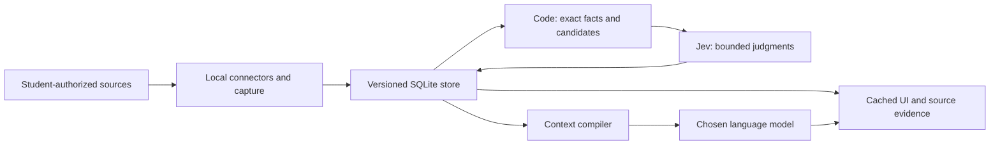

# Technical direction

Status: design, not implemented. The data layer is the first implementation priority.

## System shape

Jev is hosted. Any selected context sent to Jev or a hosted language model leaves the device. No school session or cookie should follow it. A truly local processing mode needs local alternatives or disabled hosted features.

## Access and fetching

Direction: use a legitimate student-authorized session where supported; otherwise a dedicated sign-in browser with NetID and student-completed Duo; an approved extension bridge is another candidate. Do not decrypt personal-browser cookies or evade idle expiry. One sign-in spanning all UW systems is an untested hypothesis.

Chrome's debugging restrictions make “attach to the default personal profile” an unsuitable assumption; use a dedicated profile for experiments. Embedded Electron browser compatibility with each UW flow must be tested separately. A successful Canvas login does not prove Outlook, PeopleSoft, or DARS access.

Connector ladder:

1. Official API or feed, with actually available authorization.
2. JSON used by the site, only where access and semantics are understood.
3. Rendered page and local document extraction/OCR.
4. Browser agent for otherwise inaccessible workflows.

Agents can discover a recipe; deterministic code should run and validate it. Keep known-good samples and schema checks. Quarantine changes until key fields match. On failure preserve the previous capture and report its age; never overwrite it with an empty login page. No live browser agent on the demonstration's critical path.

ICS plus a syllabus is a possible fallback with limited coverage, not an equivalent full integration. Outlook and degree audit should not become demo dependencies before access is demonstrated.

## Proposed shared record contract

Agree on actual types before separate implementations. These are conceptual requirements, not an established package API.

| Record | Required meaning |
| --- | --- |
| Capture | Source and source ID, course/section/term scope, observed time, source update time if known, content hash, version, extraction status, local evidence reference |
| Object | Stable internal ID; assignment, material, class session, message, event, or course; fields tied to captures |
| Field evidence | Value, source location/quote, last observed time, unknown/absent distinction |
| Deadline claim | Due/lock/event kind, raw text, normalized value and zone, authored time if known, observed time, scope |
| Resolution | Selected interpretation, competing claims, rule/version, unresolved conflict, separate planning date |
| Link | Typed source/target, evidence and reason, method/model/question version, judgment distribution, user override/rejection |
| Judgment | Object content hash, question version, pinned model version, result, generation/version guard |
| Source health | Last attempt, last success, coverage, fresh/stale/blocked/partial/error status and recovery action |
| Student state | Personal completion, verified submission evidence, opened resources, preferences, attempts and assistance |

Captures are versioned and normally append-only; deletions become markers. User-requested data deletion and retention controls must still be able to remove private data. A changed capture invalidates dependent judgments and summaries. Do not make an LLM brief the only place a factual field exists.

Assignment layers: raw source facts → code-derived facts → semantic judgments → student state. First useful fields: due-date evidence, points, submission state/location, kind, supporting links, and freshness. Effort can remain unknown until evidence supports a band.

## Deadline handling

Every source makes a claim. Structured fields are parsed by code; prose extraction must cite text that code can locate. Quote presence alone does not prove the date applies to this assignment, section, student, or term.

Proposed precedence: verified item-specific change → declared authoritative source → fresh structured fields → syllabus/schedule → supporting documents → item names. Check scope and freshness before applying precedence. Distinguish due time, lock time, class meeting, and personal extension.

Code performs timezone handling, year inference with explicit assumptions, and arithmetic. If conflict remains, show both claims. The earlier plausible date may be a conservative planning date; it is not established truth. Never merge records across courses because both are called P1.

## Jev and language models

Code constructs bounded candidates, Jev judges, code validates and applies policy, and a language model writes where needed. Cache by content hash, question version, and model version. Superseded responses cannot update current state.

- Choice for mutually exclusive candidates; include no match. For consequential matches, separately test whether any valid match exists.
- Multiple Nouls when several candidates can be true. Score for ordered judgments, not direct mastery probabilities.
- Tune task-specific thresholds on held-out examples. Do not multiply correlated outputs or interpret concentration as accuracy.
- Keep meaningful course/scope evidence alongside stable IDs. Named structured state is supported; prose is not universally superior.
- Use order permutations on ambiguous choices only if evaluation shows benefit.
- Dates, counts, schema mapping, and arithmetic stay in code. Model correctness judgments do not replace running tests.
- Retrieved content is untrusted. A high-confidence classifier is not an authorization boundary.
- Cache for first paint. Background judgment may improve suggestions. Missing cached routing needs a usable deterministic fallback.

Context compiler: select evidence for the task within an explicit budget, include policy and source health, preserve conflicting claims, and expose source references. Metadata relevance filtering should not discard a potentially important page solely because its title is vague.

The supported product choices are ChatGPT, Claude, Gemini, and local AI. The intended sign-ins are UW and the chosen hosted provider only; local AI needs only UW. API-key pasting or separate service accounts do not satisfy the intended default experience. Provider-specific MCP, authorized adapters, and other connection methods remain under investigation: account sign-in does not by itself establish subscription-backed access. See [AI and privacy requirements](ai-and-privacy.md).

## Stack proposal

TypeScript monorepo; Electron + React desktop; SQLite with full-text search. Desktop is first. The website is informational with downloads and GitHub links; iOS is later if time permits. Potential packages: domain types, store, connectors, judgment adapter, context/learning engines, model adapters, and UI. These package boundaries are proposals.

Expo, Next.js/Vercel, and a relay/sync service are candidates, not commitments. Phone relay must describe offline/asleep behavior and encryption boundaries. Magic Canvas uses one team-owned Jev key and pays for usage. Students need no Jev account or key. Keep that credential server-side behind our proxy, with authenticated access, request limits, and minimal logging.

Evaluate Playwright, browser-use/Stagehand, Crawlee, document parsers, and native OCR by actual need. License review includes exact versions, transitive dependencies, model weights, and bundled binaries. No dependency or production license audit has been completed. Working-Memory-Jev is ideas-only per project direction.

Private scraping is local. For a clean-room context.dev-like component, use public behavioral documentation, not implementation code. Required behavior includes partial results, login detection, safe redirect handling, output-specific status, and change baselines.

## Unverified technical capabilities

The following need evidence before we describe them as supported: sign-in across UW systems, session expiry/recovery, provider subscription access, phone relay behavior, target-platform packaging, and reliable extraction across different course structures. These unknowns do not reopen the product thesis; they identify where the technical description remains provisional.
