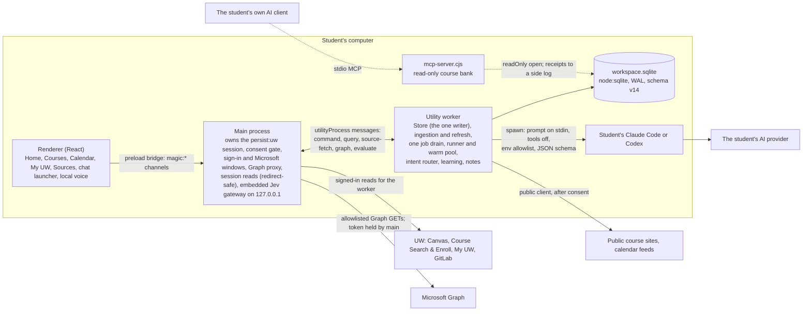
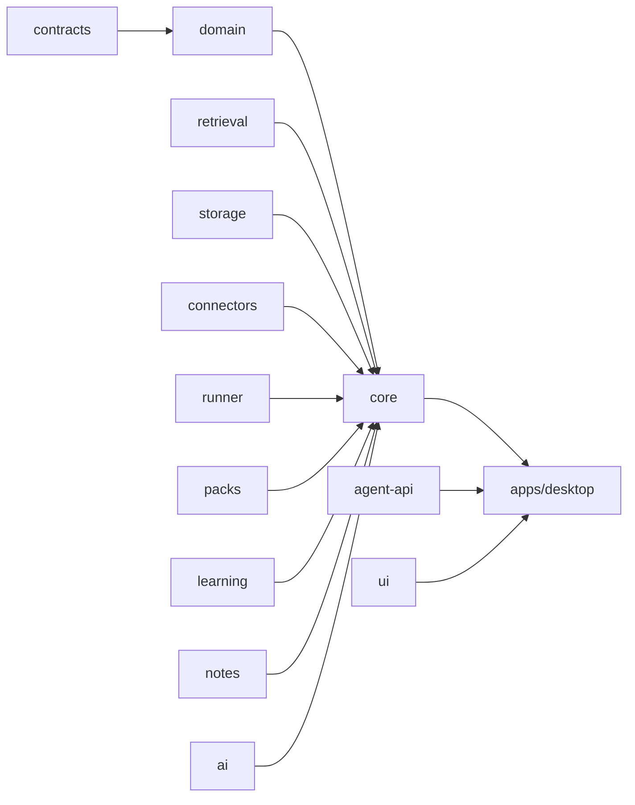
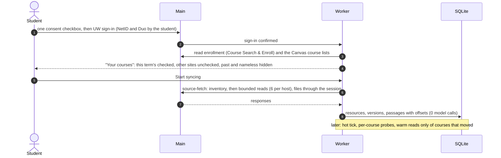
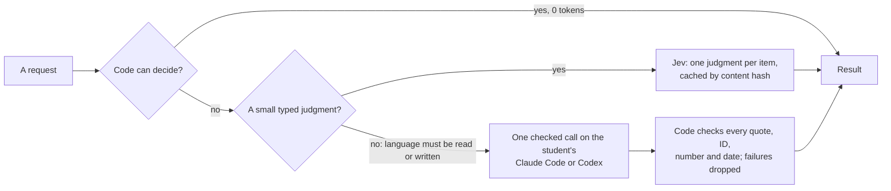
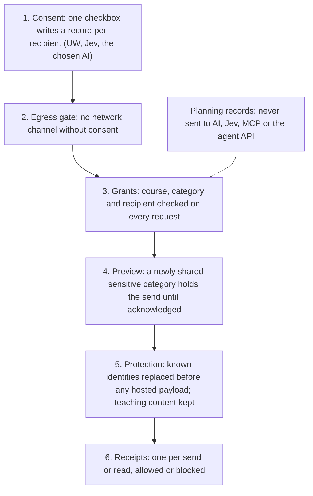

# My Magic UW architecture

My Magic UW is an independent student project, not affiliated with the University of Wisconsin–Madison.

This is the canonical architecture: processes, packages, data flow, the AI boundary, retrieval, study, notes and Outlook, privacy and the open agent layer. Per-feature status and evidence are in [implementation status](implementation-status.md); measurements and their methods are in [benchmarks](benchmarks.md). Deeper backend reference (the schema history, the job-handler contract, the measured effect of each design choice, the command bar) is in [the backend reference](course-backend-architecture.md); the platform and developer view is in [the academic data platform](academic-data-platform.md).

**Checked against:** `main` at `d832d61` (September 27, 2026), after wave 2 and the tab-speed work (#53), course analytics (#55), the study prepper (#57), the stall fix (#58), the break-card fixes (#59) and the Canvas file-CDN host fix (`749f389`).

**Status marks used on this page**

| Mark | Meaning |
|---|---|
| **main** | merged into `main` |
| **branch** `name` | pushed on that branch, not merged (no part below is branch-only at this check) |
| **planned** | specified in a plan or decision; no code |

The finer ladder (researched, proposed, built, tested in isolation, integrated, demonstrated) is applied per feature in [implementation status](implementation-status.md).

## 1. The principle: AI writes, code decides

Code does everything with one right answer: dates, IDs, permissions, budgets, quotes and change detection. Jev makes small typed judgments code can't. The student's own AI is called once, with tools off, only where language must be read or written, and code checks every quote, number, date and ID it returns. Study itself runs at zero model tokens. The reasoning is in [spec §2](plans/2026-09-26-course-backend/spec.md).

## 2. Processes

- **Renderer → preload → main** (**main**). The renderer has no Node access; `apps/desktop/src/preload.ts` exposes typed `magic:*` channels, and commands go through `magic:execute` against `commandSchema` in `packages/contracts`.
- **Main owns every credential and session** (**main**). The worker never holds cookies or tokens: it asks main for each signed-in read (`source-fetch`), each Graph request (main checks the URL against an allowlist and attaches the token) and each Jev call (`evaluate`).
- **Every session read goes through one redirect-safe helper** (**main**, #53). Electron 44's `session.fetch(url, { redirect: "manual" })` rejects every redirect, and every Canvas file download is a redirect, so a live run on September 27 lost 386 of 386 files. `sessionHopFetch` (`packages/connectors/src/session-fetch.ts`) drives `net.request` itself: only the Canvas hop carries cookies, refused downloads (403/404/410) become "not available to you", and timeouts, network errors, 429 and 5xx retry twice (1 s, 4 s). Every main-process session read (Canvas API, GitLab, Kaltura, course spaces, the sign-in check, UW planning reads) now sees a redirect as a 3xx, so a sign-out redirect becomes `needs_sign_in` instead of a transport failure. A later live refresh got all 98 files past Canvas's first redirect and then stopped at Instructure's file-service CDN (`cdn.inst-fs-…inscloudgate.net`); `canvasFileHost` now allows exactly that prefix (`749f389`), and non-Canvas hops stay cookie-less.
- **The utilityProcess worker** (**main**, `apps/desktop/src/worker.ts`) owns the Store, ingestion, refresh, the job drain, the runner and the learning and notes routers. It answers one message at a time, which is why the snapshot poll matters ([§12](#12-performance-where-the-time-goes)).
- **node:sqlite** (**main**): one file, one writer, WAL, `busy_timeout` 5000, `secure_delete` on; `SCHEMA_VERSION = 14` (`packages/storage/src/index.ts`). Schema history: [backend reference §5](course-backend-architecture.md#5-storage).
- **`mcp-server.cjs`** (**main**): a separate, optional stdio process the student's own AI client launches; it opens the database read-only ([§11](#11-the-open-agent-layer)).
- **Jev in the desktop build** (**main**, temporary): a build with `MAGIC_EMBED_TYPESAFE_KEY` compiles the key into `main.cjs` only, and main runs the gateway in-process on `127.0.0.1` (`apps/desktop/src/embedded-jev.ts`); a configured `MAGIC_GATEWAY_URL` wins, and a build without the variable embeds nothing and uses code rules. The key is never in Git, the worker, the renderer or logs. The accepted risk and its reasons are in [decisions](decisions.md#2026-09-27--embedded-jev-key-temporary). The hosted gateway (`apps/gateway`) is not deployed.

## 3. Packages

| Package | Responsibility |
|---|---|
| `contracts` | the typed commands, queries and results every process shares (zod schemas) |
| `domain` | pure rules: deadlines and their extraction, changes, course labels and policy, enrollment matching, planning, the Today rail, work projection; GPA (`gpa.ts`) |
| `storage` | the SQLite Store: migrations with a `VACUUM INTO` backup, passages and FTS, jobs, judgments, receipts, learning and notes tables, encryption at rest for sensitive fields |
| `connectors` | Canvas, documents and OCR, course sites, GitLab, calendar feeds, Microsoft Graph, UW planning, session fetch |
| `retrieval` | passage splitting (`split.v1`), Porter stemming, BM25 query terms with a coverage gate, exact quote checks (`findQuote`, `validateQuote`) |
| `core` | the application core: egress and consent, access, evidence, refresh, queries and views, the course graph and agenda, site triage and recipes, course facts, the intent router and grounded ask, the one job drain, MCP |
| `runner` | runs the student's Claude Code or Codex: client detection, instant mode, the warm pool, the env allowlist, the tool-use tripwire, the ledger |
| `packs` | versioned prompt packs: cards, quiz items, guides, problems, estimates, intent, site mapping, strategy, narration |
| `learning` | FSRS scheduling, knowledge states, Learn rounds, sectioned practice, exam prep, mastery, analytics, grades |
| `notes` | lecture-note scaffolds and two-way sync with Word, Google Docs and local cloud folders |
| `ai` | Ollama local tutoring and the Jev client |
| `agent-api` | the versioned, grant-scoped read API for developers' tools |
| `ui` | shared components, fonts, motion and deadline emphasis for the designed desktop |

Apps: `apps/desktop` (Electron), `apps/gateway` (the Jev gateway server), `apps/web` (the four-page website). Accounts and payments use `api/lemon-webhook.ts` and `supabase/` ([accounts and payments](accounts-and-payments.md)).

## 4. Sync

- **Enrollment first, current courses only** (**main**). After sign-in, onboarding reads the student's Course Search & Enroll enrollment and Canvas's course lists before any content. A course is read when Canvas lists an active enrollment in a published course whose term contains today (or ended at most 14 days ago), and an exact subject and catalog match with the enrollment corroborates it or rescues a term-less one. Completed and ended-term courses get no content reads, Canvas's nameless date-restricted rows are never stored, and nothing stored is deleted. The enrollment match is code only and never leaves the machine. Live-copy classification: 5 this term, 11 other, 11 past hidden, 7 nameless dropped ([status](status-2026-09-27.md)).
- **Change-driven refresh** (**main**; the baselines since #53). A hot tick on Canvas's `todo` and `upcoming_events` every 5 minutes, a per-course content probe every 15 minutes and on focus, and warm reads only of the courses that moved. Since #53, refresh baselines survive a relaunch, a manual refresh probes first, and no URL is read twice in a run: relaunch 283 → 8 requests (70 → 2.9 s), first sync 126 → 30 s, manual refresh 283 → 56 requests, measured on a synthetic live-shaped account (`evals/perf/sync-account.ts`). One refresh catches all six change kinds tested (new course, file, page edit, syllabus, out-of-window due date, announcement).
- **Presence**: signed-in reads run only while the student is present; no request keeps a UW session alive. Duo is never automated.
- **File downloads** (**main**, #53): through the redirect-safe helper ([§2](#2-processes)); unchanged files are skipped from `updated_at` and size before any request. A 12 MB file downloads byte-exact in the test (synthetic local servers).
- **Course websites** (**main**): code triages every outside host a course links (sync, read once, link only, ignore) before any fetch; 73 of 77 course-site pairs were decided with no fetch or model on a live copy (code only, no fetch).
- **The material pipeline** (**main**): after a sync, the drain splits passages, resolves links and compiles each course by code (material roles, dates, terms, formulas, what each assignment references). On the operator's 6 live courses: 96.4% of 673 materials categorised with 0 model calls, and 100% of 175 body links recovered (aggregates only).
- **One job drain** (**main**): idle-only, sliced, never during a sync; derivation runs in budgeted batches (drain 20.8 s → 0.5 s, longest stall 336 → 49 ms, synthetic). Contract: [backend reference §8](course-backend-architecture.md#8-one-job-drain).

Detailed Canvas reads, limits and recovery rules: [pipeline details](pipeline-details.md) and [course ingestion](ingestion-upgrade.md). My UW planning: [planning integration](planning-upgrade.md).

## 5. Storage

One SQLite file on the student's computer: sources, versioned resources, passages with exact offsets and a contentless FTS5 index, material facts, the reference graph, the course profile and brief, jobs and judgments, receipts, learning state and notes. Every content table cascades from `sources`, and "Delete local data" enumerates `sqlite_schema`, so no derived table survives. Schema v14 encrypts mail fields, notes text, planning captures and life items (AES-256-GCM, key wrapped by the OS through `safeStorage`, destroyed on purge). Planning records are stored apart and never sent to AI, Jev, MCP or the agent API. Tables by version: [backend reference §5](course-backend-architecture.md#5-storage); tables grouped for developers: [platform §3](academic-data-platform.md#3-the-agent-first-academic-database).

## 6. The AI boundary

1. **Code first** (**main**): dates, IDs, submission types, permissions, quotes and most material roles. The intent router answers on a code path with 0 model calls when it resolves (a fallback adds a 4.2 ms paired median, synthetic). Since #53, "what changed since yesterday" and grade what-ifs also run in code.
2. **Jev** (**main**): small typed judgments code can't make (assignment kind, message urgency), one per item, cached by title-and-text hash; code decides quiz and discussion items itself (100 → 50 Jev calls on a synthetic 100-assignment course). Jev can raise a notification's priority, never hide a message.
3. **One checked call on the student's own AI** (**main**), through `packages/runner`:
   - **Client detection**: finds Claude Code or Codex on any install layout (nvm, Volta, pnpm) by capability, not version.
   - **Instant mode**: the student's already signed-in client runs with the app's configuration as flags only (`--safe-mode` for Claude Code; replaced base instructions and tools off for Codex), nothing written to their settings. Input tokens 3,021 → 1,298 (Claude Code) and 21,424 → 6,373 (Codex), measured (#29).
   - **No tools**: prompt on stdin, a strict JSON schema, course text framed as untrusted data; Codex runs with 104 features disabled.
   - **Env allowlist**: the child process gets only an allowlisted environment (`allowlistedEnv`, `packages/runner/src/process.ts`), so the student's other secrets never reach it.
   - **Stream tripwire**: output is streamed and read line by line; a tool use kills the process tree (`packages/runner/src/tripwire.ts`). Checked live on Windows: both instant runs answer, and a forced Bash run is stopped.
   - **Warm pool, byte-stable course prefix, content-hash cache**: a repeat costs 0 tokens. Since #53 the chat prefix is cacheable (past the 1,024-token minimum), each ask gets its own pooled session instead of the growing conversation, the requested card or question count is honoured, and quiz and cards may abbreviate long quotes, which code restores and re-checks. Known on main: the intent-latency test runs slow on Windows since the per-ask sessions.
   - **Client health**: a typed state (not installed, not signed in, usage limited with the reset time, offline) before every run, so the student gets one notice instead of a failed call.

Mechanism table with each measured effect: [backend reference §6](course-backend-architecture.md#6-the-agent-runtime). Whether the subscription-CLI route fits each provider's terms is open (H5). A local Ollama model serves the optional local tutor ([AI and privacy](ai-and-privacy.md#local-model-selection)).

## 7. Retrieval and grounding

- **Passages** (**main**): materials split into ~1,000-character passages with exact character offsets, stored once; FTS5 in contentless-delete mode keyed by passage rowid. Search p50/p95 3.3/4.8 ms at 5,000 synthetic resources (MT1).
- **"Not in your materials" is a real answer** (**main**): an OR + BM25 query with a term-coverage gate; below the gate the ask answers with no model call.
- **Grounded ask** (**main**): code retrieves within 3,000 tokens and 8 passages; every cited quote is checked by `findQuote` against the exact passage version; generated items with an unverifiable quote are dropped. Since the break-card fix B1 (#59), every date, weekday, number and name in an answer sentence must appear in its checked quotes, or the quote is shown in the sentence's place ([break card](break-card.md)).
- **Course facts and brief** (**main**): the syllabus brief becomes a stable prompt prefix for every pack and the ask.
- **Scoped ask** (**main**, #57): `notebook.ask` limited to the sources the student ticks.

## 8. Study features

All study runs at zero model tokens: `readPackArtifact` takes no runner, and the learning engines have no runner dependency. Generation happens once, through a pack, and is cached.

| Feature | What it does | Status |
|---|---|---|
| Quizzes, flashcards, study guides | one checked call per request through versioned packs (cards and quiz v2, subject-aware); an item-quality harness (`pnpm eval:items`) | **main** |
| FSRS cards, Learn rounds, sectioned quizzes, topic states | spaced review, Learn/Write rounds, quizzes sectioned by chapter and module, per-topic states and "study this next" (at most three) | **main** |
| Exam prep | exam blueprint, practice exam builder, step-checked solving | **main** |
| Course mastery | evidence-defined topic states and "Build my strategy"; never a grade prediction; 23 ms median on 5,000 synthetic resources | **main** |
| Practice analytics | practice → assignment → course rollups | **main** |
| Study & Learn and the Home study card | a Study & Learn page listing every assignment, quiz and exam across current courses (30 days back, 120 ahead) with type, readiness, cards due and prepared materials, grouped Today / This week / Later / Past; the Home card shows the next three exams and quizzes; paint gated under 100 ms for the list and 150 ms for an item space (report-only on CI) | **main** (#57) |
| Study prep per assessment | `study.prep`: one composite read per assessment (coverage, filter chips, a code-built overview, materials, mastery), then guide, quiz and cards in one checked call, KaTeX maths; ~23 ms warm on a 5,000-resource store (synthetic) | **main** (#57) |
| Item space | one study space per work item, 11 code-derived types (exam, quiz, problem set, essay, lab, project, discussion post, presentation, reading, lecture, participation): code types the item with its reason (40/40 synthetic cases), the student can correct it, and a per-type table sets the sections and actions; practice problems and practice exams from past exams with recomputed answers | **main** (#57) |
| Course Analytics tab | grade trend, homework completion, readiness per assessment (never a grade), topic mastery, three next actions; hand-rolled SVG charts; three batched learning calls whatever the course size; paints in ~8–10 ms median; a synthetic term in the sample course | **main** (#55), a tab on every course page |
| GPA calculator | GPA by semester, what-if projections, grades needed (10/10 tests with worked examples) | **main** (#53); the panel is not yet mounted in the My UW page |

The views are capped on purpose: a dossier core of 8, an assignment view of 5, Study & Learn of 3 ([spec](plans/2026-09-26-course-backend/spec.md)).

## 9. Notes, Outlook and documents

- **Lecture notes** (**main**): every scheduled lecture, discussion and lab gets a notes page built by code at 0 tokens; "fill from slides" is one checked call on request ([notes setup](notes-setup.md)). Word and Google Docs sync is built; not run live.
- **Notes to a local cloud folder** (**main**, #53): notes sync to a locally synced OneDrive, Google Drive or iCloud folder with zero setup, never deleting or overwriting the student's edits (31/31 tests).
- **Document window** (**main**): a synced note opens in Word or Docs inside the app's signed-in window, with a browser fallback.
- **Outlook and Microsoft 365** (**main**, not run live): the app's own Microsoft sign-in (public client, PKCE, token held by main), read-only Graph scopes through main's allowlisted proxy, delta queries per folder. Mail keeps metadata and a short preview; bodies are read on demand and never stored. It needs a registered client ID before its first live run ([Outlook setup](outlook-setup.md)). A pasted published Outlook calendar link is also built (not yet tried against a live UW calendar).
- **Documents** (**main**): PDF text with page anchors, Office and HTML extraction, local OCR when configured.

## 10. Privacy and consent

- **Layers 1–6 are on main**, with protection on every egress path and encryption at rest (v14): teaching characters changed 0 of 696,516 and personal canaries leaked 0 of 14 in the privacy PR's test run (#25).
- **No school actions exist**: no submit, enroll, post or completion capability. Reading can register a page view, and the app discloses it.
- **Remember my sign-in** (**main**, opt-in): fills the NetID form once per expired session, only on UW's login page, with the student present; never touches Duo. Not run live; whether it fits the Duo rule is open (H2).
- **Checks that confirmed evidence but not the claim** (fixed, #59, [break card](break-card.md)): B1 answer sentences not bound to their quotes; B2 outside mail naming a course code labelled course staff; B3 an unbounded Jev raise (now at most one level, and at most important for non-staff senders); B4 a student-posted discussion link synced as a course site (now link only). On 60 synthetic cases per weakness with a fake model: before 60/60, after 0/60 (Wilson 95% [0, 6.0]); no live model run.

The full position, per egress path: [AI and privacy](ai-and-privacy.md).

## 11. The open agent layer

- **MCP course bank** (**main**): six read-only stdio tools (`search`, `due_soon`, `recent_changes`, `course_overview`, `get_item`, `answer_course_question`, which is extractive with no model call). The student creates a grant per client in Data & AI; the reader opens the database read-only, rechecks the grant and privacy on every call, and appends receipts to a side log the app imports. MCP search p50 6.3 s → ≈0.28 s at 5,000 synthetic resources.
- **Agent API v1** (**main**, tested in isolation): `@magic/agent-api`, contract `magic.agent-api` 1.0.0: `courses`, `courseGraph`, `resources`, `resource`, `searchPassages`, `assignments`; each call is grant-scoped, scrubbed, token-budgeted and receipted.
- **Versioned SQL views, `@magic/sdk` and a narrow write path for student-owned artifacts** (**planned**, D42).
- The model never gets tools inside the app; MCP is a secondary, optional course bank for the student's own client.

Verbs, budgets and a developer quickstart: [the academic data platform §4–§5](academic-data-platform.md#4-access-for-tools-and-agents).

## 12. Performance: where the time goes

- **The repeat-work sweep** (**main**): the course summary 83,499 → 16 statements (2.7 s → 68 ms), the snapshot 7,245 → 31, learning views ~226k → ~810 statements, measured on a read-only live-shaped copy with byte-identical outputs; CI gates the statement caps (`pnpm test:budgets`).
- **Change-driven snapshot refresh** (**main**, #58): the renderer used to poll the full workspace snapshot every 2 s (6.4–6.8 MB per read at 1,000 synthetic resources; 12.7 MB and about 125 ms per build on a live-shaped copy), and the worker answers one message at a time, so any view could wait behind it. Now the worker checks SQLite's `total_changes()` once a second, main forwards `magic:changed`, and the renderer reads the snapshot only on a change, at most every 2 s, through the frontend's snapshot gate; the idle-time poll stays as a fallback. Idle for 10 s: 4 snapshot reads, 189 statements and 6.8 MB per read → 0 reads and 10 statements (the change checks), synthetic (`evals/perf/stalls.ts`, guarded by `tests/stall-guards.test.ts`).
- **Tab speed** (**main**, #53): learning views resolve every anchor in one pass (knowledge state, practice path, analytics and mastery about 4.7 s → about 265 ms on a live-shaped copy of 2,577 resources); learning, notes and item-open commands reply with the result only, without the snapshot; views paint their last answer while the fresh read runs.

All figures, methods and the rows we lose: [benchmarks](benchmarks.md).

## 13. Where to go deeper

| Topic | Document |
|---|---|
| Status and evidence per feature | [implementation status](implementation-status.md) |
| Backend reference: schema, runtime mechanisms, drain contract, freshness, measured effects, command bar, open human calls | [backend reference](course-backend-architecture.md) |
| Developer view, agent API, business model, scorecard | [academic data platform](academic-data-platform.md) |
| Canvas reads, limits and recovery | [pipeline details](pipeline-details.md), [course ingestion](ingestion-upgrade.md) |
| Course profile and policy | [course intelligence](course-intelligence.md) |
| Privacy per egress path | [AI and privacy](ai-and-privacy.md) |
| The desktop frontend and its runtime records | [desktop handoff](design-handoff.md), [DESIGN.md](../DESIGN.md) |
