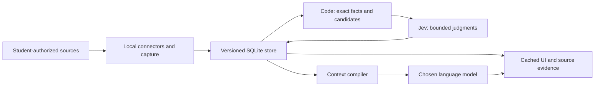

# Technical direction

## Sync resilience integration

The integrated sync resilience extension shares validated acquisition results across capture, inventory and freshness; resolves typed references through the existing document pipeline; and persists access observations independently of saved evidence. Learning keeps migration v8 and this extension uses v9. Product code is integrated into main; no packaged release is claimed. See the [canonical handoff](sync-resilience-review.md#implementation-handoff--september-26-2026) for the implemented interfaces and evidence.

## The app's backend

The course backend described in [course backend architecture](course-backend-architecture.md) is the app's backend: one local SQLite store (schema v13 on `main`) with passages, the course map, course spaces, notes and learning tables; passage retrieval; scoped queries; the job drain; the runner for the student's own AI client; prompt packs; and the learning engines. The current status of each part is in [How My Magic UW works](how-it-works.md); the developer view and the scorecard are in [academic data platform](academic-data-platform.md). The sections below are the earlier direction and remain as written.

Status: architecture direction with a working implementation foundation. Electron, a local SQLite worker, expanded Canvas/material connectors, background refresh, local MCP grants, privacy gates, and a narrow Jev gateway are implemented. See [implementation status](implementation-status.md) for capability and validation boundaries, and [development](development.md) to run them. The broader mechanisms below remain direction unless identified as implemented. Tool choices follow [engineering principles](engineering-principles.md).

## System shape

Jev is hosted. Any selected context sent to Jev or a hosted language model leaves the device. No school session or cookie should follow it. A truly local processing mode needs local alternatives or disabled hosted features.

## Access and fetching

Concrete current endpoints, paging, concurrency, throttling limitations, session tests, and proposed reconnect behavior are preserved in [pipeline details](pipeline-details.md). It also distinguishes announcements from activity coverage, Graph metadata paging, intended identity scrubbing, exact citation validation, and a testable link-threshold method. Read those boundaries before treating this architecture direction as implemented behavior.

Direction: use a legitimate student-authorized session where supported; otherwise a dedicated sign-in browser with NetID and student-completed Duo; an approved extension bridge is another candidate. Do not decrypt personal-browser cookies or evade idle expiry. One sign-in spanning all UW systems is an untested hypothesis.

Do not assume unattended debugging access to a personal profile. Chrome DevTools MCP's explicit, student-approved auto-connect is a candidate; it requires compatible Chrome and disabling usage/performance reporting. Use a separate profile for experiments, and keep Ben's current computer/Canvas testing headless. Embedded Electron browser compatibility with each UW flow must be tested separately. A successful Canvas login does not prove Outlook, PeopleSoft, or DARS access.

Connector ladder:

1. Official API or feed, with actually available authorization.
2. JSON used by the site, only where access and semantics are understood.
3. Rendered page and local document extraction/OCR.
4. Browser agent for otherwise inaccessible workflows.

Agents can discover a recipe; deterministic code should run and validate it. Keep known-good samples and schema checks. Quarantine changes until key fields match. On failure preserve the previous capture and report its age; never overwrite it with an empty login page. No live browser agent on the demonstration's critical path.

ICS plus a syllabus is a possible fallback with limited coverage, not an equivalent full integration. Outlook and degree audit should not become demo dependencies before access is demonstrated.

## Record contract: current and intended

`packages/contracts/src/index.ts` is the implemented API shared by the app, core, store, and connectors. It includes scoped capture batches, typed course/material/submission evidence, versioned resources, field observations, source health, deadline claims, change events, refresh settings, privacy preferences, MCP grants, links, jobs, judgments, practice attempts, and data receipts. The table below is the fuller intended evidence model. Per-field observation times and document page/slide references are implemented; literal source spans for every fact, authored timestamps for every claim, and resolution-rule versions remain incomplete; consult [implementation status](implementation-status.md) before relying on them.

| Record         | Required meaning                                                                                                                                                |
| -------------- | --------------------------------------------------------------------------------------------------------------------------------------------------------------- |
| Capture        | Source and source ID, course/section/term scope, observed time, source update time if known, content hash, version, extraction status, local evidence reference |
| Object         | Stable internal ID; assignment, material, class session, message, event, or course; fields tied to captures                                                     |
| Field evidence | Value, source location/quote, last observed time, unknown/absent distinction                                                                                    |
| Deadline claim | Due/lock/event kind, raw text, normalized value and zone, authored time if known, observed time, scope                                                          |
| Resolution     | Selected interpretation, competing claims, rule/version, unresolved conflict, separate planning date                                                            |
| Link           | Typed source/target, evidence and reason, method/model/question version, judgment distribution, user override/rejection                                         |
| Judgment       | Object content hash, question version, pinned model version, result, generation/version guard                                                                   |
| Source health  | Last attempt, last success, coverage, fresh/stale/blocked/partial/error status and recovery action                                                              |
| Student state  | Personal completion, verified submission evidence, opened resources, preferences, attempts and assistance                                                       |

Captures are versioned and normally append-only; deletions become markers. User-requested data deletion and retention controls must still be able to remove private data. A changed capture invalidates dependent judgments and summaries. Do not make an LLM brief the only place a factual field exists.

Assignment layers: raw source facts → code-derived facts → semantic judgments → student state. First useful fields: due-date evidence, points, submission state/location, kind, supporting links, and freshness. Effort can remain unknown until evidence supports a band.

## Deadline handling

Every source makes a claim. Structured fields are parsed by code; prose extraction must cite text that code can locate. Quote presence alone does not prove the date applies to this assignment, section, student, or term.

Proposed precedence: verified item-specific change → declared authoritative source → fresh structured fields → syllabus/schedule → supporting documents → item names. Check scope and freshness before applying precedence. Distinguish due time, lock time, class meeting, and personal extension.

Code performs timezone handling, year inference with explicit assumptions, and arithmetic. If conflict remains, show both claims. The earlier plausible date may be a conservative planning date; it is not established truth. Never merge records across courses because both are called P1.

Current resolver: accepts normalized claims, excludes lock/event claims and unconfirmed scopes, prioritizes supplied explicit-change claims, and otherwise preserves disagreements. The richer extraction and precedence rules above still need implementation. The Canvas connector supplies structured due/lock fields; it does not infer dates from prose.

## Jev and language models

Code constructs bounded candidates, Jev judges, code validates and applies policy, and a language model writes where needed. Cache by content hash, question version, and model version. Superseded responses cannot update current state.

Auto-link/confirm/no-link cut points are not established. Follow the [link evaluation procedure](pipeline-details.md#link-thresholds-a-testable-starting-method), including scoped candidates, review burden, held-out course families, correction bias, and sample limits. Do not repurpose the assignment-kind display threshold for entity matching.

- Choice for mutually exclusive candidates; include no match. For consequential matches, separately test whether any valid match exists.
- Multiple Nouls when several candidates can be true. Score for ordered judgments, not direct mastery probabilities.
- Tune task-specific thresholds on held-out examples. Do not multiply correlated outputs or interpret concentration as accuracy.
- Keep meaningful course/scope evidence alongside stable IDs. Named structured state is supported; prose is not universally superior.
- Use order permutations on ambiguous choices only if evaluation shows benefit.
- Dates, counts, schema mapping, and arithmetic stay in code. Model correctness judgments do not replace running tests.
- Retrieved content is untrusted. A high-confidence classifier is not an authorization boundary.
- Cache for first paint. Background judgment may improve suggestions. Missing cached routing needs a usable deterministic fallback.

Context compiler: select evidence for the task within an explicit budget, include policy and source health, preserve conflicting claims, and expose source references. Metadata relevance filtering should not discard a potentially important page solely because its title is vague.

The accepted launch direction is a $5 one-time app license plus the student’s paid AI plan/key, with intended Claude Code, Codex, paid-key Gemini CLI, and OpenRouter routes. Detect supported installed clients and invoke their authorized authentication/runtime paths; do not copy credentials or infer subscription access from a preference setting. Provider isolation, inference adapters, payment/license activation, and route-specific compatibility remain unimplemented or unverified. The existing local adapter remains in the foundation, while automatic local installation is no longer a launch requirement. A local stdio MCP server exposes permission-checked evidence; this alone does not establish a provider integration. See [the decision](decisions.md#pricing-and-ai-access-resolution--september-26) and [AI and privacy requirements](ai-and-privacy.md).

## Stack and remaining candidates

Implemented foundation: TypeScript monorepo; Electron + React desktop; Node 24 SQLite with full-text search. Shared packages separate contracts, domain rules, storage, connectors, application core, and AI adapters. The desktop main process brokers browser and OS capabilities; an isolated utility process owns the local store and background work. Desktop is first. The current website is informational with a GitHub link; downloads appear only when working release artifacts exist. iOS is later if time permits.

Expo, Next.js/Vercel, and a relay/sync service are candidates, not commitments. Phone relay must describe offline/asleep behavior and encryption boundaries. My Magic UW uses one team-owned, server-side Jev key for the Claude/Codex/Gemini routes, with authenticated access, request limits, and minimal logging. The accepted OpenRouter exception bills the student through their own OpenRouter key; that route is unimplemented. Keep student keys in protected local storage and out of context and logs.

Evaluate Playwright, browser-use/Stagehand, Crawlee, document parsers, and native OCR by actual need. License review includes exact versions, transitive dependencies, model weights, and bundled binaries. A limited JavaScript dependency check is recorded in [tool evaluation](tool-evaluation.md); a complete distribution/license audit remains unfinished. Working-Memory-Jev is ideas-only per project direction.

The local AI adapter uses llmfit recommendations and a compatible installed Ollama model with cloud disabled. Managed installation/downloads and model-quality evaluation remain open. The gateway implements only assignment-kind classification; the wider Jev applications described above are not hidden behind that endpoint. ChatGPT, Claude, and Gemini settings control previews and MCP sharing eligibility, not an embedded authenticated model connection.

Private scraping is local. For a clean-room context.dev-like component, use public behavioral documentation, not implementation code. Required behavior includes partial results, login detection, safe redirect handling, output-specific status, and change baselines.

## Unverified technical capabilities

Architecture choices also follow [reference-driven design](reference-driven-design.md): inspect VS Code, Notion, Drive, Arc, Codex, and Claude for specific boundaries or interactions, then test the smallest useful adaptation. Their success does not justify importing a plugin platform or general page builder without a student need. Conditional long-term scenarios test replaceability of sources/models without expanding the current build automatically.

The following need evidence before we describe them as supported: sign-in across UW systems, session expiry/recovery, provider subscription access, phone relay behavior, target-platform packaging, and reliable extraction across different course structures. These unknowns do not reopen the product thesis; they identify where the technical description remains provisional.

## Tool-selection policy

Compare new candidates against the actual task before adopting defaults. Check current versions, maintenance, licenses (including models and dependencies), telemetry, and benchmark provenance. Keep acquisition, extraction, structured interpretation, OCR, and change detection separate so they can be evaluated and replaced independently. See [engineering principles](engineering-principles.md) for acceptance and reversal criteria. User-suggested tools are candidates to test, not automatic dependencies.

## Implemented ingestion boundary

The [course-ingestion handoff](ingestion-upgrade.md) describes the current coordinator, expanded Canvas scopes, independent calendar feeds, public crawling, local document extraction, GitLab evidence, field observations/change events, and local MCP grants. These run in the existing worker/store architecture, with app-owned authentication confined to the native broker. Comments default to local collection with separate hosted sharing. Canvas viewing/must-view effects from reads are accepted and disclosed; explicit completion and other school-changing actions remain absent. Wider features above retain their stated proposal status.

## Planning implementation boundary

The [planning handoff](planning-upgrade.md) is the canonical map. SQLite schema 4 adds separate typed planning source/record/version tables. The native broker reads student identity locally, derives a keyed opaque account scope, checks it again before releasing normalized results, and binds Canvas only after matching institutional identities. No raw identity crosses into the stored account link. Fixed UW operations cover student summary, subjects/terms, enrollment, primary degree-plan history, saved DARS, public search, and selected-course packages; unsupported shapes stay partial or blocked.

The utility worker persists normalized captures and computes comparisons. Shared contracts carry course identity, source scope, provenance, completeness, freshness, and credit basis. The desktop `syncPlanning` bridge and core `planning-search` / `planning-sections` commands connect normal UI actions to bounded transport; normalized import remains available. Failed/partial captures preserve evidence. Purge/session clear cancels work, and generation guards discard late results.

`planning.reconciliation` compares exact course/term claims after fresh account binding. Canvas current/final grades and percentages remain independent from degree-plan history and program-specific DARS applications. Applied credits are not additional attempts. Planning cannot enter coursework context, Jev, tutoring context, or MCP. My UW is the primary surface; Home shows administrative alerts. Combined schedules, transcript ingestion, broader audit parsing, and language planning remain unfinished. App-owned sign-in is wired, but private headless developer reads do not establish production SSO or expiry behavior.

## Course intelligence compiler

Local captures now materialize versioned account/course profiles in SQLite schema 5, including structured grading/assessment facts and source-bound policy/topic passages. The ordinary `store.ingest` path performs deterministic compilation; desktop background work can optionally select additional semantic passages with the installed local model. It does not wait on or send data to hosted AI. The compiler preserves immutable evidence versions and dynamic source health separately, and the local tutor consumes the resulting effective policy. See [compiler contracts, reference transfers and limits](course-intelligence.md). This is not a grade predictor, exam blueprint, or complete syllabus interpreter.

## Learning session surface

The [canonical learning-session integration](learning-sessions.md) uses the existing learning `execute` channel, N25 router, Nate's deterministic grading/progression/session engines and N24 SQL adapter on the workspace connection. Typed projections expose saved rounds, drafts, actual checks and versioned evidence without answer keys. Revision-checked transactions write the session and any scored attempt together; undecided answers remain unscored history. The earlier parallel IPC, session service and direct Ollama activity pack are retired.

Storage-owned schema 8 aligns existing learning records with the engines: numeric units, selected option IDs, coverage decision authorship and scoped/pinned cards, including concept tracks without fake items. It preserves the canonical v6/v7 schemas and introduces no second course database. The worker constructs account/course context and rechecks eligibility, exact source versions, freshness and policy before prepared practice.

Practice consumes an existing checked pool and makes no student-model calls. Empty pools are unavailable. Explicit model-generated explanations belong to T42/shared packs and remain unconnected; this is not a demonstrated production tutor. See the session document for current operations, reference transfers, tests and remaining integration checks.
