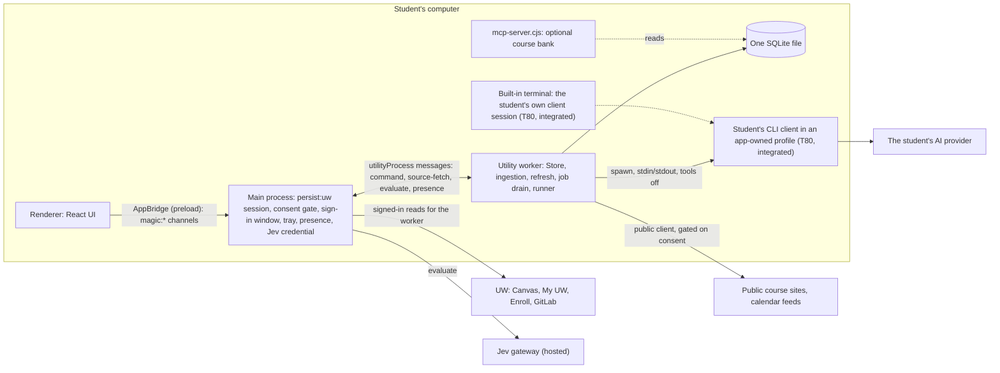

> **Archived September 27, 2026.** Superseded by [the architecture](../architecture.md), [the backend reference](../course-backend-architecture.md), [implementation status](../implementation-status.md) and [benchmarks](../benchmarks.md). This records the backend as of September 26 late (`feat/course-backend` at `33b1827`).

# Course backend: build record

**Branch:** `feat/course-backend` at `33b1827` (the same tree is in PR #6). **Status of this record:** factual, as of 2026-09-26 late. Where this record and [the architecture doc](../course-backend-architecture.md) differ on a current fact, this record wins; the architecture doc's own "Where we are" section is updated alongside it.

## 1. Summary

- The whole test suite passes **540/540** on this branch (Windows 11, Node 24.14.1), across 67 test files.
- Sign-in, session, "Keep me signed in", one-checkbox consent and the egress gate are **integrated and tested in the suite**, and a first live trial ran on the operator's own UW account (§6).
- The local database is rebuilt: schema v6 (course core) and v7 (learning and practice tables) are merged, with passages, contentless passage FTS, a one-transaction migration with backup, and a complete purge. MT1 was re-measured after the storage optimizations (T14) and every primary threshold was met (§5).
- Canvas sync and freshness (course space inventory, per-space access check, per-course content probe) are merged and tested; scoped queries (T15) replace full snapshots for the channels that use them.
- The AI runtime (`ModelRunner`, a warm session pool, pack core with grounded-quote checks and cache-by-hash) and the AI client manager (isolated Claude Code and Codex profiles, a built-in terminal, onboarding detection and screens) are merged and tested in the suite; not yet demonstrated end-to-end on a real pack run.
- The learning engines (knowledge model, FSRS, Learn and Write modes, session builder, calibration, insights, copy lint) are merged and tested; their study surfaces are not built yet.
- Course mapping, generation (quizzes, flashcards, guides from real content), the typed academic API, other sources (Outlook, feeds, Kaltura, Course Search), the data platform, and legal close are **not started**.
- A bug found live (the UW SSO relay through `sso.canvaslms.com` was blocked, showing a white screen after Duo) was fixed the same session (commit `eb2a033`).
- Nothing has been pushed to `main`; gate G0 (the team's release cleanup) holds.

## 2. Build timeline

The build ran piece by piece (P0–P14) and then as long-lived lanes once specified (`docs/plans/2026-09-26-course-backend/execution.md`). Lanes, in the order they landed on `feat/course-backend`:

| Lane / area | Tasks | Landed as | Status now |
|---|---|---|---|
| Test harness | T05a | `6199250` | integrated |
| Sign-in, session, consent | T05d, T05c, T06 | `e5430e0`, `d63a515`, `b7fb439`, `b67ab04`, `08af173`, `cb70b7a` | integrated; one live trial |
| Storage baseline | MT1 | `25cfefa` | integrated (harness) |
| AI runtime (`wave-a/T12`) | T12, D38 pool, T40, T13 core | `e65a8aa`, `838f6c7`, `4828224`, `e5ba635`, merge `efc6604` | integrated; tested in isolation |
| Learning engines (`wave-a/LRN`) | N00, N05–N12, N14, N29, P01, P05, P07, P08, P11, P13, P14, P16 | `535f70f` … `90e8f35`, merge `e161b13` | integrated |
| Data layer (`wave-a/T10`) | T11a, T10 (v6), T10L (v7), T11b, T14 | `55204ae`, `28b40dd`, `1acf88a`, `ebfb00d`, `f365af7`, merge `39bb062` | integrated |
| Seams and sync (`wave-a/T05b`) | T05b, D32 inventory, D41 access check, D37/T33 freshness | `e09ab8f`, `1bfb83e`, `a20b160`, merge `bb80f53` | integrated |
| Scoped queries | T15 | `ec2d61b` | integrated |
| Client manager (`wave-b/T80`) | T80 | `5415a0e`, `047ab6e`, merge `9a08a6b` | integrated |
| Onboarding screens (`wave-b/T81`) | T81 | `8204725`, merge `a826f41` | integrated |
| Live-trial fixes | sign-in redirect fix, trial log masking | `eb2a033`, `5740154`, `3a51df4` | integrated |

Reference: `docs/plans/2026-09-26-course-backend/execution.md` (units U0–U10, piece order P0–P14) and `tasks.md` (task lines, owns, checks). `git log --oneline origin/main..HEAD` on this branch shows 97 commits ahead of `origin/main` as of `33b1827`.

## 3. Full backend architecture layout

### 3.1 Package and module tree

| Package | Module | Responsibility |
|---|---|---|
| `contracts` | `index.ts` | the command schema, `Store` interface, shared zod schemas |
| | `course-core.ts` | schema v6/v7 row types and zod schemas at the store boundary |
| | `course-intelligence.ts` | local course-interpretation types (v5, kept from `main`) |
| | `planning.ts` | My UW planning types |
| `domain` | `index.ts` | pure domain logic over contracts types (consent, deadlines) |
| | `course-intelligence.ts` | course-intelligence hashing and views |
| | `planning.ts`, `planning-policy.ts` | planning identity resolution; reviewed public policy facts |
| `core` | `index.ts` | wires domain logic to the store (course policy, extraction hash) |
| | `access.ts` | course-inclusion checks at use time |
| | `drain.ts` | the job drain: leases only kinds with a registered handler |
| | `refresh.ts` | network scheduling, presence gating, per-course probes |
| | `egress.ts` | the consent/egress policy (T06): per-recipient consent, `maySend` |
| | `evidence.ts` | deadline-claim hashing and evidence normalization |
| | `queries.ts` | scoped queries (T15): summary, paged, single-resource, cursor |
| | `mcp.ts` | the in-process MCP handler surface |
| | `planning.ts` | planning refresh orchestration |
| | `academic-reconciliation.ts` | reconciles claims about one course attempt across sources |
| | `jobs/pack.ts` | `runPack` and `readPackArtifact`: the pack job wired to the runner, artifact store and ledger |
| `storage` | `index.ts` | the SQLite store: migrations, purge, base schema |
| | `course-core.ts` | schema v6 tables (course core), keyed to `sources(id)` |
| | `learning.ts` | schema v7 tables (learning and practice) |
| | `passages.ts` | stored passages and the contentless `passage_fts` |
| | `payload.ts` | compressed (raw-DEFLATE) resource-version payload storage |
| | `planning.ts` | planning tables (v4, from `main`) |
| `connectors` | `canvas.ts`, `canvas-http.ts`, `canvas-content.ts`, `canvas-models.ts`, `canvas-inventory.ts`, `canvas-selection.ts`, `canvas-fixture.ts` | the Canvas reader: pagination, expiry detection, space inventory, fixtures |
| | `documents.ts`, `external.ts`, `network.ts` | document downloads, external course sites, the shared HTTP client |
| | `gitlab.ts`, `calendar.ts`, `space-hosts.ts` | GitLab reader, ICS calendars, the host-to-kind table (D32) |
| | `uw-planning-*.ts` | My UW: audit, catalog, enrollment, history, HTTP boundary, profile, sync |
| | `planning-public.ts` | public Course Search & Enroll reads |
| `ai` | `index.ts`, `local.ts` | the local AI adapter (Ollama), context manifests |
| | `course-extraction.ts` | code-first course extraction with a local-AI fallback |
| `runner` | `runner.ts`, `types.ts` | `ModelRunner`: tiers, retry, escalation |
| | `claude.ts`, `codex.ts` | one-shot CLI adapters (`--json-schema` / `--output-schema`) |
| | `api.ts`, `local.ts` | API-key and local (Ollama) adapters |
| | `pool.ts` | D38 warm session pool: interactive, background and escalation lanes |
| | `process.ts`, `util.ts` | process spawning, environment allowlisting, budget/ledger helpers |
| `packs` (`packages/packs/core`) | `format.ts` | `definePack`, `buildPrompt`, `packCacheKey`, `quotesGrounded`, `createPackRuntime` |
| | `stores.ts` | `ArtifactStore` and `LedgerStore` (memory implementations); the `cache_hit` zero-token ledger row shape |
| `retrieval` | `split.ts` | passage splitter: exact character offsets |
| | `quotes.ts` | exact-quote validator |
| | `search.ts` | passage-search query shaping: OR + BM25, term coverage, not-found |
| | `porter.ts` | the Porter (1980) stemmer, for FTS5 vocabulary lookups |
| `learning` | see §7 (study features) | knowledge model, FSRS, grading, Learn/Write, session builder, insights |
| `agent-api` | — | package scaffold only; no source yet |
| `apps/desktop/src` | `main.ts` | Electron main: the `persist:uw` session, sign-in window, consent gate, tray, IPC |
| | `worker.ts` | the utility-process worker: Store, ingestion, refresh, drain, runner |
| | `ingestion.ts` | resource capture, hashing, and the ingest pipeline |
| | `local-service.ts` | the local-AI question/answer service |
| | `onboarding.ts` | client detection, engine choice, model probe (T40) |
| | `keep-signed-in.ts` | session state, expiry classification, "Keep me signed in" (T05c) |
| | `secrets.ts` | encrypted secret file read/write (`safeStorage`) |
| | `worker-clients.ts` | the worker's own gated public clients (crawl, documents, calendar, planning) |
| | `preload.ts` | the `AppBridge` / `ClientsBridge` contextBridge surface |
| | `clients/index.ts`, `clients/profiles.ts`, `clients/terminal-host.ts` | T80: client status, isolated profile directories, the PTY terminal host |
| | `mcp-server.ts` | the in-process MCP handler wiring (the standalone `mcp-server.cjs` is separate) |

### 3.2 Process model

Only main touches the UW session; the worker asks main for every signed-in read (`source-fetch`) and every Jev call (`evaluate`). T80's client manager runs the student's CLI in an app-owned profile directory (`CLAUDE_CONFIG_DIR`-style isolation), separate from the student's own `~/.claude`; this is verified (§5, client-manager rows), not just designed.

### 3.3 Data model

**Schema v4–v5 (from `main`, kept as is):** `sources`, `resources`, `resource_versions`, `observations`, `field_observations`, `resource_changes`, `completions`, `preferences`, `links`, `jobs`, `judgments`, `attempts`, `receipts`, `scope_baselines`, `course_overrides`, `sync_runs`, `mcp_grants`; `planning_sources`, `planning_captures`, `planning_records`, `planning_versions`; `course_intelligence`.

**Schema v6 (T10, this branch), the course core:** `passages`, `passage_fts` (FTS5, contentless-delete, keyed by passage rowid), `course_sessions`, `assessments`, `assessment_scope`, `map_links`, `life_items`, `course_spaces`, `extraction_recipes`, `course_briefs`, `material_facts`, `compile_runs`, `ledger`, `ui_events`. `jobs` gains a `subject` column; the drain leases only kinds with a registered consumer. `resource_search` (the old whole-document FTS5 table) is dropped.

**Schema v7 (T10L, this branch), learning and practice:** `learning_courses` (the anchor, `id = accountScope:courseId`), concepts and concept aliases, items and item tags, cards and reviews, attempts and disputes, artifacts, coverage, sessions, stars, option tags, and views — the tables the learning spec's §7.2 lists, amended by plan D17 (no passage or job methods in `LearningStore`; coverage keys to assessments).

Every new table is keyed to `sources(id) ON DELETE CASCADE`, directly or through `resources`; there is no separate `courses` table (a course is `sources.course_id`). Migration runs all pending steps inside one `BEGIN IMMEDIATE` after a `VACUUM INTO` backup copy (§5).

### 3.4 The job and drain model

Jobs carry a `subject` (added in v6). The drain (`packages/core/src/drain.ts`) leases only the kinds it has a registered handler for, so an unregistered kind is never leased, failed, or spun on; a run ends when nothing of its kinds is due, and the caller wakes it again on ingest or on a timer — there is no polling loop. The pack job (`runPack`, `packages/core/src/jobs/pack.ts`) is wired to this drain's kind registration, the `ModelRunner`, the `ArtifactStore` and the `LedgerStore`, but is not yet driven by a live worker path with real course content (tested in isolation, not integrated end to end).

### 3.5 The AI runtime path

1. **Detection (T40):** `apps/desktop/src/onboarding.ts` finds installed CLIs (`--version` only) and asks each for its own auth status; no credential file is read.
2. **Isolation (T80):** `clients/profiles.ts` gives each client an app-owned profile directory; `clients/terminal-host.ts` hosts a real PTY session where the student signs in through the provider's own flow, gated on consent and a same-window re-check right before spawn.
3. **Running a pack (T12/T13):** `ModelRunner` (`packages/runner/src/runner.ts`) picks a tier (pass first, escalate only on a failed check), builds a byte-stable prompt prefix (`buildPrompt`, O8), and calls the CLI one-shot or through the warm pool (D38, `pool.ts`).
4. **Checking the output (T13 core):** `quotesGrounded` verifies every quote against the exact passages given; a failing pack is retried, then escalated, never trusted un-checked.
5. **Caching (T13 core, `runPack`):** the cache key (`packCacheKey`) covers the pack, its system prompt, the input and the passages; a hit reads the stored `LearningArtifact` and writes a **zero-token** `cache_hit` ledger row instead of calling a model again.
6. **Study time:** `readPackArtifact` takes no `ModelRunner` argument — it can only read a stored artifact, so no code path in study lets the learning engines call a model.

### 3.6 The consent and egress path

One setup checkbox writes a `uw` consent record (plus `jev` and the chosen AI provider). Main's consent gate (`egress.ts`, wired into `main.ts`) refuses every network-reaching channel until the matching consent record exists; the worker's own public clients (`worker-clients.ts`: crawl, documents, calendar, planning) are gated the same way, not just main's channels. A newly shared sensitive category, or "always preview", holds a send as `preview_required` until the exact payload hash is acknowledged (`preview.ack`). Every send, allowed or blocked, produces a receipt.

## 4. Tests

67 files, 540 tests, 540 pass, 0 fail, 0 skipped. Counted by running each file individually (`node scripts/test-one.mjs tests/<file>.test.ts`), which matches the aggregate `pnpm test` run (`ℹ tests 540`, `ℹ pass 540`, `ℹ fail 0`).

| Test file | Area | Tests | Pass |
|---|---|---|---|
| `tests/harness.test.ts` | Test harness (T05a) | 8 | 8 |
| `tests/seams-p1.test.ts` | Session and consent seams (T05d) | 8 | 8 |
| `tests/session.test.ts` | Session state and Keep me signed in (T05c) | 16 | 16 |
| `tests/egress.test.ts` | Consent and egress gate (T06) | 13 | 13 |
| `tests/seams.test.ts` | Integration seams (T05b) | 8 | 8 |
| `tests/canvas.test.ts` | Canvas connector | 12 | 12 |
| `tests/canvas-history.test.ts` | Canvas connector: history | 11 | 11 |
| `tests/canvas-inventory.test.ts` | Canvas connector: space inventory (D32) | 8 | 8 |
| `tests/canvas-upgrade.test.ts` | Canvas connector: schema drift and upgrades | 10 | 10 |
| `tests/refresh.test.ts` | Refresh and freshness | 4 | 4 |
| `tests/refresh-course.test.ts` | Per-course freshness (D37/T33) | 4 | 4 |
| `tests/storage.test.ts` | Storage: base schema | 10 | 10 |
| `tests/storage-v6.test.ts` | Storage: schema v6 course core (T10) | 11 | 11 |
| `tests/storage-v7.test.ts` | Storage: schema v7 learning tables (T10L) | 3 | 3 |
| `tests/passages.test.ts` | Passages and quote validation (T11a) | 6 | 6 |
| `tests/quotes.test.ts` | Quote validator (T11a) | 8 | 8 |
| `tests/queries.test.ts` | Scoped queries (T15) | 3 | 3 |
| `tests/ingestion-runtime.test.ts` | Ingestion runtime | 6 | 6 |
| `tests/ingestion-storage.test.ts` | Ingestion storage | 8 | 8 |
| `tests/materials.test.ts` | Materials and content | 17 | 17 |
| `tests/core.test.ts` | Core package | 4 | 4 |
| `tests/domain.test.ts` | Domain package | 2 | 2 |
| `tests/academic-reconciliation.test.ts` | Academic reconciliation (core) | 5 | 5 |
| `tests/course-intelligence-adversarial.test.ts` | Course intelligence, adversarial inputs | 14 | 14 |
| `tests/course-extraction.test.ts` | AI course extraction (local adapter) | 6 | 6 |
| `tests/local-ai.test.ts` | Local AI adapter | 10 | 10 |
| `tests/local-integration.test.ts` | Local AI integration | 4 | 4 |
| `tests/runner.test.ts` | ModelRunner (T12) | 15 | 15 |
| `tests/session-pool.test.ts` | Warm session pool (D38) | 7 | 7 |
| `tests/packs.test.ts` | Pack core (T13) | 10 | 10 |
| `tests/gateway.test.ts` | Jev gateway | 24 | 24 |
| `tests/onboarding.test.ts` | Onboarding detection (T40) | 7 | 7 |
| `tests/onboarding-ui.test.ts` | Onboarding screens (T81) | 7 | 7 |
| `tests/clients.test.ts` | AI client manager (T80) | 8 | 8 |
| `tests/mcp.test.ts` | MCP server | 9 | 9 |
| `tests/secrets.test.ts` | Secrets storage | 1 | 1 |
| `tests/learning-config.test.ts` | Learning: knowledge-model config (N00) | 5 | 5 |
| `tests/learning-concepts.test.ts` | Learning: concept map (N05) | 5 | 5 |
| `tests/learning-items.test.ts` | Learning: checked-item pipeline (N06) | 9 | 9 |
| `tests/learning-knowledge.test.ts` | Learning: knowledge model (N07) | 13 | 13 |
| `tests/learning-grade.test.ts` | Learning: grading (N08) | 7 | 7 |
| `tests/learning-learn.test.ts` | Learning: Learn rounds and mistakes (N09) | 8 | 8 |
| `tests/learning-session.test.ts` | Learning: session builder and priority (N10) | 6 | 6 |
| `tests/learning-store.test.ts` | Learning: store interface (N11) | 9 | 9 |
| `tests/learning-fsrs.test.ts` | Learning: FSRS adapter (N14) | 5 | 5 |
| `tests/learning-artifacts.test.ts` | Learning: guide artifacts (N12) | 4 | 4 |
| `tests/learning-smoke-cases.test.ts` | Learning: frozen smoke cases (N29) | 5 | 5 |
| `tests/practice-store.test.ts` | Practice: store interface (P01) | 3 | 3 |
| `tests/practice-cards.test.ts` | Practice: cards (P01) | 5 | 5 |
| `tests/practice-quick.test.ts` | Practice: quick sessions (P05) | 3 | 3 |
| `tests/practice-write.test.ts` | Practice: Write mode (P08) | 3 | 3 |
| `tests/practice-own-cards.test.ts` | Practice: student's own cards (P11) | 5 | 5 |
| `tests/insights-errors.test.ts` | Learning insights: error patterns (P12) | 4 | 4 |
| `tests/insights-coverage.test.ts` | Learning insights: coverage map (P13) | 5 | 5 |
| `tests/insights-calibration.test.ts` | Learning insights: calibration (P14) | 4 | 4 |
| `tests/copy-lint.test.ts` | Learning copy lint (P16) | 5 | 5 |
| `tests/planning-core.test.ts` | Planning (My UW): core | 16 | 16 |
| `tests/planning-domain.test.ts` | Planning (My UW): domain | 18 | 18 |
| `tests/planning-public.test.ts` | Planning (My UW): public search | 7 | 7 |
| `tests/planning-storage.test.ts` | Planning (My UW): storage | 9 | 9 |
| `tests/uw-planning-audit.test.ts` | UW planning: audit | 8 | 8 |
| `tests/uw-planning-catalog.test.ts` | UW planning: catalog | 11 | 11 |
| `tests/uw-planning-enrollment.test.ts` | UW planning: enrollment | 15 | 15 |
| `tests/uw-planning-history.test.ts` | UW planning: history | 6 | 6 |
| `tests/uw-planning-http.test.ts` | UW planning: HTTP boundary | 15 | 15 |
| `tests/uw-planning-profile.test.ts` | UW planning: profile | 9 | 9 |
| `tests/uw-planning-sync.test.ts` | UW planning: sync | 6 | 6 |
| **Total** | | **540** | **540** |

**Run them:**
- Whole suite: `pnpm test` (`tsx --test tests/*.test.ts`).
- One file: `node scripts/test-one.mjs tests/<file>.test.ts`.
- Type check: `pnpm check`.

## 5. Scores and measurements

### 5.1 Storage lane (T10/T11/T14), MT1 at 5,000 synthetic resources, before → after

| Metric | Before → after | Threshold | Status |
|---|---|---|---|
| Ingest | 78 → 1,431 res/s | ≥750 | met |
| Size | 15.6 → 10.3 MB per 1,000 | ≤11 MB | met |
| Search p50/p95 | 56.0/197.4 → 3.3/4.8 ms | ≤5/15 ms | met |
| `searchPassages` p50/p95 | 3.4/5.5 ms | — | measured |
| Migration v5→v7 with backup | 1.60 s, 0 rows lost | ≤2 s | met |
| Purge | 8.7 s → 0.48 s, 0 rows left | ≤1 s | met |
| Question recall@5 | 0.0 → 1.00 on 52 planted questions | ≥0.90 | met |
| Correct "not found" | 0.96 on 26 | ≥0.80 | met |
| Zero-change re-sync growth | +1.48% | ≤1% | **missed** (secondary) |
| Ingest slope (last batch vs first) | 2.97× | ≤2× | **missed** (secondary) |

**Caveats:** synthetic text compresses about 2.6×; the planted questions were written by the builder, not independently.

### 5.2 Seams lane freshness (5 synthetic courses)

- A hot 5-minute tick costs 2 requests (1.0–1.7% of a full sync).
- A tick with the content probe costs 18 requests (8.7–15.3%).
- The 15-minute average is 3.5–6.2%.
- A new undated file was detected within 15 minutes, and only that course was re-read (16 requests).

### 5.3 Scoped queries at 5,000 resources

| Response | Size |
|---|---|
| Full snapshot | 30.6 MB |
| Summary query | 17.5 KB |
| 50-row course page | 78 KB |
| One resource | 2.5 KB |

### 5.4 SQLite spike (P2 review, synthetic data, single runs)

- OR + BM25 found 10/10 planted answers; prefix-AND found 0/10.
- Batched transactions ran about 227k rows/s.
- Per-row transactions ran 869 rows/s at `synchronous=FULL` and 32k at `NORMAL`.
- `VACUUM INTO` took 169 ms at 41 MB and 803 ms at 206 MB.

### 5.5 Warm CLI sessions (plan D38)

A fresh `claude -p` took 5.8–7.4 s; follow-ups in a warm session took 1.7–2.2 s; fixed tokens fell from 11.3k to 2.8k. **Not yet validated** against idle memory, history growth or Codex caching (spikes S1–S10 in the plan) — the pool is tested in isolation, not the accepted default.

### 5.6 Client manager (T80)

- The real `~/.claude`, `~/.claude.json` and `~/.codex` were left untouched: verified.
- An isolated Claude Code profile reports "Not logged in".
- `CODEX_HOME` isolation was verified on Codex 0.156.1 and 0.144.1.
- `node-pty` 1.1.0 loads in Electron 44.4.5 on Windows without build tools.
- The reviewer's seven findings on this lane are fixed.

### 5.7 Onboarding (T81)

20 Tab stops, all with visible focus. No serious or critical axe findings. No horizontal overflow at 720 px.

### 5.8 Learning lane

113 new tests (learning, practice and insights combined; see §4 for the per-file breakdown). The copy lint (`tests/copy-lint.test.ts`) is clean. The eval freeze verify (`tsx evals/freeze.ts --verify <dir>`) exits 0.

## 6. Live trial results

**2026-09-26, the operator's own account.** Counts and timings only; no course content.

- **Sign-in timeline (Central time):** UW login 22:48:03, Duo 22:48:13, the relay to canvas.wisc.edu 22:48:16, profile confirmed (200 JSON) and window closed 22:48:20 — 16.5 s including typing; the app's own confirmation takes under 1 s.
- **Duo "Remember me"** survived a full quit and relaunch; Duo was skipped on the next sign-in.
- **Bug found and fixed live:** after Duo, UW's IdP returns through `sso.canvaslms.com/delegated_auth_pass_through`. The sign-in guard blocked it, leaving a white screen; fixed by allowing that exact host (commit `eb2a033`).
- **First Canvas read:** 125 requests in 65 s, 3.3 MB. 120 × 200 and 5 × 404; the 404s are hidden Pages lists, correctly marked inaccessible rather than signed out.
- **Scope:** 6 current courses read in depth, out of 37 course records.
- **After background refreshes:** about 760 materials, 306 assignments, 126 messages and 35 course records. Sources: 227 ok, 12 inaccessible, 12 partial. Zero AI or Jev requests.
- **Found inefficiencies (a fix is in progress, not yet re-measured):**
  - reads are serial, with pacing, at about 0.5 s per request
  - 54 of the 125 requests are per-module item reads, which `include[]=items` would avoid
  - sign-in triggers two syncs, which duplicates about 10 requests

  The target is a first full sync in ≤10 s; not yet met.

No agent typed a credential or approved Duo; every check ran headless and read-only, with no submit, enrol, post or quiz attempt.

## 7. Retrieval: efficiency and cost versus the original architecture

| What | `main`'s original design | Ours now | Measured result | Source |
|---|---|---|---|---|
| **Search model** | Whole-document FTS5, every query term prefix-matched and AND-joined, no `LIMIT`, each hit re-read with its full field history | Passages with exact offsets; contentless-delete FTS5 keyed by passage rowid; questions run as OR + BM25 with `LIMIT` ≤20; "not found" when the top hit covers under half the query's content terms | Recall@5 went from 0/10 (spike) to 10/10 (spike), then to 1.00 on 52 planted questions with correct "not found" 0.96 on MT1; search p50/p95 went from 56.0/197.4 to 3.3/4.8 ms | §5.1, §5.4; `packages/retrieval/src/search.ts`, `packages/storage/src/passages.ts` |
| **Stored text** | Every body stored twice: once in `resource_versions`, once as the FTS table's own content | One copy; excerpts cut by offset from the resource version; new payloads are raw-DEFLATE compressed | Database size fell from 15.6 to 10.3 MB per 1,000 resources at 5,000 (met the ≤11 MB target) | §5.1; `packages/storage/src/payload.ts`, `passages.ts` |
| **Ingest** | An FTS delete looked up the old row by an unindexed column, scanning the whole table (about 88% of ingest time at 5,000) | FTS rows addressed by rowid | Ingest went from 78 to 1,431 resources/s at 5,000 (met the ≥750 target, a >18× change) | §5.1, §5.4 |
| **IPC payload** | Every command returned the full snapshot (30.6 MB at 5,000) | Scoped queries: a summary, a paged course view, one resource, and a change cursor, over a read-only channel; full snapshot kept only for debugging | Summary 17.5 KB; a 50-row page 78 KB; one resource 2.5 KB | §5.3; `packages/core/src/queries.ts`, task T15 |
| **Sync** | Any account-wide change triggered a full read of every course | A per-course content probe on a cadence and on focus; only courses that moved are warm-read | A hot tick costs 1.0–1.7% of a full sync; a tick with the content probe costs 8.7–15.3%; the 15-minute average is 3.5–6.2% (all synthetic, 5 courses). Live: first sync took 65 s for 125 requests; the ≤10 s target is not yet met | §5.2, §6; task D37/T33 |
| **The MCP / model context** | Spec §1b records main's search context at a worst case of about 40k tokens for a broad question | Capped, typed query handlers (T15) plus the compressed summary tier (D46, proposed, not built) | **Targeted, not yet measured**: the summary tier that would bound context size isn't built | `docs/plans/2026-09-26-course-backend/plan.md` (D46; spec B7) |

**AI cost structure** (plan D35, D36, D38, D46; spec §2 "AI writes, code decides"):

- **One checked call per task.** `ModelRunner` makes a single one-shot or pooled call per pack request; `quotesGrounded` checks the output before it's trusted. *Built and tested in isolation.*
- **A byte-stable course prefix, so the provider's own cache can hit.** `buildPrompt`'s O8 byte-stable prefix keeps the system prompt and course frame identical across calls for the same course. *Built; provider-side cache-hit rate not measured (that's the provider's infrastructure, outside this codebase).*
- **Results cached by content hash, so a repeat costs 0 tokens.** Enforced in `runPack` (`packages/core/src/jobs/pack.ts`): a `packCacheKey` hit reads the stored `LearningArtifact` and writes a `cache_hit` ledger row with no model call. `readPackArtifact` reads an artifact without a `ModelRunner` argument at all, so a study-time read structurally cannot invoke a model. *Built and tested (`tests/packs.test.ts`); not yet exercised with a real, non-synthetic pack.*
- **A warm session cuts fixed tokens and latency.** Measured on this laptop: fixed tokens fell from 11.3k to 2.8k; a new `claude -p` took 5.8–7.4 s vs 1.7–2.2 s for a warm follow-up (§5.5). *Measured, but not yet the accepted default — spikes S1–S10 gate that.*
- **Study costs 0 tokens.** The learning engines (`packages/learning/src`) are pure code with no runner dependency; `readPackArtifact`'s missing `ModelRunner` argument is the structural enforcement, not just a convention. *Built and tested (§4, learning/practice test files); no study UI exists yet to demonstrate this end to end.*
- **The cheaper model tier runs first, escalating only on a failed check.** `ModelRunner`'s tier order (`packages/runner/src/types.ts`, spec E3) tries the pass tier everywhere and escalates to a stronger tier only on a failed check or an explicit ask. *Built and tested (`tests/runner.test.ts`); not yet run against real content, so no real escalation rate exists.*

No per-semester dollar figure is claimed here; the business-model numbers ($5 lifetime, the student's own AI plan) are a pricing decision, not a measured cost (see H1 in §9).

## 8. Study features built: quizzes and flashcards

Every item below is **built and tested in isolation, merged into `feat/course-backend` at `33b1827` (the whole suite passes with it in), but not wired into a study UI screen yet** — there is no rendered quiz, flashcard deck or Learn round in the running app today.

| Feature | What it does | Test file |
|---|---|---|
| **FSRS scheduling** (`fsrs.ts`) | The FSRS adapter (`ts-fsrs` 5.4.2, 90% request retention): review, undo by log, retrievability, and a pre-exam review mode that front-loads cards before a dated assessment | `tests/learning-fsrs.test.ts` (5/5) |
| **Knowledge states** (`knowledge/elo.ts`, `events.ts`, `rules.ts`, `state.ts`) | An Elo-style update from an evidence filter (only unassisted, undisputed, non-quarantined, first-in-session answers move the estimate); six "Iffy" rules (R1–R6), each returning a reason and a concrete clearing condition; the student-facing view carries no percentage, probability or ability value | `tests/learning-knowledge.test.ts` (13/13) |
| **Grading** (`grade.ts`) | Multiple-choice and numeric answers graded exactly (numeric within tolerance); typed answers matched against a key-idea checklist with listed synonyms; an idea code can't decide is left `undecided` rather than guessed, and the attempt isn't scored until a human or model settlement hook (both exist, neither is wired — awaiting the T02 sign-off) | `tests/learning-grade.test.ts` (7/7) |
| **Learn rounds and the mistakes queue** (`learn.ts`, `mistakes.ts`) | Rounds of up to 7 item families (5/7/10, student's choice); each family runs multiple-choice then, after one right answer, a typed form; a miss drops a stage and the family returns after ≥2 others; every missed item enters the mistakes queue, confident misses first, nothing retires, a flagged item leaves at once | `tests/learning-learn.test.ts` (8/8) |
| **Session building and priority** (`session.ts`, `priority.ts`) | Blocks fill in order (R4 items ≤3 → due mistakes → due cards → Learn on the highest-priority concept) until minutes run out; priority combines need, rule strength and exam urgency (spec §5.7); a plan never exceeds its minutes by more than one item; with no evidence, it's a labelled ≤8-item diagnostic | `tests/learning-session.test.ts` (6/6) |
| **The item pipeline with flaw checks** (`items.ts`, `flaws.ts`, `labels.ts`) | Staged checks (schema, cue-flaw rules, near-duplicates, a safe arithmetic evaluator for computed answers) run in order; a failed stage drops the item with its stage and reason logged; labels never claim "verified" or "correct," only what specifically was checked | `tests/learning-items.test.ts` (9/9) |
| **Practice** (`practice/cards-ui-logic.ts`, `write.ts`, `quick.ts`, `stars.ts`, `own-cards.ts`, `store.ts`) | Flashcard shuffle and front/back swap (same FSRS card, not a new one); Write mode (typed recall, found/missing key ideas, a non-flipping "I was right" contest that only excludes an attempt); quick sessions sized to 3/5/10 minutes from existing pools; stars as a private mark separate from Flag; a student's own edited card as a new item version, keeping evidence on the version it was earned on | `tests/practice-cards.test.ts` (5/5), `practice-write.test.ts` (3/3), `practice-quick.test.ts` (3/3), `practice-store.test.ts` (3/3), `practice-own-cards.test.ts` (5/5) |
| **Insights** (`insights/calibration.ts`, `coverage-map.ts`, `errors.ts`, `changes.ts`, `history.ts`, `anchors.ts`, `option-tags.ts`) | Calibration (confidence vs. accuracy, counts only, nothing shown before 10 rated answers); a per-assessment coverage map (practiced / studied / untouched / not-captured); frequent distractors and confusable pairs, each with a "why it's tempting" line and a source anchor; what changed since last week, replayed from stored evidence; session history without time-on-task totals | `tests/insights-calibration.test.ts` (4/4), `insights-coverage.test.ts` (5/5), `insights-errors.test.ts` (4/4) |
| **The copy lint** (`scripts/copy-lint.ts`) | Scans source and rendered JSON for urgency, guilt, XP, streak, league and readiness copy patterns and fails the build if one appears | `tests/copy-lint.test.ts` (5/5) |
| **The eval freeze** (`evals/freeze.ts`) | Hashes (SHA-256, LF-normalized) every frozen case file in a directory; `--verify` exits non-zero on any changed, missing or extra file, so a benchmark case can't silently drift | run via `tsx evals/freeze.ts --verify <dir>`, exits 0 on this branch's frozen learning smoke cases (`tests/learning-smoke-cases.test.ts`, 5/5) |

## 9. Where the features come from

| Our feature | Reference product mechanism | Source | What we kept | What we changed and why |
|---|---|---|---|---|
| Grounded chat/quotes with citations | NotebookLM: grounded chat with citations as direct quotes from sources | support.google.com/notebooklm/answer/14276569 | The idea of quoting the source directly rather than paraphrasing | NotebookLM's own citations "aren't independently checked" (per our research note); ours are checked by code against the exact passage version (`quotesGrounded`, `packages/retrieval/src/quotes.ts`) — a stronger guarantee, not a cosmetic difference |
| Flashcards and quizzes with progress tracking | NotebookLM: flashcards and quizzes with progress tracking | support.google.com/notebooklm/answer/16958963 | Flashcards and quizzes as a generated study surface | Progress here is evidence-defined concept states (Iffy/Getting there/Not seen), never a raw percentage or invented mastery score (D21, H8) |
| Reports, mind maps, audio/video overviews, slide decks, infographics | NotebookLM Studio outputs | competitive-comparison.md, citing support.google.com/notebooklm | The idea of a family of generated study artifacts from one source set | Ours are versioned prompt packs scoped to what's cited as exam-relevant, not general-purpose reports; audio/video overviews are not built |
| Free-tier quotas as a cost model to react to | NotebookLM: free-tier daily quotas (sources, chats, quizzes, flashcard sets, audio) | support.google.com/notebooklm/answer/16213268, "Starting on September 2, 2026 …" | Recognizing that per-day quotas throttle a study session at the worst time | We charge $5 once and route generation through the student's own AI plan, so there's no app-side daily cap; the student's own provider limits still apply |
| Adaptive Learn mode | Quizlet Learn: adaptive round sequencing | help.quizlet.com article 360030841732 | The adaptive, miss-drops-a-stage round structure | Ours (`learn.ts`) is free at any tier and ties into our own knowledge model instead of Quizlet's; no paywall gates it |
| Progress tracking across activities | Quizlet: Progress tracks answers across activities, Plus/Unlimited only, not in games | help.quizlet.com article 360048803491 | Tracking answers across study modes, not per-mode in isolation | We never gamify it (no games, no XP) and it's free; state is per-concept evidence, not an aggregate score |
| Test mode | Quizlet: Test is Plus only | quizlet.com/features/test | The idea of a sectioned assessment-style test | Ours are "sectioned by chapters and modules" quizzes tied to real course assessments and their scope, not a generic test bank, and free |
| (Rejected) a chat companion | Quizlet's Q-Chat, turned off after June 30, 2025 | help.quizlet.com | — | We didn't build a general chat companion for this study surface; our chat (proposed, not built) is retrieval the app runs itself, never an agent with tools |
| (Rejected) answer streaks | Quizlet: answer streaks | quizlet.com/features | — | No streaks anywhere in the learning engines (D20); confirmed by the copy lint |
| FSRS at 90% desired retention | Anki: FSRS with a default desired retention of 90% | docs.ankiweb.net/deck-options | The FSRS algorithm and its 90% default, plus a pre-exam review mode Anki doesn't have | We add exam-date awareness (front-loading review before a dated assessment), which Anki's generic scheduler doesn't do |
| Statistics (retention, stability, difficulty, retrievability) | Anki: true retention, stability, difficulty, retrievability stats | docs.ankiweb.net/stats.html | Per-concept retrievability as an internal signal | We never surface these as raw stats to the student; they stay internal to the priority function and the Iffy rules (KM-6: no ability value or probability shown) |
| Free unlimited Learn/matching/spaced repetition/practice tests | Knowt: free, unlimited across modes | knowt.com | The "no caps on the free tier" posture | We fund the free posture with a one-time $5 charge plus the student's own AI plan, rather than ad-supported or fully free; sourcing is automatic from Canvas instead of manual entry |
| **What we changed, independent of any one reference** | — | plan D20, D21, spec §5.9, H8 | — | Topics shown on every question; quizzes sectioned by module; no streaks, XP, freezes or leagues; evidence-defined level bars and a mastery bar that is never a grade prediction; sources arrive automatically from Canvas, grounded to verified exam scopes; study runs at 0 model tokens; generation runs on the student's own AI plan, not a daily quota |

## 10. What's not done yet

| Item | Status |
|---|---|
| T20/T20b Jev item cards and gateway endpoints | proposed |
| T21/T22 course pass and mapping | proposed |
| Generation: T57 analyzers, T58 planner, T64 verifiers, T45/T53/T41/T44/T42/T48/T52 | proposed |
| T50a typed academic API | proposed |
| Other sources: T34 (teachers/TAs), T30/T35 (Outlook), T36 (calendar gap-fill), T31 (Course Search live wiring), T32 (Kaltura) | researched and proposed; probes E1, K1 not run |
| Study surfaces: T54 (levels/mastery display), T47 ("Quiz me on"), T59 (notes), T43 (notebook UI), P17 (journey) | proposed (engines built) |
| The data platform (T50b, course bank, scoped tokens) | proposed |
| Workspace/command bar (T27), dictation (T71) | proposed (open: H7) |
| Signed installers, licence activation (T62, T63) | not started |
| Legal close (T60, T61) | not started |
| MT2, MT7a/MT7b public benchmark comparisons | not started |
| The pack job driven by real (non-synthetic) course content end to end | built and tested in isolation; not integrated with a live sync |
| Canvas sync efficiency fix (`include[]=items`, parallel pacing, single sync on sign-in) | found live (§6); fix in progress, not yet re-measured |

## 11. Open decisions

The canonical, updated list of open human calls (H1–H8) is [plan §9](../plans/2026-09-26-course-backend/plan.md#9-open-human-calls). Nothing in this record settles any of them; where a section above depends on one (the subscription CLI route, H5; the mastery-bar wording, H8), that dependency is noted inline.
