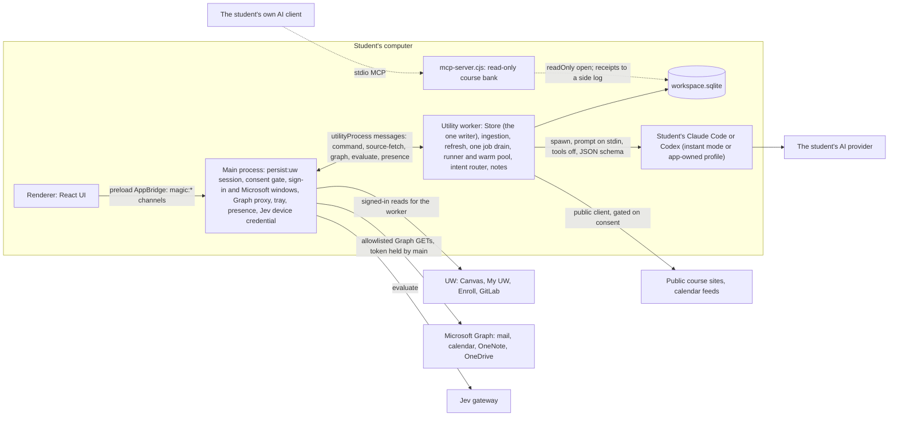
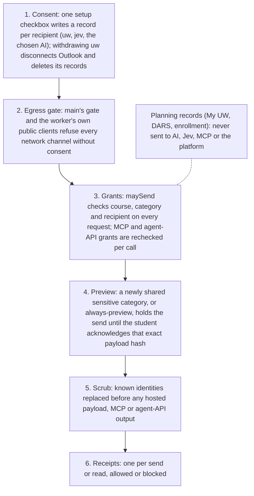

# My Magic UW course backend: architecture

**Status:** verified against `origin/main` at `699e386` (2026-09-27) and the open pull requests on `benverhaalen/magic-uw` (#1, #3, #4, #5, #25, #27, #31; #33 merged after this check and changes only notifications).
**Scope:** this document holds the technical facts: processes, data flow, storage, the agent runtime, privacy, jobs, freshness, and what each design choice measurably changed. The platform, open-source and business view is [the academic data platform](academic-data-platform.md). Product surfaces are in [the product direction](magic-canvas-direction.md). The build specification is [the course-backend plan folder](plans/2026-09-26-course-backend/) ([spec](plans/2026-09-26-course-backend/spec.md), [plan](plans/2026-09-26-course-backend/plan.md), [tasks](plans/2026-09-26-course-backend/tasks.md), [execution](plans/2026-09-26-course-backend/execution.md)); where this summary and the plan folder differ, the plan folder wins. Benchmarks are consolidated in [benchmarks](benchmarks.md); the per-lane test and measurement record is [the build record](course-backend-build-record.md).

## 1. Summary

The course backend is the local system behind every My Magic UW feature. After one UW sign-in it:
1. **connects** to every source the student's own sign-in can already read (Canvas, UW Outlook and Microsoft 365, course sites, GitLab, calendar feeds, My UW planning);
2. **stores** that material in one SQLite file on the student's computer, as versioned resources and passages with exact character offsets;
3. **maps** each course by code: material roles, dates, terms, formulas, assessments covered, and a reference graph from each assignment to what it needs;
4. **generates** study material through versioned prompt packs, one checked call on the student's own AI client;
5. **runs study** (quizzes, flashcards, Learn rounds, topic states, analytics) at zero model tokens.

**The principle: AI writes, code decides** ([spec §2](plans/2026-09-26-course-backend/spec.md)). Code does whatever has one right answer: dates, IDs, permissions, budgets, quotes. Jev makes small typed judgments. The student's AI is called once, with tools off, only where language has to be read or written, and code checks every quote, number, date and ID it returns.

### 1.1 Status labels

This document and [the platform document](academic-data-platform.md) use these labels, and only these:

| Label | Meaning |
|---|---|
| researched | evidence gathered; no specification or code |
| proposed | specified in the plan folder or a decision; no code on `main` |
| built | code exists on a branch or an open pull request, not merged into `main` |
| tested in isolation | on `main` with passing tests, but no screen in the running app reaches it |
| integrated | on `main`, and reachable from a screen of the running app (including the labelled *Workspace tools* preview tabs, #30) |
| demonstrated | shown working on a real student account; the evidence is named |

"Demonstrated" always names its evidence, and the live evidence so far is the operator's own account, reported as aggregates only.

## 2. Where we are

*Every row was checked against the code at `699e386` and the pull-request list. Test counts per PR are from each PR's own description. Rows for privacy (#25), the agenda (#27), the course pass (#45) and "Remember my sign-in" (#40) were updated when the September 27 integration branch merged them; their labels hold once that branch is on `main`.*

| Area | Status | Evidence |
|---|---|---|
| UW sign-in, session state, "Keep me signed in" | **demonstrated** | live trial 2026-09-26: sign-in to confirmed in 16.5 s including typing; Duo "Remember me" survived a quit and relaunch (#6). Typed sign-in outcome (#29) |
| One-checkbox consent and the egress gate | **demonstrated** | 0 requests before the checkbox, in a spy test and in the live trial (#6) |
| Canvas sync: inventory, access state per course space, bounded concurrent scheduler | **demonstrated** (first read); T17 speed-up **integrated** | first live read of 6 courses: 125 requests, 65 s (#6). The T17 scheduler cut a 5-course replay from 115 to 65 requests and 5.7 s to 2.1 s (#8); a live re-measure after T17 is not recorded |
| Per-course freshness (hot tick, content probe, warm reads) | **integrated** | synthetic: a hot tick costs 1–1.7% of a full sync; an undated new file found within 15 min ([build record §5.2](course-backend-build-record.md)) |
| File acquisition and extraction (session downloads, OCR) | **integrated** | synthetic 300-file course: files with text 0/300 → 285/300 (#22). Not yet run live on UW Canvas |
| Storage, schema v13 | **integrated** | migrations run on open with a `VACUUM INTO` backup; purge ≈0.35 s at 5,000 resources (#19) |
| Passages and contentless FTS search | **integrated** | search p50/p95 56/197 → 3.3/4.8 ms at 5,000 (MT1, synthetic) |
| Material pipeline: passages, links, `compile.course`, `material_facts`, references, agenda (schema v9–v10) | **demonstrated** | on the operator's 6 live courses: 1,254 jobs in 12.8 s with 0 failures; 96.4% of 673 materials categorised; references recall 100% of 175 body links; agenda vs Canvas's own to-do: 0 missing, 0 duplicates (#13) |
| One job drain | **integrated** | `tests/one-drain.test.ts`: a save during a sync leases nothing until the sync ends (#23) |
| Outlook and Microsoft 365 through the app's own Microsoft sign-in | **integrated**; not demonstrated | tested against fakes; the E1 run against Microsoft and UW's tenant is pending ([Outlook setup](outlook-setup.md)) |
| Agent runtime: runner, warm pool, instant mode, client health | **integrated** | pool wired for Claude generation and the intent router (#14, #24); instant mode cut Claude Code's input from 3,021 to 1,298 tokens and Codex's from 21,424 to 6,373 (#29) |
| Generation: quiz and flashcard packs, study guides | **integrated**; a real-content model run is not recorded | #9, #10; "Live model run pending a signed-in client profile" (#10) |
| Learning engines and study session (FSRS, knowledge states, Learn, Write, sectioned quizzes) | **integrated** | `LearningPanel` calls `study.*` and `notebook.ask`; practice ops on the learning router (#9) |
| Practice analytics | **integrated** | 0 tokens; live check found 0 of 233 current assignments reaching a topic yet (#11) |
| Lecture notes (schema v11) | **integrated** | scaffolds at 0 tokens; Word and Google Docs sync not run live (#16) |
| Intent router and grounded ask | **tested in isolation** (wired in the worker; no screen calls it) | code path 25/40 real commands, all 25 correct, on a read-only copy of the operator's workspace (#24) |
| Agent API v1 (`@magic/agent-api`) | **tested in isolation** | `tests/fix-platform-agent-api.test.ts` (#19); the MCP course bank shares its session code |
| Read-only MCP course bank | **integrated** | exported from Data & AI; the reader opens the database read-only; search p50 6.3 s → ≈0.28 s at 5,000 (#19) |
| Jev gateway (`apps/gateway`) | **tested in isolation** | its README says "Not deployed"; judgments 100 → 50 Jev calls on a synthetic 100-assignment course by deciding quiz and discussion items in code (#14) |
| Privacy protection across every egress path; encryption at rest (schema v14) | **integrated** (#25, via the September 27 integration) | teaching characters changed 0 of 696,516; personal canaries leaked 0/14 (PR description) |
| Critical-action agenda | **integrated** (#27, via the September 27 integration) | Workspace tools, Agenda tab |
| Course brief (`course_briefs`) and the course pass (T21, T22) | **integrated** (#45, via the September 27 integration) | the `course.facts` drain job writes the brief through the student's own client, with a local fallback; packs, guides and the grounded ask open with it |
| Versioned SQL views, `@magic/sdk`, write path (D42) | **proposed** | [plan D42](plans/2026-09-26-course-backend/plan.md) |
| "Remember my sign-in" (D39) | **integrated** (#40, via the September 27 integration), tested with fakes; not live-trialled; open H2 | `tests/remember-signin.test.ts` |
| Dictation (D43) | **proposed** | |

**Gates:** T02 (the operator signs off the AI boundary) is still open, and G0 (nothing pushed before the team's release cleanup) governs this workspace's branches. The open human calls are in §12.

## 3. Process model



- **Only main touches credentials and sessions.** The worker asks main for every signed-in read (`source-fetch`), every Graph request (main checks the URL against an allowlist and attaches the token), and every Jev call (`evaluate`).
- **One writer.** Only the worker writes `workspace.sqlite`. The MCP reader opens it with `node:sqlite` `readOnly: true`, never migrates it, refuses an older schema, and appends its receipts to `workspace.sqlite.reader-receipts.jsonl`, which the app imports on its next open (#19).
- **The model is a subprocess with no tools.** The worker spawns the student's CLI with tools off, the prompt on stdin and a JSON schema for the output (§6).

## 4. Data flow: from sign-in to study

```mermaid
sequenceDiagram
  autonumber
  actor S as Student
  participant M as Main
  participant W as Worker
  participant DB as SQLite
  participant J as Jev gateway
  participant AI as Student's AI client
  S->>M: one consent checkbox, then UW sign-in (NetID and Duo by the student)
  M->>M: confirm the session (login redirect, login page or 401 "unauthenticated" = expiry)
  M->>W: sign-in confirmed
  W->>M: source-fetch (inventory, then bounded concurrent reads, 6 per host)
  M-->>W: Canvas, GitLab, Graph responses
  W->>DB: ingest: resources, versions, passages with offsets (0 model calls during sync)
  Note over W,DB: sync ends; the idle drain starts
  W->>DB: passages.resource, link.resource, compile.course: material_facts, references (code)
  W->>J: enrich.resource only where code can't decide (typed judgment, consent and scrub first)
  S->>W: "make me a quiz on unit 3"
  W->>AI: one call: stable course prefix, selected passages, strict schema, tools off
  AI-->>W: JSON
  W->>W: code checks every quote, key, number and date; failed items dropped
  W->>DB: accepted items, content-hash cache, ledger row
  S->>W: study: answers, reviews
  W->>DB: FSRS schedule, topic states, analytics (0 tokens)
```

The same stored result serves every later request: a repeat costs 0 tokens through the content-hash cache, and study reads only stored artifacts.

## 5. Storage

One file, one writer, schema versions owned only by `packages/storage` (`SCHEMA_VERSION = 13` on `main`). All pending steps run in one `BEGIN IMMEDIATE` after a `VACUUM INTO` backup copy, so a failure can't leave an intermediate version.

| Version | What it adds | Status |
|---|---|---|
| v1–v3 | `sources`, `resources`, `resource_versions`, `resource_changes`, `completions`, `preferences`, `links`, `jobs`, `judgments`, `attempts`, `receipts`, `scope_baselines`, `course_overrides`, `sync_runs`, `mcp_grants` | integrated |
| v4 | planning: `planning_sources`, `planning_captures`, `planning_records`, `planning_versions` (local only) | integrated |
| v5 | `course_intelligence`: the course profile with quoted policy, grading and topics ([course intelligence](course-intelligence.md)) | integrated |
| v6 | the course core: `passages`, `passage_fts` (contentless-delete FTS5 by passage rowid), `passage_vocab`, `course_sessions`, `assessments`, `assessment_scope`, `map_links`, `course_spaces`, `extraction_recipes`, `course_briefs`, `material_facts`, `life_items`, `compile_runs`, `ledger`, `ui_events`, `field_seen`; jobs gain subjects; the old whole-document `resource_search` is dropped | integrated |
| v7–v8 | learning and practice: `learning_courses`, concepts and aliases, items with sources, concepts and checks, cards and reviews, attempts, self-ratings, disputes, artifacts, coverage, sessions, concept state, stars, option tags, views | integrated |
| v9 | course-space observations (the access state of every course space, persisted) | integrated |
| v10 | the course graph: `external_refs`, `resource_refs` | integrated |
| v11 | notes: `notes`, `note_versions`, `note_links`, `note_template_choices`, `note_suggestions`, `note_remotes`, `note_sync_settings` | integrated |
| v12 | planning indexes and capture pruning | integrated |
| v13 | a receipts index for the 90-day retention roll-up | integrated |
| v14 | encryption at rest (AES-256-GCM, key wrapped by `safeStorage`, destroyed on purge) for mail fields, notes text, planning captures and `life_items` | integrated (#25) |

- **Every content table cascades from `sources(id)`,** directly or through `resources`, and purge enumerates `sqlite_schema` rather than a fixed list, so no derived table survives "Delete local data".
- **Courses are not a table.** A course is `(accountScope, courseId)` on `sources`; `learning_courses` anchors the learning tables.
- The grouping of these tables for developers is in [the platform document §3](academic-data-platform.md#3-the-agent-first-academic-database).

## 6. The agent runtime

**Order of methods.** Every decision goes to the cheapest method that can be right:
1. **Code** for exact facts: dates, IDs, submission types, permissions, quotes, and most material roles (96.4% of 673 live materials categorised by code, #13).
2. **Jev** for small typed judgments code can't make, one per item, cached by a title-and-text hash so a grade or submission change costs 0 Jev budget (#14).
3. **One checked call** to the student's AI where language must be read or written: a pass tier first, escalation to the strong tier only when the output fails its schema or checks.

**How a call is made** (`packages/runner`, `packages/packs/core`, `packages/core/src/pack-handler.ts`):

| Mechanism | What it does | Measured effect |
|---|---|---|
| **No tools** | the CLI runs with tools off, the prompt on stdin, and a strict JSON schema; course text is framed as untrusted reference data (`POOL_PROTOCOL`) | untrusted course text can't trigger an action; argument lists checked against a fake CLI (`tests/runner.test.ts`) |
| **Byte-stable course prefix** (O8) | system text, then the course frame (course, sections, the course-intelligence profile, the effective AI policy), then the question last; the prefix depends only on the pack and the course | lets the provider's prompt cache hit across calls for one course; the provider-side hit rate is not measured |
| **Content-hash cache** | pack version + prefix + input + passages → one key | a repeat writes a `cache_hit` ledger row and costs 0 tokens (`tests/packs.test.ts`) |
| **Warm session pool** (D38) | an interactive lane per course, a rotated background lane, escalation on demand; `warm()` starts the CLI with the prefix and sends nothing | 5.8–7.4 s per cold `claude -p` against 1.7–2.2 s warm on one laptop ([plan D38](plans/2026-09-26-course-backend/plan.md)); two quiz calls → one spawn (#14). Codex stays one-shot |
| **Instant mode** (D50) | runs the student's already signed-in Claude Code or Codex with the app's configuration as flags only (`--safe-mode` for Claude Code; `--ignore-rules`, replaced base instructions and tools off for Codex), offered only after `--help` confirms the flags; nothing is written to the student's settings | input tokens 3,021 → 1,298 (Claude Code), 21,424 → 6,373 (Codex) (#29) |
| **Client health** (D51) | a typed state checked before every run: not installed, not signed in, plan insufficient, usage limited with the reset time, model unavailable, offline, ok | one notice with the next step instead of a failed call (#29) |
| **Background budget** | a daily token limit on work the student didn't start, and a pause after a provider usage limit | protects the student's plan limits (`packages/runner/src/runner.ts`) |
| **Ledger** | one row per call, cache hit or intent route | the student sees each action's use |

**The course brief.** The checked syllabus brief (D34, `course_briefs`) is meant to join the prefix once the course pass (T21) writes it. On `main` the table and its quote validation exist, the guide pack reads it when present, and nothing writes it yet; the prefix today carries the course-intelligence profile instead. Where the brief lives is open decision H6.

**Study at zero tokens.** `readPackArtifact` takes no runner, and the learning engines have no runner dependency, so no study-time path can call a model.

## 7. Privacy and consent layers



- **Layers 1–6 are integrated.** The scoped protection by content class, role-typed placeholders, log redaction and encryption at rest are **integrated** (#25, via the September 27 integration).
- **School actions do not exist.** No submit, enroll, post or completion capability; reading can register a page view, and the app discloses that. Duo is never automated.
- **Microsoft scopes** are read-only except the app's own OneDrive folder and one calendar event per click the student confirmed; `Mail.Send` and `Mail.ReadWrite` are never requested ([Outlook setup](outlook-setup.md)). Mail keeps metadata and Graph's ≤255-character preview; bodies are read on demand and never persisted.
- The full privacy position is [AI and privacy](ai-and-privacy.md).

## 8. One job drain

There is exactly **one job drain** in the app: core's pipeline loop (`packages/core/src/jobs/pipeline.ts`, over `createDrain` in `packages/core/src/drain.ts`). Core has no inline drain; `saved()` and `wake()` only wake the loop. Every kind runs there as a registered handler: the material pipeline's code jobs (`passages.resource`, `link.resource`, `compile.course`) and Jev's `enrich.resource` (`jobs/enrich.ts`).
- **Idle-only and sliced:** a slice starts after a quiet gap (3 s), leases at most 20 jobs while the student is present (200 away), then yields.
- **Never during a sync:** `syncStarted()` aborts the slice between jobs and nothing is leased, whatever wakes it, until `syncEnded()`. The desktop worker wraps `ingestion.tick` with both.
- **Retry-after:** a handler's `defer` returns the job to pending without spending an attempt and sets a durable per-kind cooldown; the loop wakes itself when it ends, also after a restart.
- **Errors:** a thrown handler error is a retry, and its message is recorded on the job.
- **Cancellation:** purge, a privacy change and close abort the running slice between jobs and cancel an in-flight Jev call (its result is discarded; no receipt claims a failure).

**Registering a kind** (for example a `course.facts` job): add a `JobHandler` to the registry passed to `createCore({ jobs })` (the worker passes `pipelineJobRegistry()` in `jobs/default-registry.ts`). Register before `createCore`: the loop fixes its kinds when it starts. Core adds `enrich.resource` itself.

```ts
interface JobHandler {
  kind: string;                         // "area.name", unique
  subject: "resource" | "course" | "assessment";
  ready: boolean;                       // false: a stub, never enqueued or leased
  owner: string;
  onSave?(resource: Resource): boolean; // save → enqueue for resource subjects; course subjects get one job per course at its inventory hash
  available?(ctx: { store }): boolean;  // checked before every lease; false leaves the kind queued (Jev: gateway + maySend)
  run(job, { store, now, signal }): Promise<
    | { status: "done" }
    | { status: "retry"; error: string }               // backoff, then the store's retry limit
    | { status: "stop"; error: string }                // refused (consent): finish with the error, end this wake
    | { status: "defer"; until: string; error: string } // retry-after: no attempt spent, the kind waits
  >;
}
```
A handler that sends goes through egress itself (manifest, receipt, re-check after the call), as `enrich.resource` does.

## 9. Freshness

- **Canvas (D37).** The account-wide activity stream doesn't carry files, pages or module items (its item types are listed in [canvas-lms `lib/api/v1/stream_item.rb`](https://github.com/instructure/canvas-lms/blob/master/lib/api/v1/stream_item.rb); sourced, checked 2026-09-26), so it can't see a quietly added lecture file. The app runs a hot tick on `todo` and `upcoming_events` every 5 minutes, a per-course content probe every 15 minutes and on focus, and warm reads only of the courses that moved.
- **Presence.** Signed-in reads run only while the student is present (input in the last 30 minutes, screen unlocked); credential-free feeds run while away; one catch-up read on return. No request keeps a UW session alive.
- **Scheduler (T17).** Six requests in flight per host, honouring Canvas's `X-Rate-Limit-Remaining` and cost headers and backing off on 403 and 429; module items read inline; identical GETs within a sync read once (#8).
- **Microsoft Graph.** Delta queries per mail folder and a −14…+120-day calendar window; a check with nothing new costs one request per folder; 410 restarts the stream, 429 and 503 honour `Retry-After` (`packages/connectors/src/graph.ts`).
- **Files.** Unchanged files are skipped from the Files list's `updated_at` and size before any request (#22).

## 10. Where the design is novel, and the measured effect

Measurements are on one Windows 11 laptop unless marked live. Synthetic results say where time and bytes go; only rows marked live say anything about real UW timing. The consolidated table with methods and caveats is [benchmarks](benchmarks.md).

| Choice | What we did | Measured effect | Status |
|---|---|---|---|
| **Automatic Canvas connection for a student alone** | the student's own UW sign-in; no institution setup, no developer key | live: sign-in to confirmed 16.5 s; first read of 6 courses in 65 s (before T17) | demonstrated |
| **Passages with offsets and contentless FTS** (D46) | text stored once; FTS5 in contentless-delete mode keyed by passage rowid; OR + BM25 with a term-coverage gate so "not in your materials" is a real answer | ingest 78 → 1,431 resources/s; search p50/p95 56/197 → 3.3/4.8 ms; 15.6 → 10.3 MB per 1,000 resources; question recall@5 0 → 1.00 on 52 builder-written planted questions (MT1, synthetic) | integrated |
| **Code-first course mapping** | material roles, dates, terms, formulas and assessments covered, each with a basis and a quote | live: 96.4% of 673 materials categorised with 0 model calls; references recall 100% of 175 body links (#13) | demonstrated |
| **Code-first Jev** | code decides quiz and discussion items from submission types; Jev sees the title, ≤2,000 characters and the clipped item policy | 100 → 50 Jev calls on a synthetic 100-assignment course (#14) | tested in isolation |
| **Per-course change detection** (D37) | hot tick plus per-course content probes | a hot tick is 1–1.7% of a full sync (synthetic) | integrated |
| **Bounded concurrent sync** (T17) | per-host scheduler with Canvas's own rate-limit headers | replay: 115 → 65 requests, 5.7 → 2.1 s (#8) | integrated |
| **Session file downloads to verified hosts** | main follows Canvas's redirects itself; only the Canvas hop carries cookies | synthetic: files with text 0/300 → 285/300; 4 syncs → 1 (#22) | integrated |
| **Warm pool and instant mode** | one warm session per course; the student's own signed-in client with flags only | 5.8–7.4 s → 1.7–2.2 s per ask; input tokens 3,021 → 1,298 (Claude Code), 21,424 → 6,373 (Codex) | integrated |
| **Speculative intent routing** | the AI branch prepares in parallel with a 20 ms code resolver and sends only on a miss | code hit p50 1.1 ms, 0 calls; a code miss adds p95 −0.9 ms against AI-only (fake CLI at 800 ms, #24) | tested in isolation |
| **Grant-scoped read-only course bank** | the MCP reader opens the file read-only and searches `passage_fts` within the grant | search p50 6.3 s → ≈0.28 s at 5,000 resources (#19) | integrated |
| **Scoped queries instead of snapshots** | summary, paged course views, one resource, and an exact change cursor | 30.6 MB snapshot → 17.5 KB summary (MT1, synthetic); the renderer switch is the frontend owner's | tested in isolation |
| **One-transaction migrations with a backup** | `VACUUM INTO`, then every step in one `BEGIN IMMEDIATE` | v5 → v7 with backup in 1.60 s, 0 rows lost (MT1, synthetic) | integrated |
| **Code-verified quotes** | every quote checked against the exact passage version; a sentence with no checked quote is dropped | no public tool we checked states that it verifies quotes ([platform §8](academic-data-platform.md#8-scorecard)) | integrated (generation); tested in isolation (grounded ask) |

**Quality is not yet benchmarked.** The blind quality run on a public MIT OpenCourseWare course (spec B6, [benchmarking](notes/benchmarking.md)) has its protocol fixed; its results, including rows we lose, go to [benchmarks](benchmarks.md).

## 11. Frontend surfaces the backend serves

The UI will change with the team's design direction ([DESIGN.md](../DESIGN.md)). Channels are in `apps/desktop/src/preload.ts`, handled in `main.ts`; commands go through `magic:execute` (`commandSchema` in `packages/contracts/src/index.ts`).

| Surface | Calls | Status |
|---|---|---|
| Onboarding: agreement → UW sign-in → your AI → appearance → connections | `magic:onboarding`, `consent`, `magic:signin`, `magic:sync` | integrated |
| Course item and study panel | `learning` (`study.*`, `notebook.ask`) | integrated |
| Workspace tools (labelled previews, #30): agenda, references, guides, practice, analytics, mastery, notes, Outlook, course facts, page views | scoped queries, `magic:graph`, one learning or notes op per tab | integrated |
| Today rail and My UW | `snapshot`, `day-plan`, `magic:planning-sync`, `planning-*` | integrated |
| Settings: data, privacy and the course bank | `privacy`, `purge`, `mcp-grant`, `magic:mcp-export` | integrated |
| Command bar (D40) | `command` (intent router) | tested in isolation (no screen yet) |

**From the 2-second snapshot poll to summary plus change cursor.** The backend side is in place (`core.query` via `magic:query`); the renderer switch belongs to its owner:
1. **On mount:** `query({ view: "summary" })`, then `query({ view: "resources", courseId, limit })` for the visible course, paging with `nextCursor`; open one item with `query({ view: "resource", id })`.
2. **Every tick, or on the worker's change notification:** `query({ view: "changes", cursor })`, then patch only the listed resource ids. Store the returned `cursor`.
3. **The cursor:** the first caught-up page hands over from the summary's time cursor to a sequence cursor on `resource_changes.seq`. `complete: false` with changes means another page follows; `complete: false` with none (a purge, a removed source) means reload the summary and the visible page.
4. **After a command:** use the command's own result and re-run step 2; `snapshot` stays for debugging.

### 11.1 Command bar and intent router

**What it does.** The command bar (Ctrl+K typed, or dictated into the same bar) takes a plain-language request and returns one typed result: `ran {action, args, result}`, `clarify {question, candidates}`, `answer {text, citations}` or `unavailable {reason}`, each with its path (`code`, `ai`, `cache` or `none`), latency and tokens (`packages/core/src/intent`).
- **The code path, 0 tokens:** courses by code, name or nickname; relative dates in the student's time zone; topics by the course's concept labels; assignments by title words. A confident single match runs at once; an ambiguous one is asked by code. The resolver runs under a 20 ms CPU-time budget; an overrun is a miss, never an error.
- **The AI fallback** (`intent-classify` v1): the prefix is the action catalogue, an argument glossary and the course codes and names, with no passages and no other student data. Code re-resolves every argument the model returns: an invented course, assignment or date becomes `clarify`, never a guess.
- **The grounded ask** (`intent-ask` v1): code retrieves within 3,000 tokens and 8 passages; the coverage gate answers "Not in your materials." with no model call; every cited quote is checked by `findQuote`, and a sentence without a checked quote is dropped. Planning records are never retrieved.
- **Actions that write** go through their owners' checks: a calendar event from the router is only a proposal; main writes it after the student clicks to confirm.

## 12. Open human calls

The canonical list is [plan §9](plans/2026-09-26-course-backend/plan.md#9-open-human-calls). None is settled here.

| # | The question | The operator's direction | The team's recorded position | What depends on it |
|---|---|---|---|---|
| H1 | Pricing and setup prerequisites | open source and free with the student's own keys; $5 lifetime for the hosted Jev service | a $5 one-time app licence covering the service and company-funded Jev ([decisions](decisions.md#pricing-and-ai-access-resolution--september-26)) | licence activation (T62), setup, the submission text |
| H2 | "Remember my sign-in" | opt-in saved sign-in on UW's login page; Duo still decides (D39) | "Never automate Duo or bypass expiry" ([AGENTS.md](../AGENTS.md)) | T05e, the public disclosure |
| H3 | A sign-in window that opens by itself | opens when needed and "Keep me signed in" is on (D33) | "the app does not pop up a login during background work" ([pipeline details](pipeline-details.md)) | T05c, T05e |
| H4 | Jev links and scopes applied without review | settled by code, then Jev, then one pass; correctable in one click (D33) | auto-apply only independently checked exact identity rules ([pipeline details](pipeline-details.md)) | T20, T22 |
| H5 | The subscription CLI route | the student's own Claude Code or Codex sign-in drives the app's runs (D36; instant mode, D50) | no subscription integration promised before it's verified ([AGENTS.md](../AGENTS.md)); see the provider terms in [platform §7](academic-data-platform.md#7-business-model) | T12, D38's background lane, onboarding wording |
| H6 | Syllabus brief vs the course-intelligence profile | the syllabus becomes the course's checked brief (D34) | the compiler's cited-policy profile; "Unknown policy is not permission" ([course intelligence](course-intelligence.md)) | where the brief lives; which policy governs coaching |
| H7 | Terminal-driven workspace vs the near-approved Home | a command bar over one workspace (D40) | "Home is approximately 95% desired … Preserve its structure" ([DESIGN.md](../DESIGN.md)) | the workspace UI, the mic's place |
| H8 | The mastery bar and percentage copy | an evidence-defined bar toward mastery (D21) | "No invented mastery, readiness score, or completion claim" ([Home direction](home-design-direction.md)) | T54, the copy lint |

## 13. How to run and verify

Node 24, pnpm 10.29.2.

| Command | What it checks |
|---|---|
| `pnpm install` | dependencies |
| `pnpm check` | TypeScript across apps, packages and `evals/**` |
| `pnpm test` | the whole suite (`tsx --test tests/*.test.ts`) |
| `node scripts/test-one.mjs tests/<file>.test.ts` | one file's tests |
| `pnpm build` | check, then the desktop build |
| `pnpm magic:perf --suite baseline` | MT1 on synthetic data; results go to `.data/perf/<commit>/`, which git ignores |
| `node docs/plans/2026-09-26-course-backend/check-tasks.mjs` | the task graph |

**Live trials** run with the operator present: the operator signs in with their NetID and Duo in the app's own window; every agent check is headless and read-only; raw numbers stay in `.data/`, and only aggregates are published, including the rows we lose.
