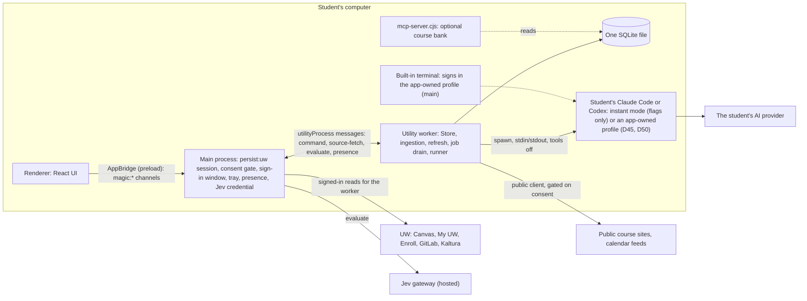
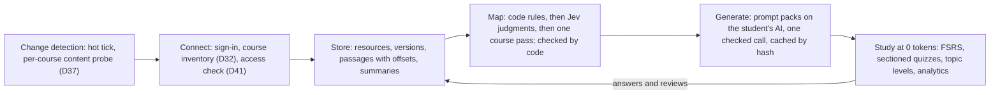
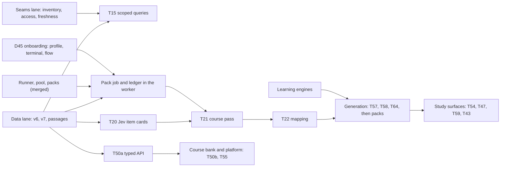

# My Magic UW course backend: architecture

**Status:** the course backend is on `main`: it landed through PR #6 and the PRs after it, and main is at schema v13 as of `699e386`, 2026-09-27. The current status of each part is in [How My Magic UW works](how-it-works.md). Sections 6–8 below keep the build-time record, and the commit IDs there refer to the original lane branches.
**Companion:** [My Magic UW: product direction](magic-canvas-direction.md) holds the product facts: what the student gets, the surfaces, pricing and the roadmap. This document holds the technical facts. The build itself is specified in [the course-backend plan folder](plans/2026-09-26-course-backend/): [spec](plans/2026-09-26-course-backend/spec.md), [plan](plans/2026-09-26-course-backend/plan.md), [tasks](plans/2026-09-26-course-backend/tasks.md) and [execution](plans/2026-09-26-course-backend/execution.md). Where this summary and the plan folder differ, the plan folder wins.

## 1. Summary

The course backend is the local system behind every My Magic UW feature:
- it connects to every source the student's own UW sign-in can already read
- it stores that material in one SQLite file on the student's computer, as passages with exact offsets
- it maps each course: sessions, topics, assessments and their stated scope, and the materials for each
- it generates study material through written prompt packs on the student's own AI client
- it runs study (quizzes, flashcards, levels, analytics) at zero model tokens

**The principle: AI writes, code decides.** Code does whatever has one right answer (dates, IDs, permissions, quotes). Jev makes small typed judgments. The student's AI gets one checked call only where language has to be read or written ([spec §2](plans/2026-09-26-course-backend/spec.md)).

**Status in one sentence:** see [How My Magic UW works](how-it-works.md). It holds the status of every step, with the same labels (demonstrated live, integrated, tested in isolation, in progress, planned), and this document does not repeat it. Where a table below still reads "proposed" or "not started", how-it-works and `main` are authoritative.

## 2. Where we are

Current status, step by step and labelled demonstrated live, integrated, tested in isolation, in progress or planned, is kept in one place: **[How My Magic UW works](how-it-works.md)**. It is checked against `main` (schema v13) and lists the open PRs and branches still in flight ([What is in flight](how-it-works.md#what-is-in-flight)). Tests, measurements and the live trial are in [the build record](course-backend-build-record.md). The piece-by-piece build order (P0–P14) and its remaining tasks are in [execution.md](plans/2026-09-26-course-backend/execution.md) and [tasks.md](plans/2026-09-26-course-backend/tasks.md).

## 3. System map

### 3.1 Processes



- **Only main touches the UW session.** The worker asks main for every signed-in read (`source-fetch`) and for every Jev call (`evaluate`); main holds the device credential.
- **Main's consent gate** checks every channel that can reach the network (§6).
- **The worker's own public sockets** (course-site crawl, document downloads, calendar feeds, Registrar reads) are wrapped by the same consent check (`apps/desktop/src/worker-clients.ts`).
- **The MCP server** is a separate, optional process and a read-only reader (T50b, `fix/platform-mcp`): it opens the database with `node:sqlite` `readOnly: true`, never migrates it or takes a `VACUUM INTO` backup, and refuses a database older than its schema ("Open My Magic UW once"). Its receipts go to an append-only log beside the database (`workspace.sqlite.reader-receipts.jsonl`), which the app imports into `receipts` when it next opens the store. New connection files carry no database path; the reader derives it from the file's folder (`<data>/mcp/<id>.json` → `<data>/workspace.sqlite`); files exported earlier keep working until re-exported. Its tools are an adapter over `@magic/agent-api`'s grant session: search runs on `passage_fts` (BM25, OR) within the grant's account × course pairs, only returned items are scrubbed, and each tool trims to a token budget instead of refusing.

### 3.2 Data flow



### 3.3 Storage layout

One file, one writer (the worker), schema versions owned only by `packages/storage`.

```mermaid
flowchart TB
  subgraph MAIN["On main"]
    V13["v1-v3: sources, resources, resource_versions, observations, field_observations, resource_changes, completions, resource_search (FTS5), preferences, links, jobs, judgments, attempts, receipts, scope_baselines, course_overrides, sync_runs, mcp_grants"]
    V4["v4 planning: planning_sources, planning_captures, planning_records, planning_versions"]
    V5["v5 course intelligence: course_intelligence"]
  end
  subgraph OURS["Course backend, on main since PR #6"]
    V6["v6 course core: passages, passage_fts (contentless), course_sessions, assessments, assessment_scope, map_links, life_items, course_spaces, extraction_recipes, course_briefs, material_facts, compile_runs, ledger, ui_events; jobs gain subjects; resource_search dropped"]
    V7["v7 learning and practice: learning_concepts, items, cards, reviews, attempts, artifacts, coverage, sessions, concept state, stars, option tags, views, and the rest of the learning spec's tables"]
    V8["v8 learning aligned with the canonical engine (learning_cards_v8, learning_reviews_v8)"]
    V9["v9 course-space access observations"]
    V10["v10 course graph: external_refs, resource_refs, basis and quote on material_facts"]
    V11["v11 notes: notes, note_versions, note_links, note_remotes, note_sync_settings"]
    V12["v12 planning index and capture pruning"]
    V13b["v13 receipts index for the retention sweep (current)"]
  end
  V13 --> V4 --> V5 --> V6 --> V7 --> V8 --> V9 --> V10 --> V11 --> V12 --> V13b
```



- Every new table is keyed to `sources(id) ON DELETE CASCADE`, directly or through `resources`. A course is `sources.course_id`; there's no `courses` table.
- The planning (v4) and course-intelligence (v5) tables are untouched.
- `material_summaries` and `platform_writes` are specified ([spec B2](plans/2026-09-26-course-backend/spec.md)) and not built yet.
- The canonical purge list is [spec B1](plans/2026-09-26-course-backend/spec.md).

## 4. How it fits the whole system

### 4.1 What we reuse from `main`

The map of what exists is [the backend map](notes/backend-map.md).

| Part on `main` | How the course backend uses it |
|---|---|
| **Refresh coordinator** (`packages/core/src/refresh.ts`): a probe before any full read, quiet hours, jitter | kept. We add a cadence table and presence gating (integrated), and per-course probes that re-read only a course that moved (integrated) |
| **Job queue and drain** | extended, not replaced: jobs gain a subject and `lease(kinds[])`, and only kinds with a consumer are queued (data lane) |
| **Judgments cache** (input hash, model, question version) | reused for every Jev judgment. A text hash (O5) lets text judgments survive a submission change |
| **Links with reasons** | kept for exact links. Jev and course-pass links live in `map_links` with their rung (code, Jev, pass, student) |
| **Receipts** | reused for every send; T06 adds the `preview_required` status and a `blocked` receipt for a refused Jev send |
| **Privacy gates** (`maySend`) | extended with consent records per recipient (T06) |
| **Course intelligence** (schema v5; [course intelligence](course-intelligence.md)) | kept as the fully local path, and its quote anchoring is reused. Whether our syllabus brief (D34) becomes a revision of it or its own table is open decision H6 |
| **Planning** (schema v4; [planning handoff](planning-upgrade.md)) | reused as is. Planning records never enter AI, Jev, MCP or the data platform |

### 4.2 What we build on from the team's in-flight branch

`integration/backend-features` isn't on `main` yet. The course backend reuses these parts instead of rebuilding them:

| Team work (pending merge) | Where we use it |
|---|---|
| Deadline claims from course prose, each with a literal span, and a tiered resolver | the unified schedule (spec D8) and the code-first scope patterns; the course pass reads only what this can't (PDF schedules, discussions) |
| Fuzzy supporting-material candidates after each sync (rule `link.fuzzy.v1`) | the input to Jev's link judgments (spec C4), not a second candidate generator |
| Known-identity scrubber and citation-span validation | applied to every hosted payload, MCP output and platform export |
| Madgrades adapter | planning (local only) |
| Judgment queue that pauses on gateway budget refusals | kept as the `enrich.resource` handler's retry-after in the one drain (§4.2a) |
| Recurring ICS events expanded within a bounded window | the unified schedule |

### 4.2a Jobs: one drain and how a kind registers

There is exactly **one job drain** in the app: core's pipeline loop (`packages/core/src/jobs/pipeline.ts`, over `createDrain` in `packages/core/src/drain.ts`). Core has no inline drain; `saved()` and `wake()` only wake the loop. Every kind runs there as a registered handler: the material pipeline's code jobs (`passages.resource`, `link.resource`, `compile.course`) and Jev's `enrich.resource` (`jobs/enrich.ts`).
- **Idle-only and sliced:** a slice starts after a quiet gap (3 s), leases at most 20 jobs while the student is present (200 away), then yields.
- **Never during a sync:** `syncStarted()` aborts the slice between jobs and nothing is leased, whatever wakes it, until `syncEnded()`. The desktop worker wraps `ingestion.tick` with both.
- **Retry-after:** a handler's `defer` returns the job to pending without spending an attempt and sets a durable per-kind cooldown; the loop wakes itself when it ends, also after a restart.
- **Errors:** a thrown handler error is a retry, and its message is recorded on the job.
- **Cancellation:** purge, a privacy change and close abort the running slice between jobs and cancel an in-flight Jev call (its result is discarded; no receipt claims a failure).

**Registering a kind** (for example a `course.facts` job): add a `JobHandler` to the registry passed to `createCore({ jobs })` (the worker passes `pipelineJobRegistry()` in `jobs/default-registry.ts`). Register before `createCore`: the loop fixes its kinds when it starts. Core adds `enrich.resource` itself.

```ts
interface JobHandler {
  kind: string;                         // "area.name", unique
  subject: "resource" | "course" | "assessment";
  ready: boolean;                       // false: a stub, never enqueued or leased
  owner: string;
  onSave?(resource: Resource): boolean; // save → enqueue for resource subjects; course subjects get one job per course at its inventory hash
  available?(ctx: { store }): boolean;  // checked before every lease; false leaves the kind queued (Jev: gateway + maySend)
  run(job, { store, now, signal }): Promise<
    | { status: "done" }
    | { status: "retry"; error: string }               // backoff, then the store's retry limit
    | { status: "stop"; error: string }                // refused (consent): finish with the error, end this wake
    | { status: "defer"; until: string; error: string } // retry-after: no attempt spent, the kind waits
  >;
}
```
A handler that sends goes through egress itself (manifest, receipt, re-check after the call), as `enrich.resource` does. `signal` aborts between jobs for a sync, suspend or the student's return; a handler that must stop mid-call on purge or privacy takes core's cancellation scope, as `enrich.resource` does.

### 4.3 The Today rail and planning

The Today rail work is on the team's `sean/today-calendar-rail` branch (PR #2), not on `main` yet. It adds day-plan entries (`day-plan` and `day-plan-remove` commands), the published Outlook calendar ICS, and one work projection for Upcoming and the rail.
- **The unified schedule (spec D8)** reads day-plan entries as the student's own entries. Study sessions it proposes are saved as day-plan entries when the student moves them.
- **Outlook calendar (T36)** reuses the rail's published-ICS route once PR #2 merges, and only fills gaps.
- **One open storage point:** day-plan entries live in `preferences` with no link to their source, so deleting a source leaves them behind. The P2 review recommends a table with a cascade. That's the rail author's call.
- **Planning** stays its own surface (My UW) and its own tables. Only its dates (enrollment windows, appointments, holds) appear on the schedule, locally.

## 5. Frontend surfaces the backend serves

The UI will change with the team's design direction ([DESIGN.md](../DESIGN.md)). This section names only the channels and commands each surface calls.

**Channels** (`apps/desktop/src/preload.ts` → `ipcMain.handle` in `main.ts`):

| Channel | Bridge method | On `main` or ours | Status |
|---|---|---|---|
| `magic:execute` | `execute(command)` | main | integrated |
| `magic:open`, `magic:import`, `magic:signin`, `magic:sync`, `magic:planning-sync`, `magic:signout`, `magic:local-status`, `magic:local-ask`, `magic:local-cancel`, `magic:mcp-export` | as named | main (sign-in, sync and planning reads now pass the consent gate) | integrated |
| `magic:keep-signed-in` | `keepSignedIn(value?)` | ours (T05c) | integrated |
| `magic:onboarding` | none yet | ours (T40) | main answers it; the preload doesn't expose it yet (T81 adds the bridge method) |
| `magic:open-link` | `openLink(url)` | ours (T05b) | built on the seams lane: link cards open in the default browser, https only |

**Commands** through `magic:execute` (`packages/contracts/src/index.ts`, `commandSchema`):
- **On `main`:** `snapshot`, `import`, `ingestion-settings`, `course-override`, `mcp-grant`, `fixture`, `complete`, `privacy`, `context`, `enrich`, `link`, `purge`, `planning-guide`, `planning-search`, `planning-sections`, `planning-compare`, `planning-import`.
- **Ours, integrated:** `consent` (grant or revoke per recipient; the only writer of consent records) and `preview.ack` (the answer to a blocking preview, bound to the payload's hash).
- **Ours, added by the course backend** (which of these the running app calls today is in [How My Magic UW works](how-it-works.md); an operation whose task has not landed still answers `not_built`): `map`, `correct`, `pack`, `ui_event`, `workspace` (the command bar's resolved verb: open, quiz, cards, explain, due), and `learning` with the ops `notebook.*`, `study.*`, `knowledge.*` and `practice.*`.

| Surface | Calls |
|---|---|
| Onboarding (T81) | `magic:onboarding`, then `consent`, `magic:signin`, `magic:sync` |
| Consent and agreements | `consent`, `preview.ack`, `privacy`; the receipts come back in `snapshot` |
| Sign-in and "Keep me signed in" | `magic:signin`, `magic:signout`, `magic:keep-signed-in` |
| Course map and dossier | `map`, `correct`, `ui_event` (T15 replaces full snapshots with scoped queries) |
| Access chips and "Connect this course" (D41) | `map` (access states), `magic:signin` for UW single-sign-on hosts, `magic:open-link` for the rest |
| Notebook, chat and artifacts | `learning` `notebook.*`, `pack` |
| Study: flashcards, quizzes, Learn, levels | `learning` `study.*`, `knowledge.*`, `practice.*` |
| Command bar (D40) | `workspace` |
| Today rail and schedule | `snapshot` today; `day-plan` on PR #2; `timeline` (spec D8, proposed) |
| My UW | `magic:planning-sync`, `planning-*` |
| Settings: data and privacy | `privacy`, `purge`, `mcp-grant`, `magic:mcp-export` |

### Renderer: from the 2-second snapshot poll to summary plus change cursor

The renderer today calls `snapshot` on mount, **every 2 seconds while visible** and after every command (`renderer/App.tsx`), and filters resources per render. At 5,000 resources each poll is up to ~29 MB and ~480 ms to execute (MT1, synthetic data). The backend side of the replacement is in place (`core.query` via `magic:query`); the renderer switch belongs to its owner:

1. **On mount:** `query({ view: "summary" })` (courses with counts and next due, source health, privacy, jobs, the last 20 receipts, `changesCursor`), then `query({ view: "resources", courseId, limit })` for the visible course, paging with `nextCursor`. Open one item with `query({ view: "resource", id })`.
2. **Every tick (keep 2 s, or on the worker's change notification):** `query({ view: "changes", cursor })`, then patch only the listed resource ids (re-query `resource` for the open item, or the visible page if a listed id is in it). Store the returned `cursor`.
3. **The cursor:** the first caught-up page hands over from the summary's time cursor to a seq cursor on `resource_changes.seq`. With a seq cursor, `complete: false` means another page follows: call again with the new cursor before patching. A time cursor that overflows, or a seq cursor whose sequence was reset (a purge, a removed source), returns `complete: false` with no changes: reload the summary and the visible page, then follow the returned cursor.
4. **After a command:** use the command's own result for its message and re-run step 2; don't take a new snapshot. `snapshot` stays for debugging only.

The change feed is exact and bounded: at most `limit` (≤500) changes per call, oldest first, ids stable, so a patch is idempotent.

## 6. What changed from `main`, and why

| Area | `main` today | Ours | Why (evidence) | Status |
|---|---|---|---|---|
| **IPC and snapshots** | every command returns the full snapshot | scoped, paged, course-scoped queries with a change cursor (T15, O1); the backend side is built, the renderer switch is below | the snapshot is 28.8 MB and takes 480 ms p50 to execute at 5,000 resources (MT1, synthetic data, this laptop) | backend built (`core.query` summary, resources, resource, changes with a seq cursor); renderer switch proposed |
| **Search and FTS** | FTS5 over whole documents; every query term prefix-matched and AND-joined; no `LIMIT`; each hit re-read with its field history | passages with exact offsets; contentless-delete FTS5 keyed by passage rowid; questions as OR + BM25, `LIMIT` ≤20; "not found" when the top hit covers under half the query's content terms | 45.8% of MT1's queries return nothing (MT1); OR + BM25 found 10 of 10 planted answers where prefix-AND found 0 (P2 spike, synthetic); contentless tables per [SQLite FTS5](https://www.sqlite.org/fts5.html#contentless_delete_tables) | built (data lane) |
| **The ingest bottleneck** | deleting a resource's old FTS row looks it up by an unindexed column, so each delete scans the whole table | FTS rows addressed by rowid | the scan is 5.4 ms per delete at 1,000 resources and 23.4 ms at 5,000, about 88% of ingest time; ingest without it ran at 2,147 resources/s (P2 spike, synthetic) | built (data lane); target ≥10× at 5,000 |
| **Duplicate text** | each body stored twice: in `resource_versions` and as the FTS table's content | one copy; excerpts cut by offsets | the FTS copy is 31% of the database (24.2 of 78 MB at 5,000; P2 spike) | built (data lane) |
| **Field history** | every sync appends one row per observed field, changed or not | last-seen per field (upsert) | a zero-change re-sync adds 15.8 MB (+20%) at 5,000, and the history is never read (P2 spike). This changes the team's ingestion design, so it goes to `main` as a reviewable PR | built (data lane) |
| **Migrations and backup** | each version step in its own transaction; no backup; the MCP server can open and migrate the file too | all pending steps in one `BEGIN IMMEDIATE` that re-reads the version; a `VACUUM INTO` copy first; restore through `node:sqlite` `backup()` | a mid-chain failure today leaves an intermediate version; `VACUUM INTO` took 317 ms on 92 MB, and `backup()` into the live path restored cleanly with a reader open (P2 spike); [VACUUM INTO](https://www.sqlite.org/lang_vacuum.html#vacuuminto), [node:sqlite](https://nodejs.org/docs/latest-v24.x/api/sqlite.html) | built (data lane); the MCP read-only open is proposed |
| **Purge** | deletes a fixed list of tables; 8.7 s at 5,000 | enumerates every table in `sqlite_schema` and every app-owned file; foreign keys off for the purge transaction; both sessions' HTTP caches cleared too (as sign-out does); the reader's receipt log removed | a derived table must not survive "Delete local data" (P2 spike timing). Measured on this laptop, synthetic 5,000: 0.66 s at `fc43f7a`, 0.35 s with foreign keys off (one run each) | built; target ≤1 s met |
| **Sync and change detection (D37)** | one account-wide activity-summary probe; any change triggers a full read of every course | a hot tick on `todo` and `upcoming_events` (their IDs carry the course); a per-course content probe every 15 min and on focus; warm reads of the courses that moved only | the activity stream's item types are discussion topics, announcements, context messages, messages, conversations, submissions, conferences, collaborations and assessment requests, so files, pages and module items never move it ([canvas-lms `lib/api/v1/stream_item.rb`](https://github.com/instructure/canvas-lms/blob/master/lib/api/v1/stream_item.rb)); a zero-change re-sync still made 69 of the full sync's 79 requests (MT1) | built (seams lane); targets ≤5 min dated, ≤15 min undated |
| **Background reads while away** | background refresh runs whenever the app is open | signed-in reads (Canvas, GitLab) only while the student is present (input in the last 30 min, screen unlocked); credential-free feeds while away; one catch-up read on return | no request ever keeps a UW session alive, so the session ends on UW's own clock | integrated (T05d) |
| **Sign-in and session** | sign-in window with a profile check; expiry recovery was open | expiry confirmed only by a login redirect, a login page, or a 401 whose body says `unauthenticated`, then one "Sign in again"; a permission error marks only that area; "Keep me signed in" (on by default: tray, start at login); quitting signs out | session cookies are dropped on quit (measured, Electron 44.4.5), and UW calls browser session restore "a serious security concern" ([KB 4302](https://kb.wisc.edu/4302)) | integrated (T05c); not demonstrated |
| **"Remember my sign-in" (D39)** | none | opt-in, encrypted with `safeStorage`, filled only on UW's NetID login page; Duo never automated | UW's standard permits "Storing one's personal NetID and NetID password in a password management application" ([KB 59262](https://kb.wisc.edu/itpolicy/page.php?id=59262)); saved only when [safeStorage](https://www.electronjs.org/docs/latest/api/safe-storage) encryption is available | proposed; open H2 |
| **Consent and egress** | privacy preferences and `maySend`; the accepted disclosure flow "not implemented" ([AI and privacy](ai-and-privacy.md)) | one setup checkbox writes a consent record per recipient; main's gate refuses every network channel without it; the worker's own public clients are gated too; a new sensitive category (or "always preview") holds the send as `preview_required` until `preview.ack` for that exact payload hash | implements the team's accepted flow with the fewest clicks; zero requests before the checkbox (spy test) | integrated (T06) |
| **AI runtime** | local Ollama coaching; paid routes accepted, not built | `ModelRunner` with Claude Code and Codex one-shot adapters, API-key adapters and a local adapter; one call, tools off, a JSON schema, the prompt on stdin, retry then escalation, a ledger and a background budget | one checked call instead of an agent loop, so untrusted course text can't trigger a tool | tested in isolation (T12) |
| **Warm session pool (D38)** | none | an interactive lane per open course, one background lane rotated per batch, an escalation lane on demand | measured on this laptop: a new `claude -p` per call took 5.8–7.4 s; a warm session answered follow-ups in 1.7–2.2 s (plan D38) | tested in isolation |
| **Packs** | none | versioned packs with byte-stable prefixes (O8), grounded-quote checks, a cache key by hash, ledger rows | the model writes; code checks every quote against the exact passages it was given | tested in isolation (T13 core; the stores are in memory until v6 merges) |
| **Onboarding and client detection** | none | detects Claude Code and Codex and asks each CLI for its own sign-in state (no credential file read), then chooses Claude Code → Codex → a stored key → Ollama | AGENTS.md: no provider integration is promised before it's verified | tested in isolation (T40) |
| **Isolated client profiles (D45)** | none | the app runs the student's client with its own configuration directory, e.g. `CLAUDE_CONFIG_DIR=<userData>/clients/claude`; the student signs in there through the provider's own flow in a built-in terminal | "a session with a different `CLAUDE_CONFIG_DIR` reads a different entry" ([authentication](https://code.claude.com/docs/en/authentication), [env vars](https://code.claude.com/docs/en/env-vars)). The lead's spike (2026-09-26): with an app-owned directory, `claude auth status` reported "Not logged in", and the student's own `~/.claude` wasn't modified | proposed; building on `wave-b/T80` |
| **Subscription route** | none | the student's own Claude Code sign-in, unmodified binary | verified in the provider's terms for Claude Code ([legal and compliance](https://code.claude.com/docs/en/legal-and-compliance): "Each end user must authenticate with their own Anthropic API key, Claude subscription plan credentials, or 3P inference provider credential"), pending live testing. Codex has no documented arrangement ([openai/codex#36886](https://github.com/openai/codex/issues/36886)); Gemini CLI's terms forbid third-party use of its sign-in ([tos-privacy.md](https://github.com/google-gemini/gemini-cli/blob/main/docs/resources/tos-privacy.md)), so Gemini is API key only | researched; open H5 |
| **Course inventory and access (D32, D41)** | a fixed set of Canvas endpoints | every place a course keeps content is listed by code (tabs, external tools, module items by type, the syllabus, links in bodies); each gets an access state: readable, needs UW sign-in, needs its own login, link-only, blocked | a fixed endpoint list misses external tools and linked platforms. The app never launches an LTI tool, because a launch can enrol the student or start recording ([KB 65466](https://kb.wisc.edu/65466)) | built (seams lane) |
| **Store vs link (D40)** | everything captured is stored | text-bearing content becomes passages; tools and platforms with their own login become link cards opened in the default browser | stores what can be quoted and checked; never scrapes a third-party login | proposed (the link-card channel is built on the seams lane) |
| **Learning system** | an `attempts` table with no consumer | knowledge model, FSRS, Learn and Write modes, the session builder, calibration, the copy lint | study runs at 0 tokens, and progress is defined by evidence rules | built (learning lane); tables built (data lane) |
| **Jev** | one question type; small per-device limits | code-first classification, then one batched request per item; versioned endpoints and limits (T20b, a PR) | code answers most items at no cost, and nothing is re-asked | proposed |
| **Data platform (D42)** | six local MCP tools with grants and receipts | a versioned read contract, a read-only course bank, scoped tokens, a narrow write path for student-owned artifacts ([spec F3](plans/2026-09-26-course-backend/spec.md)) | see the product direction | `@magic/agent-api` v1 read surface built and tested in isolation (courses, course graph summary, resources, resource, passage search, assignments; agenda a stub); SQL views, `@magic/sdk` and writes proposed |
| **Dictation (D43)** | none | on-device speech-to-text into the command bar only; never stored or sent ([spec D9](plans/2026-09-26-course-backend/spec.md)) | Electron's `SpeechRecognition` fails in Electron ([electron#46143](https://github.com/electron/electron/issues/46143)) | proposed |
| **Outlook (D44)** | none | Microsoft Graph, delegated; sender, subject, time and link stored; an optional code-extracted gist; never bodies ([spec A3](plans/2026-09-26-course-backend/spec.md)) | `Mail.ReadBasic` excludes bodies ([permissions reference](https://learn.microsoft.com/graph/permissions-reference)); user consent to it may be blocked by the tenant ([app consent policies](https://learn.microsoft.com/entra/identity/enterprise-apps/manage-app-consent-policies)); probe E1 decides | researched and proposed |

## 7. Implemented, per task

Tests counted on this branch at `b496d0a`; the whole suite is 359/359.

| Task | What | Files | Checks | Status |
|---|---|---|---|---|
| T05a | Windows-safe suite, `test-one`, `check-probes` | `scripts/test-one.mjs`, `scripts/check-probes.mjs` | `tests/harness.test.ts` 8/8 | integrated |
| MT1 | performance harness and baseline, synthetic data, replayed Canvas transport | `evals/perf/*` | `pnpm magic:perf --suite baseline`; result recorded at `91e39fa` | integrated (a harness, not an app feature) |
| T05d | session and consent seams: providers, consent contracts, presence-gated cadence | `packages/contracts/src/index.ts`, `packages/core/src/refresh.ts`, `apps/desktop/src/worker.ts` | `tests/seams-p1.test.ts` 8/8 | integrated |
| T05c | session state at launch, expiry classification, one "Sign in again", "Keep me signed in" (tray, login item), sign-in window self-confirmation | `apps/desktop/src/keep-signed-in.ts`, `main.ts`, `packages/connectors/src/canvas-http.ts` | `tests/session.test.ts` 16/16 | integrated; not demonstrated |
| T06 | one-checkbox consent, per-recipient records, main's consent gate, gated worker clients, previews bound to a payload hash, egress receipts | `packages/core/src/egress.ts`, `apps/desktop/src/worker-clients.ts`, `renderer/consent/ConsentSetup.tsx`, `packages/storage/src/index.ts` | `tests/egress.test.ts` 13/13 | integrated |
| T12 | `ModelRunner`: Claude and Codex one-shot, API-key and local adapters; retry, escalation, ledger rows, background budget | `packages/runner/src/*` | `tests/runner.test.ts` 15/15 (argument lists checked against a fake CLI) | tested in isolation |
| D38 | warm Claude session pool: per-course interactive lanes, a rotated background lane, on-demand escalation | `packages/runner/src/pool.ts` | `tests/session-pool.test.ts` 7/7 | tested in isolation |
| T40 | onboarding detection: installed CLIs, their own auth status, engine choice, model probe | `apps/desktop/src/onboarding.ts`, `main.ts` (`magic:onboarding`) | `tests/onboarding.test.ts` 7/7 | tested in isolation (no bridge method yet) |
| T13 core | pack format, O8 byte-stable prefixes, grounded-quote checks, cache by hash, ledger and artifact stores (in memory) | `packages/packs/core/src/*`, `packages/core/src/jobs/pack.ts` | `tests/packs.test.ts` 10/10 | tested in isolation |
| T11a, T10, T10L, T11b | passage splitter and quote validator; schema v6 and v7; the drain; one-transaction migration; complete purge; stored passages and passage search | data lane (`wave-a/T10`) | the lane's own tests; not yet re-run by the lead | built |
| T05b, D32/D41, D37/T33 | integration seams; course inventory and access check; per-course freshness | seams lane (`wave-a/T05b`) | the lane's own tests | built |
| N00–N14, P01–P16 (subset) | knowledge model, FSRS adapter, item checks, guide schemas, concept map, Learn, Write, session builder, calibration, copy lint | learning lane (`wave-a/LRN`) | the lane's own tests | built |
| T05e | "Remember my sign-in" | none | none | proposed (H2) |

## 8. Measurements

### 8.1 MT1 baseline (synthetic data, this laptop)

**Machine:** Windows 11, Intel Core Ultra 9 275HX, 24 cores, 31.4 GiB. Node 24.14.1, SQLite 3.51.2. Commit `91e39fa`. Synthetic corpus, replayed Canvas transport, no network.
**What it proves:** where today's code spends time and bytes as data grows. It's the "before" for every storage and IPC change. It says nothing about real UW timing.
**Noise:** across runs, throughput varied about ±20% and p95 up to 2.6×. So every adopt threshold asks for an effect of 3× or more, or is structural.

| Metric | Size | Today (MT1) | Adopt at |
|---|---|---|---|
| Ingest throughput | 100 / 1,000 / 5,000 resources | 963 / 351 / 78 resources/s | ≥1,000 at 1,000; **≥750 at 5,000 (≥10×)** |
| Database bytes per 1,000 resources | 5,000 | 15.6 MB | **≤11 MB (−30%)** |
| Search p50 / p95 through the store API | 1,000 | 10.5 / 16.4 ms | ≤2 / ≤8 ms |
| Search p50 / p95 through the store API | 5,000 | 56 / 197 ms | **≤5 / ≤15 ms** |
| Queries returning no hit | 24 queries | 45.8% | question recall@5 ≥0.90; correct "not found" ≥0.80 |
| Command payload (full snapshot) | 5,000 | 28.8 MB; execute p50 480 ms | **≤256 KB**; p95 ≤50 ms |
| Canvas full sync, 5 courses | replay | 79 requests (15.8 per course) | see D37 targets |
| Zero-change re-sync | replay | 69 requests (0.87 of a full sync) | only changed courses read |
| Fresh database create and migrate | in process | 14.5 ms p50 | migration with backup ≤2 s, 0 rows lost |
| Jobs queued by one 5-course sync | replay | 300, most with no consumer | only kinds with a consumer are queued |
| Not measured yet | | the live sync; the renderer ↔ worker round trip and cold start (no timing hooks); the AI ledger | |

### 8.2 SQLite spike (P2 review, synthetic data, this laptop, single runs)

**What it proves:** the cause of each MT1 problem, and that the fix works in isolation. They're indicative numbers, not the MT1 record; MT1 "after" confirms them.

| Finding | Measured |
|---|---|
| The FTS delete scans the whole table | 5.4 ms per delete at 1,000; 23.4 ms at 5,000; about 88% of ingest time |
| Ingest without that path | 2,147 resources/s (a zero-change re-ingest of 5,000) |
| Search time spent re-reading each hit | about 88% |
| FTS match only: prefix-AND, all rows vs OR + BM25, `LIMIT` 20 | 6.4 / 21.2 ms vs 1.2 / 5.6 ms p50/p95 at 5,000; contentless 0.9 / 5.1 ms |
| Planted-answer recall@5 | OR + BM25 10/10; prefix-AND 0/10 |
| FTS content copy | 24.2 of 78 MB (31%) at 5,000 |
| Zero-change re-sync growth | +15.8 MB (+20%) at 5,000 |
| Purge | 8.7 s at 5,000 (target ≤1 s) |
| `VACUUM INTO` backup | 317 ms for 92 MB (target ≤1 s) |

### 8.3 Warm sessions (plan D38, measured on this laptop, 2026-09-26)

| Mode | Latency | Fixed tokens |
|---|---|---|
| a new `claude -p` per call | 5.8–7.4 s | 2.8k–11.3k |
| one warm session, follow-up asks | 1.7–2.2 s | the course prefix read from cache |
| our system prompt replacing the default | | 11.3k → 2.8k |

**What it proves:** the pool saves seconds per ask on this machine. It doesn't yet prove it's the right default: spikes S1–S10 (history growth, idle memory, Codex caching) and MT6's warm-versus-cold row decide that. Cache reads are billed at a fraction of input on the key route ([Anthropic pricing](https://docs.anthropic.com/en/docs/about-claude/pricing)); on a subscription they count against the plan's own limits.

### 8.4 Thresholds not yet measured

- **P1 live trial:** launch to setup ≤3 s; back from sign-in to confirmed ≤3 s p95; first assignment ≤30 s; relaunch to "Sign in again" ≤2 s with 0 requests; 0 false "Sign in again"; 0 requests before the checkbox; 0 Jev or AI requests in local mode.
- **Freshness:** a new dated item ≤5 min, undated material ≤15 min, while the student is present.
- **Public comparisons** (spec B6, MT7a/MT7b): targets are fixed before anything runs, and the rows we lose are published too ([benchmarking](notes/benchmarking.md)).

## 9. Where we differ from recorded decisions, and the open calls

The evidence-backed differences are in [where we differ](notes/where-we-differ.md). The human calls below come from the plan's conflict review ([plan §9](plans/2026-09-26-course-backend/plan.md#9-open-human-calls) carries the canonical list as it's updated). Each position is stated with its source, and none is settled here.

| # | The question | Our direction | The team's recorded position | Who decides | What depends on it |
|---|---|---|---|---|---|
| H1 | Pricing and setup prerequisites | open source and free with the student's own keys; $5 lifetime for the hosted Jev service (Nathaniel, 2026-09-26) | a $5 one-time app licence covering the service and company-funded Jev ([decisions](decisions.md)) | Nathaniel and Ben | licence activation in setup (T62), the setup screen's recipients, the price row in the benchmark, the submission text |
| H2 | "Remember my sign-in" | opt-in saved sign-in, filled on UW's login page after an expiry; Duo still decides (plan D39) | "Never automate Duo or bypass expiry" ([AGENTS.md](../AGENTS.md)) | Ben reads D39 against the rule; the team | T05e, the live trial, the public disclosure |
| H3 | A sign-in window that opens by itself | opens by itself when a sign-in is needed and "Keep me signed in" is on (plan D33) | "the app does not pop up a login during background work" ([pipeline details](pipeline-details.md)) | the team | T05c's behaviour, T05e |
| H4 | Jev links and scopes applied without review | settled by code, then Jev, then one pass; correctable in one click, never a confirmation step (plan D33) | "auto-apply only independently checked exact identity rules" until evaluation supports more ([pipeline details](pipeline-details.md)) | the team | T20, T22, MB1 as the adoption gate |
| H5 | The subscription CLI route | the student's own Claude Code or Codex sign-in drives the app's runs (plan D36) | no subscription integration promised before it's verified ([AGENTS.md](../AGENTS.md)); verify per route ([decisions](decisions.md)) | Nathaniel and Ben; accepting Anthropic's Commercial Terms before any release | T12's routes, D38's background lane, T40/T81 wording |
| H6 | Syllabus brief vs the course-intelligence profile | the syllabus becomes the course's checked brief from our course pass (plan D34) | the compiler's cited-policy profile; "Unknown policy is not permission" ([course intelligence](course-intelligence.md)) | the team, with the compiler's authors | where the brief lives; which policy source governs coaching |
| H7 | Terminal-driven workspace vs the near-approved Home | a command bar and live activity line over one workspace (plan D40) | "Home is approximately 95% desired … Preserve its structure" ([DESIGN.md](../DESIGN.md)) | Ben, as design owner, from a concrete comparison | the workspace UI, T43, P17, the dictation mic's place |
| H8 | The mastery bar and percentage copy | an evidence-defined bar toward mastery of an assessment (plan D21) | "No invented mastery, readiness score, or completion claim" ([Home direction](home-design-direction.md)) | the team | T54, P17, the copy lint |

**Also open:**
- **T02:** the operator signs off the AI boundary (spec §2) before phase 2. Owner: Nathaniel.
- **PRs to `main`** for the shared-package changes (schema v6/v7, the agent-API move, the gateway endpoints): when, after G0. Owner: Nathaniel with the team.
- **Day-plan storage** (§4.3): the rail author's call.
- **Two MCP issues** were reported to the team privately.

## 10. How to run and verify

Node 24, pnpm 10.29.2.

| Command | What it checks |
|---|---|
| `pnpm install` | dependencies |
| `pnpm check` | TypeScript across apps, packages and `evals/**` |
| `pnpm test` | the whole suite (`tsx --test tests/*.test.ts`): 359/359 at `b496d0a` |
| `node scripts/test-one.mjs tests/<file>.test.ts` | one task's tests (fails if the file is missing) |
| `pnpm build` | check, then the desktop build |
| `pnpm magic:perf --suite baseline` | MT1 on synthetic data; results go to `.data/perf/<commit>/`, which git ignores |
| `node docs/plans/2026-09-26-course-backend/check-tasks.mjs` | the task graph: dependencies, cycles, phase order |

**The live trial** (the `live-trial` procedure, with the operator present):
- The operator signs in in the app's own window with their NetID and Duo. No agent types credentials or approves Duo.
- Every agent check runs headless and read-only: no submit, enrol, post or quiz attempt.
- Raw numbers stay in `.data/`, outside git. Only aggregates are published, including the rows we lose.
- Status as of this update: the trial has started; no NetID sign-in has been completed yet.

## 11. What's next

The build order is in [execution.md](plans/2026-09-26-course-backend/execution.md) and [tasks.md](plans/2026-09-26-course-backend/tasks.md). The dependencies between the main pieces:



## 12. Command bar and intent router

**What it does.** The command bar (Ctrl+K typed, or Ctrl+Shift+Space dictated into the same bar) takes any plain-language request and returns one typed `CommandResult.command`: `ran {action, args, result}`, `clarify {question, candidates}`, `answer {text, citations}` or `unavailable {reason}`, each with the path (`code`, `ai`, `cache` or `none`), the latency and the tokens. It is the `command` Command (`{text, context?: {courseId?, view?, noteId?}, mode?: run | prewarm}`), handled by `packages/core/src/intent` through core's seam. The live hint is the read-only `intent.preview` query (`core.query`, no snapshot recompute); `mode: "preview"` on the command stays for compatibility and is deprecated. Status: built and tested in isolation; wired in the worker; no renderer yet.

**AI writes, code decides (spec §2).**
- **The registry** (`intent/registry.ts`). An `ActionSpec` is `{name, description, slots, argsSchema (zod over resolved args), examples, patterns?, run(args, ctx)}`. Built in: `course.open`, `assignment.open`, `practice.quiz` (`practice.target` test), `practice.flashcards` (flashcards due), `practice.learn` (Learn round), `pack.generate` (cards or quiz for a scope), `agenda.due` (core's D40 `due` verb), `materials.search` (passage search) and `ask`. The lanes on main are wired through `intent/adapters/`, one file per source: `mail.search` (stored fields only, never a body) and `calendar.proposeEvent` (Outlook, #12: the router returns the fields; main issues the single-use proposal ID and writes only after the student clicks to confirm, so the router never creates an event), `guide.view` (#10), `analytics.course`, `analytics.assignment` and `analytics.agendaHints` (#11), and from the material pipeline (#13) its daily agenda (preferred over the D40 `due` verb), `assignment.references` and `course.overview`. The notes lane's `notesActions` (#16) register first through `adapters/notes.ts`, which maps the router's resolved slots onto their raw-string arguments and hands them the router's resolvers.
- **The code path, 0 tokens** (`intent/resolve.ts`, `courses.ts`, `dates.ts`). Course references: a code ("CS 400", "COMP SCI 400", "compsci400"), a full name, a subject nickname ("my econ class"), or a distinctive name word next to a course cue; the current term wins over an older course with the same subject. Relative dates in the student's time zone (today, tomorrow, a weekday, "next tuesday", this or next week, "the next 3 days", "oct 3"). Topics by the course's concept labels (a unit names its topics); with no course named, the one current course whose map has the topic. Assignments by title words. A confident single match runs at once; an ambiguous reference is asked by code; anything else is a `miss` or a `partial` whose settled slots go to the model as hints. The resolver runs under a 20 ms CPU-time budget inside try/catch (CPU time, so a loaded machine that preempts it doesn't turn a code hit into a model call): an exception or an overrun is a miss, never an error to the student. The index it reads (courses, assignments, compiled matchers and the current courses' concept maps) is built at launch after the first bootstrap query and at prewarm, or else once, synchronously, before a command's budget starts (about 0.2–0.5 s on the operator's 2,253 resources); it is rechecked at most every 2 s, rebuilt when the sources' revision changes and re-read when a concept map changes. A match already resolved is kept even past the budget.
- **The AI fallback** (`packages/packs/intent`, `intent-classify` v1, pass tier). Input: the utterance, the current course and code's hints. The prefix is the catalogue (name, description, argument names), an argument glossary and the course codes and names: byte-stable, so the provider caches it. No passages and no student data beyond course names and codes. Output (strict): `{action, args: {course, assignment, topics, date, query, kind, count, scope}, confidence: high|low, alternatives, question}`. Code then checks that the action exists and re-resolves every argument: an invented course, assignment or date is refused and becomes `clarify`, never a guess; low confidence becomes `clarify` with the alternatives. The runner escalates to the strong tier only when the output fails the schema. The cache key is the normalised utterance plus the prefix hash, so a repeat costs 0 tokens. Consent is `maySend` with the utterance as `course_text`, with a receipt per send. With no client connected, a code hit still runs and a miss says that only exact commands work.
- **The grounded ask** (`intent/ask.ts`, `intent-ask` v1). Code retrieves with `searchPassages` (contentless FTS, BM25) over the current course, or all current courses when asked, within 3,000 tokens and 8 passages. The coverage gate answers "Not in your materials." with no model call. One checked call returns sentences, each citing 1–3 passages with verbatim quotes; `findQuote` checks every quote, a sentence with no checked quote is dropped (counted in `dropped`), and each citation carries the resource, its URL and the offsets in the current text. Planning records are a separate table and are never retrieved.
- **The ledger.** Each command writes an `intent-route` row (the path in `tier`, the action, the latency); tokens stay on the per-call rows, so nothing is counted twice.

**Latency (the operator's requirement: a code miss adds effectively nothing).**
- *Speculation, gated.* When a command arrives, the AI branch starts preparing at once (the client lookup, the catalogue prompt, the cache lookup) in parallel with the resolver; the send is gated on the resolver's verdict. A code hit aborts the branch before anything is sent; a miss sends as soon as preparation is ready.
- *Measured* (`tests/intent-latency.test.ts`, fake CLI at a fixed 800 ms through a warm pooled session, 24 interleaved pairs, in the full parallel suite): fallback p50/p95 811/819 ms against AI-only 809/820 ms (added p95 −0.9 ms; earlier runs −17 to +4 ms, which is scheduling jitter). A code hit: p50 1.1 ms, p95 3.2 ms, 0 billed calls.
- *Why not "send at once, cancel on a hit".* In this single-threaded worker the resolver is synchronous and sub-millisecond, so the send's first await resumes only after the resolver has answered: the `race` mode measured the same (0 billed, miss p95 814 ms). A true send-first would need the resolver deferred, which would bill a call per code hit and, on the pool, kill the warm session on every abort. We keep `gate`.
- *Pre-warm and preview.* `mode: "prewarm"` (call it when the bar opens or dictation starts) builds the course index and the catalogue prefix and finds the client; it reports `ready {ai}`. `mode: "preview"` (debounce about 300 ms while typing or dictating) runs only the code resolver and returns a hint; it never calls the model. Claude answers through a session pool (lane `interactive:intent`). `prewarm` calls `SessionPool.warm()`, which starts the CLI with the byte-stable catalogue prefix and sends nothing (0 tokens), so even the first AI command skips the CLI's start-up (tested: one spawn at prewarm, none for the next two commands).

**Live evaluation (private data; aggregates only; the raw file stays in `research/`).** 40 realistic commands on a read-only copy of the operator's workspace. Code path: 25/40 (63%), all 25 correct. Clarifications: 3/40, all by code at 0 tokens (two expected; one had no concept map to find the course from a topic). The other 12 need the model; the AI path was not run because no isolated client profile is signed in. Resolver p95 0.7 ms; code-path commands excluding the agenda p50 0.6 ms, p95 8.5 ms. The agenda was slow because core's D40 `due` verb rebuilt `courseInclusion` once per assignment (O(n²): 25–41 s on 306 assignments). With that computed once, the `due` verb alone takes p50/p95 576/580 ms, and the agenda command (now the pipeline's agenda) takes 216/264 ms. Ask: the coverage gate retrieved passages for 9 of 10 real questions and answered "Not in your materials" for 1 with no call; citation pass rates need a signed-in client.
