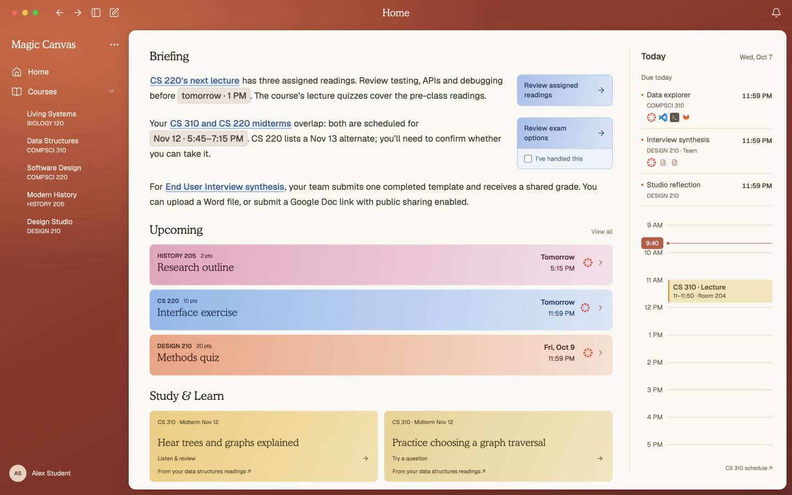

# Visual baseline — cohesive Home v1

Recorded September 26, 2026. This is calibration evidence for the design system, not an integrated theme or a fully approved universal design system. Preserve the Home Ben called “95% of what id want that static home page to look like essentially.” Use the original corrections to refine representative images and coded compositions, then prove the system can design a related surface from a description. The image is not a demand to preserve criticized details or incidental coordinates. See the [decision record](decision-record.md) for quote scope and the [component contracts](component-contracts.md) for behavior.

## Reference identity and permitted use

| Property | Value |
| --- | --- |
| Asset | `docs/design/assets/home-reference-v1.jpg` |
| Dimensions | 1440 × 900 pixels; current reference capture, not a responsive specification |
| Actual encoding | JPEG/JFIF; verified from file metadata. The original `.png` extension was corrected to `.jpg` without changing the image bytes. |
| SHA-256 | `195787caefcb7826ae35c6f85862d66fb1a2f06164727d5809c2824ba8a0813e` |
| Provenance | Captured from a synthetic-content derivative of the local `magic-canvas-cohesive-home.html` mock. Course/profile copy was substituted for private original content while retaining the visual layout. |
| Evidence role | Composition, relative emphasis, typography, color relationships and density. It does not establish working interactions, live school data, accessibility or responsive behavior. |
| Approval scope | The original cohesive Home is the accepted visual anchor. The synthetic derivative is a shareable reference, not a separately approved screen. |
| Known action delta | The combined review/handled region shown is taller than the reading action; its proportions are pending correction/comparison under D12, not accepted geometry. |
| Historical difference | Image and original mock predate the newer **Home / Courses / My UW / Calendar** navigation decision. Follow that newer decision when building. |

Keep this image unchanged so reviews can name a stable reference. Add a separately named, documented successor after an accepted change. Its synthetic data must stay labeled in demos and review packets. This asset is a design reference; it is not evidence of actual coursework or product readiness. Provider marks pictured in the reference identify destinations; the capture does not supply licenses for extracting/reusing those marks. Obtain legitimate provider assets during implementation.

The exploratory HTML remains private and is not builder input. A bounded inspection extracted the small value seed in [tokens.css](tokens.css); its implementation, private text, scripts and embedded fonts are not transferred. This follows the project's practical clean-room handoff interpretation, not a legal clean-room certification. Builders work from this image, semantic values and behavior contracts.

## Composition and hierarchy

Normal entry is the saved, populated Home with Courses expanded. The student reads a relevant implication, inspects its evidence, then begins useful work while retaining today's timing context. Success requires that journey in use; this reference only fixes its visual starting point.

| Role | Observed geometry at 1440 × 900 | Preserve when adapting |
| --- | --- | --- |
| Shell | Warm ember gradient across the top and 234 px sidebar; compact top controls; centered Home label; profile at bottom | One navigation sidebar and one ivory workspace. Identity is the Cooper wordmark; no added logo. The right rail is time context, not another navigation column. |
| Workspace | Approximately x=234–1430, y=55–890; rounded 13 px outer corners and narrow outer wrap | Large continuous quiet surface, without a card around every section. These bounds are observations, not minimum viewport requirements. |
| Main reading area | Content begins around x=272, y=92; roughly 842 px usable width before the rail gap | Briefing first, then Upcoming, then Study & Learn. Preserve left alignment and the clear serif section rhythm. |
| Briefing | Three prose passages; first two reserve a right action area of about 174 px with a 24 px gap; informational third passage spans the width | Prose remains readable and useful without forced actions. No mandatory divider or box around every insight. |
| Upcoming | Three flat colored rows, approximately 74 px tall with 8 px gaps; title left, deadline and destination right | Deadline easy to scan; one coherent row; no application/window previews. Long titles need tested wrapping rather than clipping to reproduce this fixture. |
| Study & Learn | Two side-by-side warm yellow actions with an approximately 11 px gap | Specific activity and source context; editorial title does the work, without generic thumbnails or a study-mode menu. |
| Today | Divider near x=1144; roughly 240 px readable inner rail; due items above, day schedule anchored below | Readable hours and calm event blocks, deadline/event distinction, no competing large heading. Dense and empty days still require implementation checks. |

Treat these dimensions as anchors for comparison, not instructions to freeze a 1440 px canvas. At a smaller laptop viewport, enlarged text or a collapsed sidebar, preserve reading order and the complete journey. A later responsive implementation must decide and demonstrate how the rail moves or scrolls; the screenshot does not approve a breakpoint policy. Calendar separately offers week/month views with suggestions on request; its detailed presentation remains to be designed.

## Typography and glyphs

The exact supplied **Cooper Light BT** face is the local mock's editorial reference. Its CSS family alias is `Cooper Light`; the name alone does not load the font. **Geist** supplies interface text and prose. Private font files and embedded font data are excluded from this package; production font selection/distribution remains unresolved. Georgia and system sans fallbacks keep content usable but are **not accepted visual matches**. Label fallback screenshots. They can verify behavior, content order and semantic color, but wrapping, vertical rhythm, truncation, tag fit and action proportions need the exact fonts before visual signoff. Do not change accepted geometry to compensate for fallback metrics. Before claiming fidelity, verify the actual loaded face and compare the render; do not let silent fallback pass review.

The observed scale is compact: 19 px wordmark, 18 px centered page title, 21 px section headings, 19 px work titles, 18 px study titles, and 16 px briefing prose with 1.72 line height. Interface metadata generally uses 10–13 px; Today heading is 16 px. Cooper uses weight 400; normal prose is 400 with selective 500/550 emphasis. Tracking ends at normal in the reference, and Geist tracking remains adjustable. Serif can appear in briefing/section/action roles as well as identity; it is not confined by a blanket headings-only rule.

Lucide is the chosen icon family. The seed stroke weight is 1.65 with round caps/joins in the mock; apparent glyph size still needs refinement. Keep glyph weight coherent across the shell, course dropdown, actions and nested pages. Judge the visible glyph separately from its interactive hit area and retain keyboard names/focus. Third-party destination marks are separate from the Lucide interface system.

## Color, surfaces and boundaries

[tokens.css](tokens.css) centralizes repeated roles that are useful to tweak together. It contains extracted values and no component rules. Values are a starting seed, not a claim that every combination passes contrast or that every future screen needs every role.

- **Identity:** the layered ember gradient wraps the quiet ivory workspace. Light shell text sits on the red field. Blue has deliberate room as an accent; the earlier minor-blue-only restriction is superseded. Green is not the main direction.
- **Reading:** warm dark ink on ivory, restrained secondary ink, blue entity links and blue review actions. Time tags remain at prose size. Their exact backing/outline is pending.
- **Work identity:** rose, blue and coral gradients carry recognizable row identity; paired ink stays readable. Keep an entity's identity consistent when it appears elsewhere. These three sample colors are not an index-based production course assignment algorithm, nor meanings such as error/success. Keep identity colors separate from blue action/link affordances and urgency/status marks. Use a stable source-backed course ID, a shared short-label formatter for compact contexts, and the full official name in detail; CS/COMPSCI aliases in this synthetic example are not a naming specification. “Flat” permits these gradients but excludes window previews, artificial elevation and nested card decoration.
- **Study:** warm gold gradients with dark brown ink distinguish learning actions without adding imagery.
- **Boundary roles:** a filled work surface already has an edge; a quiet line separates the Today context; a divider distinguishes review from local confirmation; focus marks keyboard position. Do not apply the action outline to every surface. Final action/tag outline and link-backing treatments are still open.

Verify text, small metadata, focus and icons over the relevant lightest/darkest gradient regions in the actual output. Avoid treating a token file as accessibility evidence. Use labels and shape as well as color to convey course, source and state.

## Accepted anchors and local comparisons still needed

Accepted anchors are the recognizable composition, warm shell, continuous ivory workspace, Cooper/Geist direction, Lucide family, briefing hierarchy, flat Upcoming, specific study actions, right Today rail, and the newer four-destination sidebar. The image preserves the current candidate details; it does not settle all of them.

Compare **action outlines, time-tag treatment, entity-link backing, smaller glyphs, and combined review/confirmation footprint** locally. In particular, Ben wants the combined review/handled region to feel the same size as the reading-review region and match its associated text area. Paragraph lengths vary, so a universal fixed height is not settled. Preserve separate review and confirmation actions and demonstrate a concrete comparison before fixing their shared geometry. Border and tag properties marked `candidate` in the seed are deliberately provisional.

## Portable application and website adapter

Desktop and website can consume the same semantic values through one small stylesheet or a direct token mapping. Map identity, type, surfaces, ink, accent, radius and focus once; component code should use those roles where they truly repeat. Keep one-off page placement local. Do not introduce a page builder, a variable for every pixel, or a second copied palette for the website.

The website can transfer the wordmark, type relationship, ember/ivory balance, controlled blue and flat colored action language. Its information/download journey needs its own layout; it should not reproduce Mac traffic lights, pretend navigation history or the student Today rail as working site controls. A product screenshot may show the desktop chrome when clearly presented as a screenshot. Resolve any intentional website brand divergence with the affected humans; see [platform handoff](platform-handoff.md).

For adoption, import/map the seed only in a later implementation task, load permitted fonts explicitly, then inspect the default entry and a complete evidence-to-work-and-return journey against this reference and the component contracts. Test the affected hover/focus/disabled/error states and narrower geometry. This foundation has been inspected as docs, values and an image; it has not been integrated or demonstrated in the application.
