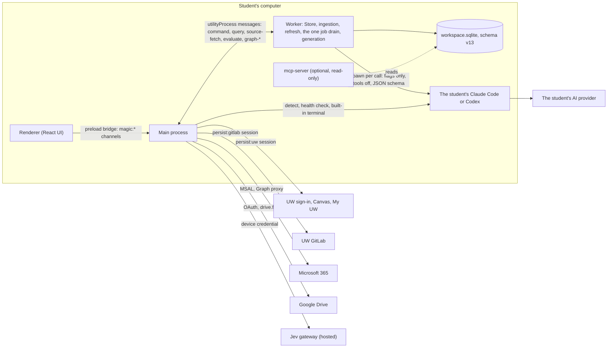
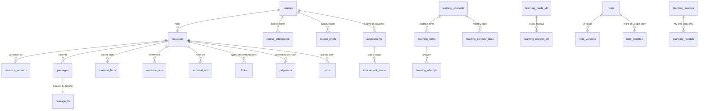

# How My Magic UW works

This page follows one student from install to daily study. For each step it says what the student sees, what happens underneath, what it costs, and how far that step has been proven. It is the canonical explanation of the running system. Other documents link here rather than repeat it.

**Checked against:** `main` at `699e386` (2026-09-27, after PR #30). The local database is at schema **v13**. Work on branches and open PRs is labelled "in progress" with its branch or PR number. It is never described as done.

## Status labels

| Label | Meaning |
|---|---|
| **demonstrated live** | Run on a real UW account with the operator present, and recorded in the [build record](course-backend-build-record.md#6-live-trial-results) or a merged PR |
| **integrated** | On `main` and called by the running app, either from a screen or from the background worker |
| **tested in isolation** | On `main` with passing tests, but nothing in the running app calls it yet |
| **in progress** | On a branch or in an open PR, not on `main` |
| **planned** | Decided in the [course-backend plan](plans/2026-09-26-course-backend/plan.md), with no code yet |

Several features reach the screen today only through **Workspace tools**. This is one navigation entry with a labelled Preview tab per backend feature: Agenda, Assignment references, Study guides, Practice, Practice analytics, Notes, Outlook and Course facts ([PR #30](https://github.com/benverhaalen/magic-uw/pull/30)). Each tab calls the real backend and shows its real result or an honest empty state. These tabs are wiring previews, not designed screens. The designed screens come from the teammate's integrated UI, which is still in progress (see [What is in flight](#what-is-in-flight)).

Numbers appear only where they were measured, and each one names its source. A synthetic or replayed measurement says so. Jev cost figures are not published.

## The runtime

- **The renderer** never reaches the network. It calls `window.magic` methods, which the preload script maps to `magic:*` IPC channels (`apps/desktop/src/preload.ts`).
- **Main** owns every signed-in session: `persist:uw` for UW and Canvas, `persist:gitlab`, Microsoft sign-in through `@azure/msal-node`, and Google's OAuth. It also holds the Jev device credential and a vault encrypted with the operating system's `safeStorage`. Its consent gate checks every channel that can reach the network (`packages/core/src/egress.ts`).
- **The worker** is an Electron `utilityProcess` that owns the database and does all the work: ingestion, refresh, the job drain and generation. It has no sessions of its own. When it needs a signed-in read, it asks main with `source-fetch`. When it needs a Jev judgment, it asks main with `evaluate`. Its public reads, such as course websites and calendar feeds, pass the same consent check.
- **The student's AI client** is spawned once per call: by the worker for generation, and by main for detection, health checks and the built-in terminal. It runs with tools turned off and a JSON output schema, and its answer is checked by code (step 4).
- **The MCP server** is a separate, optional process that the student's own AI client launches. It opens the database read-only (step 9).

## 1. Install and onboarding

**What the student sees.** Six screens in order: **Agreement → UW sign-in → Your AI → Appearance → Connections → Your workspace** (`apps/desktop/src/renderer/onboarding/model.ts`).

1. **Agreement.** One checkbox: "I agree: My Magic UW may read UW with my sign-in, and share what I allow with the recipients above." The screen above it discloses that reading a Canvas page can register a view. The app sends zero requests before this box is checked; a spy test enforces this.
2. **UW sign-in.** UW's own login page opens in an app window. The student types their NetID and password and approves Duo themselves. The app never automates Duo and never fills in a credential. The window is sandboxed with no injected script. Main confirms the sign-in only by reading the Canvas profile afterwards (`apps/desktop/src/main.ts`). The app then keeps the signed-in session, never the password.
3. **Your AI.** The app detects Claude Code and Codex on the computer. It runs `--version` and then the client's own status command (`claude auth status --json`, `codex login status`); it never makes a model call or reads a credential file. If a client is signed in, the app uses it in **instant mode**, with the app's configuration passed as command-line flags only. Nothing is written to the student's `~/.claude` or `~/.codex`. If the client is signed out, the screen says: "Open a terminal and run `claude`, sign in, then click Check again" (`codex login` for Codex). Other states each have one typed message with the exact next step: not installed, a free plan that can't run the client, usage limit reached, model unavailable, and offline. An isolated profile that the app owns, signed in once inside the built-in terminal, is the opt-in alternative. Gemini runs only with the student's API key.
4. **Appearance.** Light, dark or system, plus an accent colour.
5. **Connections.** Microsoft 365 uses the app's own Microsoft sign-in. Google Drive uses Google's sign-in with the `drive.file` scope. Both are optional and can be skipped.
6. **Your workspace.** The student lands on Home and the first sync starts.

**Underneath.**

| Part | Where | Stored |
|---|---|---|
| Consent records | `consent` command; the only writer is `packages/core/src/egress.ts` | `preferences` in the database |
| UW session | main's `persist:uw` partition; "Keep me signed in" keeps it between launches | Electron's session storage |
| Client health | `apps/desktop/src/clients/` (`health.ts`, `instant.ts`, `profiles.ts`) | the choice and its mode; app files only under `<userData>/clients/` |
| Microsoft tokens | MSAL cache in main | encrypted with `safeStorage` |
| Google tokens | `apps/desktop/src/notes-google.ts` (PKCE, loopback redirect, no client secret) | encrypted vault |

**Instant-mode flags.** They were verified on Windows 11 on 2026-09-27 against Claude Code 2.1.283 and Codex 0.156.1 (`apps/desktop/src/clients/instant.ts`).

- **Claude Code:** `-p --output-format json --json-schema … --tools "" --strict-mcp-config --setting-sources project,local --no-session-persistence --system-prompt-file … --model …`, plus `--safe-mode`.
- **Codex:** `exec --json --output-schema … --ephemeral -s read-only --skip-git-repo-check`, plus `--ignore-rules`, `-c` overrides that remove its default instructions and web search, and `--disable` for every tool feature the installed version lists.
- **Codex exception:** Codex always reads `$CODEX_HOME/AGENTS.md`, and no flag turns that off. The app says so, and code checks every answer either way.

**What it costs.**
- UW sign-in took 16.5 s including typing in the live trial; the app's own confirmation took under 1 s ([build record §6](course-backend-build-record.md#6-live-trial-results)).
- Onboarding makes no model calls.
- Instant mode cut the fixed prompt the student's client loads on every call: Claude Code from 3,021 to 1,298 input tokens with `--safe-mode`, and Codex from 21,424 to 6,373 with the overrides ([PR #29](https://github.com/benverhaalen/magic-uw/pull/29)).

**Status.**
- UW sign-in and Duo "remember me": **demonstrated live** (2026-09-26). A live bug was found and fixed during that run.
- Agreement, Your AI, Connections: **integrated** ([PR #29](https://github.com/benverhaalen/magic-uw/pull/29), 965/965 tests at merge).
- Client-detection fixes: **in progress** (branch `fix/client-detection`, uncommitted).
- Microsoft 365: **integrated**, but not yet run against UW's Microsoft tenant; it needs the app's Entra registration first ([Outlook setup](outlook-setup.md)).
- Google Drive: **integrated** when `MAGIC_GOOGLE_CLIENT_ID` is configured; without it the connection reports "not configured" rather than failing. It has not been run live.
- Appearance: the choice is **integrated**, but dark mode and the accents are **in progress**. The choice is saved and set on the root element, and `tokens.css` has no dark or accent values yet, so it changes nothing visible (`apps/desktop/src/renderer/appearance.ts`). The token values belong to the design integrator ([DESIGN.md](../DESIGN.md)).
- "Remember my sign-in", an opt-in encrypted NetID save for the UW login page only: **planned** (plan D39, task T05e). The Agreement screen already mentions it.

## 2. First sync

**What the student sees.** Courses, assignments and dates appear first, then pages; files and their text fill in behind them. The top bar shows "Working…" while a command runs, and Settings lists recent refreshes with their status (`ok`, `partial`, `unchanged`, `needs_sign_in`, `error`) and duration. A live sync indicator with named stages is **in progress**: its slot on `main` renders nothing until the `sync.status` contract merges (`apps/desktop/src/renderer/backend/WorkspaceTools.tsx`).

**Underneath.**
- **Staging.** Account-level reads come first: to-do, upcoming events, activity and the course list. Then each course runs in three priorities: essentials (assignments, modules with their items inline, announcements), then pages, then background lists (details, submissions, files, folders, assignment groups, quizzes, discussions) (`packages/connectors/src/canvas.ts`).
- **One scheduler per sync.** Up to 6 requests are in flight per host. The scheduler honours Canvas's `X-Rate-Limit-Remaining` and cost headers, backs off on 403 or 429, and reads identical GETs once per sync (`packages/connectors/src/fetch-scheduler.ts`, [PR #8](https://github.com/benverhaalen/magic-uw/pull/8)).
- **Files.** Downloads go only to verified Instructure hosts: the Canvas origin, `*.canvas-user-content.com`, `inst-fs-*.inscloudgate.net` and Instructure's upload bucket, checked at every redirect. Text is extracted off-thread from PDF, Word, PowerPoint, Excel and OpenDocument files. Scanned pages go to the operating system's own OCR: Windows OCR, or Apple Vision on macOS (written, not yet run). A configured Tesseract is the fallback. OCR never holds up a sync ([PR #22](https://github.com/benverhaalen/magic-uw/pull/22)).
- **Failures keep what was there.** A restricted, partial or failed read never deletes stored coursework. Only a complete, successful scope can establish that something was removed.

**What changes afterwards.** The refresh coordinator (`packages/core/src/refresh.ts`) runs while the app is open:
- A hot tick every 5 minutes reads Canvas's to-do and upcoming lists.
- A per-course content probe runs every 15 minutes.
- A full read runs as a backstop every 6 hours.
- Mail is read every 5 minutes.

When a probe shows a course has moved, **only that course** is re-read. Otherwise the result is `unchanged`.
- **Canvas notification emails:** Canvas's notification mail is recognised and tagged with its course (`packages/connectors/src/graph.ts`). Using it to trigger a targeted read is **in progress** (branch `fix/canvas-sync-events`, no commits yet).
- **Calendar feeds:** feeds and the Outlook calendar are read on their own schedule. They update events; they do not force a Canvas read.

**What it costs.**
- **Live first read, before the scheduler work:** 125 requests in 65 s, 3.3 MB, 6 current courses read in depth. Zero AI or Jev requests ([build record §6](course-backend-build-record.md#6-live-trial-results)).
- **After the scheduler, on a 5-course replay:** 115 → 65 requests and 5.7 s → 2.1 s. A tick with nothing changed costs at most 4 requests per course ([PR #8](https://github.com/benverhaalen/magic-uw/pull/8)). The live read has not been re-measured since.
- **Synthetic 5-course fixtures:** a hot tick costs 2 requests, and a content tick 38–48 ([sync resilience review](sync-resilience-review.md)).
- **Synthetic 300-file course:** 0 → 285 of 300 files with text, and no downloads on a repeat sync. OCR took about 1.8 s per page on Windows ([PR #22](https://github.com/benverhaalen/magic-uw/pull/22)).
- A sync makes no model calls.

**Status.**
- First sync: **demonstrated live** (2026-09-26), before the scheduler work landed.
- Staged scheduler and file acquisition: **integrated**, but not yet re-run live on UW Canvas.
- Probe-driven refresh: **integrated**.

## 3. The local academic database

Everything lives in one SQLite file, `<userData>/workspace.sqlite`, written only by the worker. Schema versions are owned by `packages/storage`, and `main` is at **v13** (`packages/storage/src/index.ts`). On disk, the app's data folder still carries the internal name `Magic Canvas` (`app.setName` in `apps/desktop/src/main.ts`).

| Layer | Tables | What it holds |
|---|---|---|
| Coursework | `sources`, `resources`, `resource_versions`, `observations`, `resource_changes` | One source per course or feed. Each course item (assignment, page, file, module, message, event) is a `resources` row with its versions and a change feed. A course is `sources.course_id`; there is no separate courses table. Modules are fields on their items. |
| Passages | `passages`, `passage_fts` (contentless FTS5, BM25) | Extracted text split into passages with exact offsets and page, slide or time anchors. Every quote the app shows is checked against these. |
| Material facts | `material_facts` | Code-first categorisation of each material (role, module or week, dates, terms, formulas, what it covers), each with its basis and the quote it came from |
| Reference graph | `links`, `resource_refs`, `external_refs`, `map_links` | What refers to what, with a reason and strength. External links are classed by host. |
| Course profile | `course_intelligence`, `course_briefs`, `assessments`, `assessment_scope` | AI policy, grading, topics and assessments, each claim tied to a structured field or a quoted passage. A per-course `syllabus.md` used as a byte-stable prompt prefix is **in progress** (branch `feat/course-facts`). |
| Learning | `learning_concepts`, `learning_items`, `learning_attempts`, `learning_cards_v8`, `learning_reviews_v8`, `learning_concept_state`, `learning_sessions`, artifacts | Generated items and cards, every answer and review, FSRS state and per-concept mastery |
| Notes | `notes`, `note_versions`, `note_links`, `note_remotes`, `note_sync_settings` | Lecture notes, their versions and their Word or Google copies (step 7) |
| Mail | ordinary `resources` rows from the Microsoft source | Sender, subject, Graph's own ≤255-character preview, the code's category with its reason, and a link back to Outlook. The body is never stored. A ≤280-character gist written by the student's AI is **planned** (the `mail.gist` job is a stub). Encryption at rest is **in progress** ([PR #25](https://github.com/benverhaalen/magic-uw/pull/25), schema v14). |
| Planning | `planning_sources`, `planning_captures`, `planning_records`, `planning_versions` | My UW enrollment, history and saved DARS audits. These never go to Jev, the student's AI, MCP or the platform. |
| Work and trust | `jobs`, `judgments`, `receipts`, `mcp_grants`, `preferences` | The job queue, cached judgments, one receipt per outbound send, MCP grants, consent and settings |

**What it costs.** These figures come from the perf harness at 5,000 synthetic resources ([build record §5](course-backend-build-record.md#5-scores-and-measurements), [PR #19](https://github.com/benverhaalen/magic-uw/pull/19)):
- Passage search: p50/p95 3.4/5.5 ms.
- Ingest: 1,431 resources/s.
- A full purge: about 0.35 s.

**Status.** **Integrated.**

## 4. Understanding the course

**What the student sees.** Each course's items get categorised, linked to the materials they reference, and placed on the agenda, with no waiting and no prompts.

**Underneath: the order of methods.** AI writes; code decides.

1. **Code first.** Dates, IDs, permissions, links and categories that have one right answer are computed.
   - Code categorised 96.4% of 673 live materials, and flagged 24 as needing judgment ([PR #13](https://github.com/benverhaalen/magic-uw/pull/13)).
   - Code decides quiz versus discussion from Canvas's submission types, which halved Jev calls on a synthetic 100-assignment course, 100 → 50 ([PR #14](https://github.com/benverhaalen/magic-uw/pull/14)).
2. **Jev for small typed judgments.** The hosted gateway answers bounded questions: `assignment.kind.v1`, `message.triage.v1` and `mail.triage.v1` (`packages/ai/src/index.ts`).
   - The input is clipped: for example, a title plus at most 2,000 characters.
   - It is identity-scrubbed, and sent only after consent. Each send writes a receipt.
   - A 429 becomes a durable cooldown for that kind, not a retry storm (`packages/core/src/jobs/enrich.ts`).
3. **One checked call on the student's AI** where language has to be read or written, as with study items, guides and grounded answers.
   - Each prompt pack makes one call with tools off and a JSON schema (`packages/runner`, `packages/packs`).
   - Code checks the output: every quote must appear verbatim in its cited passage, and item structure and IDs are validated. Code then re-locates the quote in the live text instead of trusting the model's copy.
   - A failed check retries once with the errors, then escalates once from the pass tier to the strong tier. A usage limit is reported, never retried.

**One job drain.** Every background job kind runs in one loop in the worker (`packages/core/src/jobs/pipeline.ts`, [PR #23](https://github.com/benverhaalen/magic-uw/pull/23)): `passages.resource`, `link.resource`, `compile.course`, and Jev's `enrich.resource`. The loop is idle-gated and presence-aware, using small slices while the student is active and larger ones while away. It stops when a sync starts and resumes when the sync ends, so it never competes with a read. Replacing the per-row queue with one batched reconcile pass is **in progress** (branch `fix/nonblocking-jobs`, uncommitted).

**Content-hash caching.** Unchanged content never costs twice:
- A Jev judgment is keyed by the hash of the title and text, so a grade or submission change costs nothing.
- A pack's output is keyed by the pack version, its prompt prefix and the hashes of its passages. A cache hit returns the stored artifact with zero tokens and skips the model call entirely (`packages/core/src/jobs/pack.ts`).

**What it costs.**
- On the operator's live data, 1,254 jobs drained in 12.8 s with 0 failures, and no model calls ([PR #13](https://github.com/benverhaalen/magic-uw/pull/13)).
- Tokens per pack on real course content are not yet recorded.

**Status.**
- Code-first pass and drain: **integrated**, evaluated on a copy of live data.
- Jev enrichment: **integrated**, gated by consent.
- Packs on the student's AI: **integrated** through the Study guides and Practice tabs.
- Local tutoring with an installed Ollama model: **integrated**. It was run once against a real model, answering in about 2.2 s ([implementation status](implementation-status.md#verification)).

## 5. Daily use

**What the student sees today.**
- **Home and the Today rail:** today's due work, events with join links, a saved day plan, and change notes such as "Was due 11:59 PM" ([PR #2](https://github.com/benverhaalen/magic-uw/pull/2), [PR #15](https://github.com/benverhaalen/magic-uw/pull/15)).
- **The notification bell:** code rules for due-date changes, new work, grades, missing work and source health. New announcements and email can be raised, never lowered, by Jev triage ([PR #32](https://github.com/benverhaalen/magic-uw/pull/32)).
- **The Agenda and Assignment references tabs.**

**The agenda.**
- `agenda()` (`packages/core/src/graph/agenda.ts`) merges assignment due and lock dates, calendar events, class meetings and quoted exam dates, deduplicates them by source authority, and groups them into overdue, today, this week and later.
- On `main` the order is chronological. On the operator's live data it matched Canvas's own to-do and upcoming lists with 0 missing, 0 duplicate and 0 mismatched dates ([PR #13](https://github.com/benverhaalen/magic-uw/pull/13)).
- **Least slack first** is **in progress** ([PR #27](https://github.com/benverhaalen/magic-uw/pull/27), plan D49). Each open item gets latest start = due − estimated effort − buffer, and items sort by slack ascending, all by code. Each top item gets a checked one-line "why now", and the app shows the last-known ranking instantly at launch.

**Assignment references.** `references(assignmentId)` lists what an assignment points to: direct links, named files and pages, module siblings, syllabus lines, and materials whose facts say they cover it. On live data it recalled 100% of 175 body links and 10 named items ([PR #13](https://github.com/benverhaalen/magic-uw/pull/13)).

**Page views and study offers.** The assignment workspace, the lecture session page and the assessment page, each one composite query, plus study offers ranked by the stakes of upcoming graded work: **in progress** (branch `feat/page-views`, uncommitted).

**Commands, voice and chat: one action path** (plan D56).
- **The intent router is integrated in the worker** (`packages/core/src/intent/`, [PR #24](https://github.com/benverhaalen/magic-uw/pull/24)).
  - It resolves plain-language commands in code first, within a 20 ms budget and at zero tokens.
  - The AI classification is prepared in parallel and used only on a miss, adding no latency: its p95 was within 10 ms of AI-only on a fake 800 ms client.
  - Code re-resolves every argument the model returns. An invented course, assignment or date becomes a clarifying question.
  - Grounded "ask" retrieves up to 8 passages and makes one call. Code checks every quote and drops failures. With nothing relevant it answers "Not in your materials" without a call.
  - On a live-shaped copy, code resolved 25 of 40 realistic commands, all correctly.
- **The command bar (Ctrl+K)** that fronts the router: **planned**. The slot is in the renderer but empty.
- **Dictation (Ctrl+Shift+Space, transcribed locally)** entering the same router: **planned**.
- **The floating wizard chat:** **in progress** (branch `feat/floating-chat`, uncommitted).

**Confirm before change.** Anything that changes something outside the app is prepared, shown, and applied only when the student clicks.
- **Calendar events: integrated.** The router or the Outlook tab gets a single-use proposal, and main creates the Outlook event only after the confirm click (`calendarProposeEvent` then `calendarCreateEvent`).
- **Email drafts to a contact: planned** (plan D55, an unsent Outlook draft or a `mailto:` link). The app never sends mail, submits, posts or enrols.

**What it costs.**
- Agenda, references and notifications cost zero tokens; they are code over the local database.
- The notification feed reloads in about 25 ms, down from about 2.2 s, on a 1,971-resource workspace (commit `b29a4e3`, harness `evals/notifications/`).
- The due command's course check went from 25–41 s to about 0.6 s ([PR #24](https://github.com/benverhaalen/magic-uw/pull/24)).

**Status.**
- Today rail, notifications, agenda and references: **integrated**.
- Intent router: **integrated** in the worker, with no UI yet.
- Calendar confirm: **integrated**, tested with synthetic meetings.
- Everything else in this step is **in progress** or **planned**, as marked above.

## 6. Studying

**What the student sees** (the Practice, Study guides and Practice analytics tabs):
- **Flashcards** scheduled by FSRS (`ts-fsrs` 5.4.2, target retention 0.90), with extra reviews before an exam that don't disturb the schedule.
- **Learn rounds**, **quizzes by module**, and **"Quiz me on"** chosen topics.
- **Study guides** in six kinds: guide, briefing, FAQ, timeline, compare and concept map. Every block carries a quote that code re-checks.
- **Practice analytics** for each course and assignment.
  - Topics are counted by state (Mastered, Getting there, Iffy, Not seen yet), never shown as a percentage or a grade prediction.
  - A "study next" list of at most three items is ranked by code from weakness, exam proximity and scope share.

**Underneath.**
- Generation happens once, up front, as one checked pack call (step 4), and is cached by content hash.
- Everything after that is code in `packages/learning`: serving items, grading them (exact and numeric matching, key-idea checklists with synonyms, undecided answers left unscored), FSRS scheduling and analytics.

**What it costs.** Studying costs **0 tokens**. Only generating new items or guides calls the student's AI, and a repeat of the same generation is a cache hit.

**Status.**
- Cards, Learn, module quizzes, "Quiz me on", guides and analytics: **integrated** (Preview tabs). Item quality on real courses has not been evaluated; that harness is on branch `feat/item-eval`.
- Practice exams matched to the exam blueprint, with step-checked solving: **in progress** (branch `feat/exam-prep`, 1 local commit).
- Course mastery: **in progress** (branch `feat/course-mastery`, uncommitted). It covers two-tier mastery, due-for-review, one next step, claims the student can negotiate, exam history and grade trajectory.
- Per-topic level bars and the assessment mastery bar: **planned**. Today states are text badges.
- "Build my strategy": **planned**. No code on any branch.

## 7. Notes

**What the student sees** (the Notes tab):
- **Scaffolds.** A scaffold is ready for every lecture, discussion and lab this week and next, built from the course's sessions and materials.
- **Templates.** A template suggested by subject.
- **Fill from slides.** On request, the scaffold is filled from the session's slides.
- **Word and Google copies.** A copy of each note in Word or Google Docs that syncs both ways.

**Underneath** (`packages/notes`, [PR #16](https://github.com/benverhaalen/magic-uw/pull/16)):
- Scaffolds are built by code. A note the student has edited is never rebuilt.
- "Fill from slides" is one checked call on the student's AI, and only when asked.
- **Word.** Files go to the app's own OneDrive folder through Graph (`Files.ReadWrite.AppFolder`), as `<Course>/<date> <type>.docx`, read back with ETag conditional GETs.
- **Google.** Files are Google Docs created under the `drive.file` scope, so the app sees only files it created.
- **Sync** runs every 2 minutes.
  - If only one side changed, that side wins.
  - If both changed, the remote version is saved as a separate conflict version. Neither side is overwritten.

**What it costs.** Scaffolds and sync cost 0 tokens. "Fill from slides" costs one call.

**Status.**
- Scaffolds, templates and sync: **integrated**, tested with fakes. Not yet run against UW's Microsoft tenant or a live Google account.
- Opening a synced note in a signed-in document window through UW single sign-on, with a browser fallback: **in progress** ([PR #31](https://github.com/benverhaalen/magic-uw/pull/31)).

## 8. Privacy and control

**What the student sees.**
- One agreement, and each provider's own sign-in.
- **Data & AI** lists what may be shared and with whom, the receipts of what was sent, MCP connections that can be revoked, and **Delete local data**.

**Underneath.**
- **Consent gates.** Every network-reaching channel in main is blocked until a current consent record exists: `uw` for reading UW, `jev` for the gateway (`packages/core/src/egress.ts`). Hosted sharing is off by default.
- **Receipts.** Every outbound send writes a receipt naming what was sent, where it went and why.
- **Preview before send.** A newly shared sensitive category, or the "always preview" setting, holds the request until the student acknowledges that exact payload (bound to its hash). The policy is **tested in isolation**; its screen is not built yet.
- **People's identities.** A roster built from Canvas separates students, whose names are scrubbed from outbound text, from instructors, whose names are kept because they are part of the teaching content. Redaction is span-mapped, so quotes still resolve to the original text (`packages/core/src/identity.ts`). It runs on hosted context, Jev triage, generation and MCP.
- **Planned privacy hardening, in progress** ([PR #25](https://github.com/benverhaalen/magic-uw/pull/25), schema v14): pattern-based personal-data detectors, per-request pseudonyms, log redaction and encryption at rest.
- **What never leaves the computer:**
  - the UW session and any password (the app never sees the password);
  - OAuth tokens;
  - planning records;
  - full mail bodies (never stored at all);
  - grades and comments, unless the student allows them;
  - the database itself.
- **Purge.** "Delete local data" empties every table and FTS index, deletes the migration backup and the MCP receipt log, and clears the UW and GitLab sessions and their caches. It also disconnects Microsoft, clears the vault, closes client sessions, and removes the app's `clients`, `documents` and `mcp` folders (`packages/storage/src/index.ts`, `apps/desktop/src/purge-host.ts`). It cannot remove UW's own records or anything a provider retained.

**What it costs.** A purge at 5,000 synthetic resources takes about 0.35 s ([PR #19](https://github.com/benverhaalen/magic-uw/pull/19)).

**Status.**
- Consent gates, receipts, scrubbing and purge: **integrated**. Zero requests before consent is covered by a spy test.
- PR #25: **in progress**.

The full data disclosure is in [AI and privacy](ai-and-privacy.md).

## 9. The open platform

**What a Badger developer gets.**
- **The packages**, MIT-licensed, with a read-only API over the student's own local course database.
- **An MCP course bank** that any compatible AI client can use with the student's grant.

**`@magic/agent-api` v1** ([README](../packages/agent-api/README.md)) is an in-process TypeScript library, versioned as `magic.agent-api` 1.0.0. Its verbs are:
- `courses()`
- `courseGraph({courseId})`
- `resources({courseId?, kinds?, cursor?, limit?})`
- `resource({id})`
- `searchPassages({query, courseId?, limit?})` (BM25 over passages)
- `assignments({courseId?, days?})`

`agenda()` returns `not_built` until a variant without planning data exists. Every call:
- rechecks a grant (client, token, courses and categories);
- scrubs identities from free text;
- trims to a token budget, reporting `trimmed: true` rather than failing;
- writes one receipt.

No verb writes.

**MCP.** `apps/desktop/src/mcp-server.ts` is a stdio server over the same grant session. Its six read-only tools are `search`, `due_soon`, `recent_changes`, `course_overview`, `get_item` and `answer_course_question`; the last returns cited passages and makes no model call. To connect:
1. The student creates a grant in Data & AI.
2. **Export** writes a connection file to `<userData>/mcp/<id>.json` and returns an `mcpServers` block to paste into their client.
3. The file is restricted to the current user (`icacls` on Windows), and the restriction is rechecked on every start.

The server opens the database read-only and never migrates it. Its receipts go to a log that the app imports.

**Building on it.** Clone the repo, run `pnpm install`, open a store with `createStore(path, { readOnly: true })`, and call `createReadApi` with a grant. The [academic data platform](academic-data-platform.md#3-developer-quickstart) has the quickstart. A versioned `@magic/sdk`, SQL views and a narrow write path for decks, cards and notes are **planned** (plan D42).

**Status.**
- MCP server and agent-api v1: **integrated**, as the MCP reader ([PR #19](https://github.com/benverhaalen/magic-uw/pull/19)). Their use by outside developers is untested.

## What is in flight

| Work | Where | Step |
|---|---|---|
| Critical-action agenda (least slack first, "why now", instant launch view) | [PR #27](https://github.com/benverhaalen/magic-uw/pull/27) | 5 |
| Privacy hardening and encryption at rest (schema v14) | [PR #25](https://github.com/benverhaalen/magic-uw/pull/25) | 3, 8 |
| Signed-in document window for notes | [PR #31](https://github.com/benverhaalen/magic-uw/pull/31) | 7 |
| The teammate's integrated desktop UI (designed screens, course pages, motion, fonts) | `codex/desktop-design-integration`, merged locally into `feat/floating-chat` and `local/ui-preview` | all |
| Floating wizard chat | `feat/floating-chat` (uncommitted) | 5 |
| Page views (assignment, lecture, assessment) and study offers | `feat/page-views` (uncommitted) | 5 |
| Course mastery, exam history, grade trajectory | `feat/course-mastery` (uncommitted) | 6 |
| Practice exams | `feat/exam-prep` | 6 |
| Per-course `syllabus.md` and course facts | `feat/course-facts` | 3 |
| Course-website recipes (replay a known page layout at 0 tokens, one call for a new one) | `feat/site-recipes` (uncommitted) | 2 |
| Non-blocking derived jobs | `fix/nonblocking-jobs` (uncommitted) | 4 |
| Client-detection fixes | `fix/client-detection` (uncommitted) | 1 |
| Canvas change events from notification mail | `fix/canvas-sync-events` (no commits yet) | 2 |
| Dark mode and accent token values | the design integrator ([DESIGN.md](../DESIGN.md)) | 1 |
| Fresh-system end-to-end tests (Playwright Electron, fake clients) | `test/fresh-system-e2e` | all |

## Where to go next

- [Course backend architecture](course-backend-architecture.md): processes, data flow, interfaces and the reasons behind them.
- [Build record](course-backend-build-record.md): tests, measurements and the live trial.
- [Implementation status](implementation-status.md): the detailed history of each capability and its verification.
- [Course-backend plan](plans/2026-09-26-course-backend/plan.md): decisions D1–D56 with their evidence.
- [Development](development.md): run the app and the checks.
